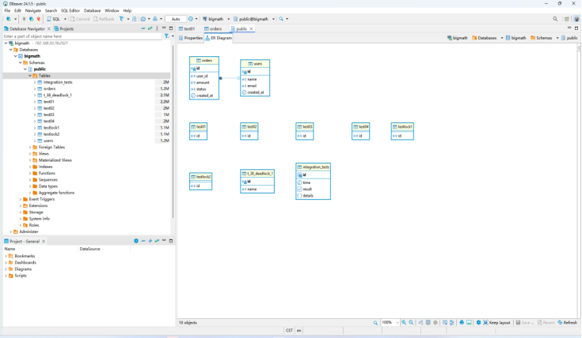
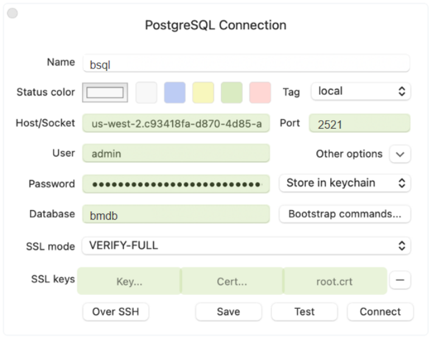

## **ALTER KEYSPACE**

使用ALTER KEYSPACE语句可以更改现有键空间的属性。
仅出于兼容性原因支持此语句，在内部不起作用（无操作语句）。
如果指定的键空间不存在，或者用户（角色）没有键空间ALTER操作的权限，则该语句可能失败。

语法：

```
alter_keyspace ::= ALTER { KEYSPACE | SCHEMA } keyspace_name
                       [ WITH REPLICATION '=' '{' keyspace_property '}']
                       [ AND DURABLE_WRITES '=' { true | false } ]
 
keyspace_property ::= property_name = property_value
```

* keyspace_name和property_name是标识符。
* property_value是布尔、文本或映射数据类型。

描述：

* 如果指定的keyspace_name不存在，则会引发错误。 
* 如果用户（使用的角色）对此指定的键空间没有ALTER权限，对所有键空间也没有ALTER权限时，将引发错误。 
* 语法中支持BCQL键空间属性，但在内部不起作用（使用AiSQL 默认值）

示例：

```
cqlsh> ALTER KEYSPACE example;
```

```
cqlsh> ALTER KEYSPACE example WITH REPLICATION = {'class': 'SimpleStrategy', 'replication_factor': '3'} AND DURABLE_WRITES = true;
```

```
cqlsh> ALTER SCHEMA keyspace_example;
```

```
SQL error: Keyspace Not Found.
ALTER SCHEMA keyspace_example;
             ^^^^^^
```

```
cqlsh> ALTER KEYSPACE example;
```

```
SQL error: Unauthorized. User test_role has no ALTER permission on <keyspace example> or any of its parents.
ALTER KEYSPACE example;
^^^^^^
```

## **ALTER ROLE**

使用ALTER ROLE语句可以更改现有角色的属性。它允许修改属性SUPERUSER、PASSWORD和LOGIN。 
通过将dbServer标志--use_cassandra_authentication设置为true，可以启用此语句。

语法：

```
alter_table ::= ALTER ROLE role_name WITH role_property [ AND role_property ...];
 
role_property ::=  PASSWORD = '<Text Literal>'
                 | LOGIN = <Boolean Literal>'
                 | SUPERUSER = '<Boolean Literal>'
```

* role_name是一个文本

描述：

* 如果role_name不存在，则会引发错误。

示例：

```
cqlsh:example> CREATE ROLE finance;
```

```
cqlsh:example> ALTER ROLE finance with LOGIN = true;
```

```
cqlsh:example> ALTER ROLE finance with SUPERUSER = true;
```

```
cqlsh:example> ALTER ROLE finance with PASSWORD = 'jsfp9ajhufans2' AND SUPERUSER = false;
```

## **ALTER TABLE**

使用ALTER TABLE语句可以更改现有表的架构或定义。它允许添加、删除或重命名列以及更新表属性。

语法：

```
alter_table ::= ALTER TABLE table_name alter_operator [ alter_operator ...]
 
alter_operator ::= add_op | drop_op | rename_op | property_op
 
add_op ::= ADD column_name column_type [ ',' column_name column_type ...]
 
drop_op ::= DROP column_name [ ',' column_name ...]
 
rename_op ::= RENAME column_name TO column_name [ ',' column_name TO column_name ...]
 
property_op ::= WITH property_name '=' property_literal [ AND property_name '=' property_literal ...]
```

* table_name、column_name和property_name是标识符（table_name可以用键空间名称限定）。 
* property_tliteral是布尔、文本或映射数据类型。

描述：

* 如果关联的键空间中不存在table_name，则会引发错误。 
* 作为PRIMARY KEY一部分的列不能更改。 
* 添加列时，表中所有现有行的值默认为null。 
* 删除列后，表中当前为该列存储的所有值都将被丢弃（如果有的话）。

示例：
1）增加新列到表中：

```
cqlsh:example> CREATE TABLE employees (id INT, name TEXT, salary FLOAT, PRIMARY KEY((id), name));
cqlsh:example> ALTER TABLE employees ADD title TEXT;
cqlsh:example> DESCRIBE TABLE employees;
```

显示信息如下：

```
CREATE TABLE cycling.employees (
    id int,
    name text,
    salary float,
    title text,
    PRIMARY KEY (id, name)
) WITH CLUSTERING ORDER BY (name ASC)
    AND default_time_to_live = 0
    AND transactions = {'enabled': 'false'};
```

2）从表中删除一列

```
cqlsh:example> ALTER TABLE employees DROP salary;
cqlsh:example> DESCRIBE TABLE employees;
```

显示信息如下：

```
CREATE TABLE cycling.employees (
    id int,
    name text,
    title text,
    PRIMARY KEY (id, name)
) WITH CLUSTERING ORDER BY (name ASC)
    AND default_time_to_live = 0
    AND transactions = {'enabled': 'false'};
```

3）修改表中的列名

```
cqlsh:example> ALTER TABLE employees RENAME title TO job_title;
cqlsh:example> DESCRIBE TABLE employees;
```

显示信息如下：

```
CREATE TABLE cycling.employees (
    id int,
    name text,
    job_title text,
    PRIMARY KEY (id, name)
) WITH CLUSTERING ORDER BY (name ASC)
    AND default_time_to_live = 0
    AND transactions = {'enabled': 'false'};
```

4）修改表属性

```
cqlsh:example> ALTER TABLE employees WITH default_time_to_live = 5;
cqlsh:example> DESCRIBE TABLE employees;
```

显示信息如下：

```
CREATE TABLE cycling.employees (
    id int,
    name text,
    job_title text,
    PRIMARY KEY (id, name)
) WITH CLUSTERING ORDER BY (name ASC)
    AND default_time_to_live = 5
    AND transactions = {'enabled': 'false'};
```

## **CREATE INDEX**

使用CREATE INDEX语句可以对表创建新索引。它定义了索引名称、索引列以及要包含的其他列。

```
create_index ::= CREATE [ UNIQUE ] [ DEFERRED ] INDEX
                 [ IF NOT EXISTS ] index_name ON  table_name (
                 partition_key_columns , [ clustering_key_columns ] )
                 [ covering_columns ] [ index_properties ]
                 [ WHERE index_predicate ]
 
partition_key_columns ::= index_column | ( index_column [ , ... ] )
 
clustering_key_columns ::= index_column [ , ... ]
 
index_properties ::= WITH
                     { property_name = property_literal
                       | CLUSTERING ORDER BY (
                         { index_column [ ASC | DESC ] } [ , ... ] ) }
                     [ AND ... ]
 
index_column ::= column_name | jsonb_attribute
 
jsonb_attribute ::= column_name [ -> 'attribute_name' [ ... ] ] ->> 'attribute_name'
 
covering_columns ::= { COVERING | INCLUDE } ( column_name [ , ... ] )
 
index_predicate ::= where_expression
```

* index_name、table_name、property_name和column_name是标识符。 
* table_name可以用键空间名称限定。 
* index_name不能用键空间名称限定，因为必须在表的键空间中创建索引。 
* property_tliteral是布尔型、文本型或映射数据类型。 
* index_column可以是除MAP、SET、LIST、JSONB、USER_DEFINED_TYPE之外的任何数据类型。

描述：

* 如果在要索引的表上没有使用WITH transactions=｛'enabled':true｝子句启用事务，则会引发错误。这是因为辅助索引在内部使用分布式事务来确保在对辅助索引和相关主键的更新中提供ACID保证。


* 如果index_name已存在于关联的键空间中，则会引发错误，除非使用了IF NOT EXISTS选项。

1）强一致性
注意： 
只有当您的问题没有其他解决方案时，才选择用户强制的一致性。用户强制的一致性需要大量的用户努力来保持索引和表的同步。

索引要求在表上启用事务。对于在不启用事务的情况下创建表的情况，consistency_level必须设置为user_enforced，例如

```
CREATE TABLE orders (id int PRIMARY KEY, warehouse int);
CREATE INDEX ON orders (warehouse)
      WITH transactions = { 'enabled' : false, 'consistency_level' : 'user_enforced' };
```


注意：
同步表和索引 
在使用未启用事务的索引时，应用程序有责任重试任何插入/更新/删除失败，以确保表和索引同步。 
此外，如果索引是在数据添加到表后创建的，则根据disable_index_backfill_for_non_txn_tables标志的设置，索引可能不会自动回填。如果设置为true，则用户有责任使用bm-admin backfill_indexes_for_table命令触发回填，该命令将在大约一分钟的小延迟后触发回填。此延迟由index_backfill_upperbound_for_user_enforced_txn_duration_ms标志控制。

2）分区键
分区键是必需的，它定义了将索引拆分为多个分区。

3）聚集键

* 聚集键是可选的，它定义了分区内索引行的顺序。
* 默认排序为升序（ASC），但可以使用CLUSTERING ORDER BY属性将每个集群列设置为升序或降序。 
* 在index_columns中未显式索引的表的任何主键列都将作为集群列隐式添加到索引中。这是必要的，以便对表的整个主键进行索引。

4）index_properties

* CLUSTERING ORDER BY属性可用于单独设置每个集群列的顺序（默认为ASC）。
* tiles=<num>属性指定要用于指定BCQL索引的分片数量。设置此属性将覆盖--bm_num_shards_per_tserver选项中的值。
* 使用AND运算符可以使用多个索引属性。
* 使用default_time_to_live在索引上设置TTL时，请确保TTL值与表的TTL值相同。如果它们不同，则会导致索引和表不同步，并导致意外行为。

5）包含列

* 包含列是可选的表列，其值除了存储在表中之外，还会复制到索引中。当索引中包含其他列时，它们可以用于直接响应索引中的查询，而不必查询表。
* 以下内容无法添加到索引的包含列中：表的静态列、表达式以及具有以下类型的表列：frozen、map、set、list、tuple、jsonb和用户自定义。

6）唯一索引

* 唯一索引不允许在索引列中插入重复的值。它可用于确保索引列值的唯一性。

7）延迟索引
目前，每个创建的索引都会启动一个“索引回填”作业。对于创建表并添加多个索引的情况，需要多次扫描主表以填充每个索引。这是不必要的，也可能导致单点触摸和多点触摸块缓存算法的问题。
在创建了一组延迟回填的索引后，可以通过以下方式之一触发整批索引（在同一表上）的回填作业：

创建一个不延迟的新索引：

```
CREATE DEFERRED INDEX idx_1 on table_name(col_1);        // No backfill launched.
CREATE DEFERRED INDEX idx_2 on table_name(col_2);        // No backfill launched.
CREATE DEFERRED INDEX idx_9 on table_name(col_9);        // No backfill launched.
 
// To launch backfill ...
CREATE INDEX idx_10 on table_name(col_10);   // Will launch backfill for idx_10 and
                                                    // all deferred indexes idx_1 .. idx_9
                                                    // on the same table viz: table_name.
```

使用bm-admin为表上的延迟索引启动回填。

```
./bm-admin -master_addresses <ip:port>  backfill_indexes_for_table cql.cycling table_name
```

使用Mserver的--defer_index_backfill 标志强制所有索引为DEFERRED，并运行bm-admin backfill_indexes_for_table来回填索引

8）部分索引

* 如果指定了WHERE子句，则仅对满足index_predicate的行进行索引。
* index_predicate可以在以下数据类型的列上具有子表达式：TINYINT、SMALLINT、INT/INTEGER、BIGINT、VARINT、BOOLEAN和TEXT以及以下运算符（如适用）：=、！=、>、<、>=、<=。
* 部分索引可以是唯一的。UNIQUE部分索引强制执行约束，即对于每个可能的索引列元组，表中只允许有一行满足index_predicate。
* 如果SELECT语句的where _expression=>（逻辑上意味着）index_predicate，则SELECT查询可以使用部分索引进行扫描。

注意：

* 如果有更好的查询计划，也可能不会选择部分索引。

* 如果index_predicate的所有子表达式在where_expression中存在，则逻辑含义成立。例如，假设where_expression=A AND B AND C，index_predicate_1=A  AND  B，index_predicate_2=A AND  B AND D，index_predicate_3=A AND B AND  C AND D。那么其中where_expression仅表示index_prediate_1。
* 目前，在检查逻辑含义时，没有考虑有效的数学含义。例如，即使where_expression=x>5和index_predicate =x>4，SELECT查询也不会使用索引进行扫描。这是因为两个子表达式x>5和x>4不同。

* 当使用预编译的语句时，逻辑检查（决定部分索引是否可用）将只考虑where _expression中没有绑定变量的子表达式。这是因为查询计划是在执行之前（即预编译）决定的。

```
CREATE TABLE orders (customer_id INT,
                                    order_date TIMESTAMP,
                                    product JSONB,
                                    warehouse_id INT,
                                    amount DOUBLE,
                                    PRIMARY KEY ((customer_id), order_date))
                WITH transactions = { 'enabled' : true };
 
CREATE INDEX idx ON orders (warehouse_id)
                WHERE warehouse_id < 100;
 
EXPLAIN SELECT product FROM orders
                WHERE warehouse_id < 100 AND order_date >= ?; // Idx can be used
```

```
 QUERY PLAN
------------------------------------------
 Index Scan using temp.idx on temp.orders
   Filter: (order_date >= :order_date)
```

```
EXPLAIN SELECT product FROM orders
                WHERE warehouse_id < ? and order_date >= ?; // Idx cannot be used
```

```
 QUERY PLAN
--------------------------------------------------------------------------
 Seq Scan on temp.orders
   Filter: (warehouse_id < :warehouse_id) AND (order_date >= :order_date)
```

* 如果没有部分索引，我们不允许在SELECT的where表达式中的同一列上同时使用多个运算符组合，例如：where v1！=NULL and v1＝5。但，若有一个部分索引包含SELECT的where表达式的某些子句，则可能支持两个或多个不支持在一起的运算符。

```
EXPLAIN SELECT product FROM orders
                WHERE warehouse_id != NULL AND warehouse_id = ?;
```

```
SyntaxException: Invalid CQL Statement. Illogical condition for where clause
EXPLAIN SELECT product from orders where warehouse_id != NULL and warehouse_id = ?;
                                                                  ^^^^^^^^^^^^
 (ql error -12)
```

```
CREATE INDEX warehouse_idx ON orders (warehouse_id)
                WHERE warehouse_id != NULL;
EXPLAIN SELECT product FROM orders
                WHERE warehouse_id != NULL AND warehouse_id = ?; // warehouse_idx can be used
```

```
 QUERY PLAN
----------------------------------------------------
 Index Scan using temp.warehouse_idx on temp.orders
   Key Conditions: (warehouse_id = :warehouse_id)
```

实例：
1）创建要索引的表
'customer_id' 是分区列， 'order_date' 是分簇列。

```
CREATE TABLE orders (customer_id INT,
                                    order_date TIMESTAMP,
                                    product JSONB,
                                    warehouse_id INT,
                                    amount DOUBLE,
                                    PRIMARY KEY ((customer_id), order_date))
                WITH transactions = { 'enabled' : true };
```

2）创建基于order_date列上查询的索引

```
CREATE INDEX orders_by_date ON orders (order_date) INCLUDE (amount);
```

3）创建基于JSONB 属性的product->>'name'查询的索引

```
CREATE INDEX product_name ON orders (product->>'name') INCLUDE (amount);
```

4）创建基于warehouse_id列上查询的索引

```
CREATE INDEX orders_by_warehouse ON orders (warehouse_id, order_date) INCLUDE (amount);
```

5）导入数据

```
INSERT INTO orders (customer_id, order_date, product, warehouse_id, amount) VALUES (1001, '2018-01-10', '{ "name":"desk" }', 107, 100.30);
INSERT INTO orders (customer_id, order_date, product, warehouse_id, amount) VALUES (1002, '2018-01-11', '{ "name":"chair" }', 102, 50.45);
INSERT INTO orders (customer_id, order_date, product, warehouse_id, amount) VALUES (1001, '2018-04-09', '{ "name":"pen" }', 102, 20.25);
INSERT INTO orders (customer_id, order_date, product, warehouse_id, amount) VALUES (1003, '2018-04-09', '{ "name":"pencil" }', 108, 200.80);
```

6）通过分区键customer_id查询

```
SELECT SUM(amount) FROM orders WHERE customer_id = 1001 AND order_date >= '2018-01-01';
```

```
  sum(amount)
----------------
      120.55
```

7）按索引orders_by_date中的分区列order_date查询

```
SELECT SUM(amount) FROM orders WHERE order_date = '2018-04-09';
```

```
 sum(amount)
-------------
      221.05
```

8）按product_name索引中的分区列product->>'name'进行查询

```
 SELECT SUM(amount) FROM orders WHERE product->>'name' = 'desk';
```

```
 sum(amount)
-------------
      100.30
```

9）按orders_by_warehouse索引中的分区列warehouse_id进行查询

```
 SELECT SUM(amount) FROM orders WHERE warehouse_id = 102 AND order_date >= '2018-01-01';
```

```
 sum(amount)
-------------
        70.7
```

10）创建带有唯一索引的表

```
CREATE TABLE emp (enum INT primary key,
                                 lastname VARCHAR,
                                 firstname VARCHAR,
                                 userid VARCHAR)
               WITH transactions = { 'enabled' : true };
CREATE UNIQUE INDEX emp_by_userid ON emp (userid);
```

11）插入数据

```
INSERT INTO emp (enum, lastname, firstname, userid) VALUES (1001, 'Smith', 'John', 'jsmith');
INSERT INTO emp (enum, lastname, firstname, userid) VALUES (1002, 'Smith', 'Jason', 'jsmith');
```

```
InvalidRequest: Error from server: code=2200 [Invalid query] message="SQL error: Execution Error. Duplicate value disallowed by unique index emp_by_userid
INSERT INTO emp (enum, lastname, firstname, userid)
       ^^^^
VALUES (1002, 'Smith', 'Jason', 'jsmith');
 (error -300)"
```

```
INSERT INTO emp (enum, lastname, firstname, userid) VALUES (1002, 'Smith', 'Jason', 'jasmith');
SELECT * FROM emp;
```

```
 enum | lastname | firstname | userid
------+----------+-----------+---------
 1002 |    Smith |     Jason | jasmith
 1001 |    Smith |      John |  jsmith
```

12）创建指定分片的索引

您可以将CREATE INDEX语句与with tiles=<num>子句一起使用，以指定索引的分片数。这对于根据需求放大或缩小索引非常有用。例如，对于较小或部分索引，拥有大量碎片（分片）可能是浪费。在这种情况下，您可以使用它来减少为索引创建的分片的数量。同样，对于非常大的索引，可以使用此语句将索引预拆分为大量碎片，以提高性能。

请注意，AiSQL 默认情况下会预拆分bm_num_shards_per_tserver*num_of_tserver碎片中的索引。此子句可用于在每个索引的基础上覆盖该设置。

```
CREATE TABLE tracking (id int PRIMARY KEY, a TEXT) WITH transactions = { 'enabled' : true };
CREATE INDEX my_indx ON tracking(a) WITH tiles = 10;
```


## **CREATE KEYSPACE**

使用CREATE KEYSPACE语句创建一个keyspace ，用作数据库对象（如表或类型）的分组机制。

语法：

```
create_keyspace ::= CREATE { KEYSPACE | SCHEMA } [ IF NOT EXISTS ] keyspace_name
                       [ WITH REPLICATION '=' '{' keyspace_property '}']
                       [ AND DURABLE_WRITES '=' { true | false } ]
 
keyspace_property ::= property_name = property_value
 
```

* keyspace_name和property_name是标识符。
* property_value是布尔、文本或映射数据类型。

描述：如果指定的keyspace_name已经存在，则会引发错误，除非使用存在IF NOT EXISTS选项。语法中支持Cassandra的CQL keyspace 属性，但在内部不起作用（使用AiSQL 默认值）。 

示例：

```
cqlsh>CREATE KEYSPACE example;
```

```
cqlsh>DESCRIBE KEYSPACES;
```

```
example  system_schema  system_auth  system
```

```
cqlsh>DESCRIBE example;
```

```
CREATE KEYSPACE example WITH REPLICATION = {'class': 'SimpleStrategy', 'replication_factor': '3'} AND DURABLE_WRITES = true;
```

```
cqlsh>CREATE SCHEMA example;
```

```
SQL error: Keyspace Already Exists
CREATE SCHEMA example;
^^^^^^
```


## **CREATE ROLE**

使用CREATE ROLE语句创建一个新角色，该角色用于向BCQL进行身份验证，并作为一组权限用于限制对数据库对象的操作。请注意，用户是启用登录的特定角色。BCQL中没有显式的CREATE USER命令。
通过将dbServer标志--use_cassandra_authentication设置为true，可以启用此语句。

语法：

```
create_role ::= CREATE ROLE [ IF NOT EXISTS ] role_name 
                [ WITH role_property [ AND ... ] ]
 
role_property ::=  PASSWORD = <Text Literal>
                 | LOGIN = <Boolean Literal>
                 | SUPERUSER = <Boolean Literal>
```

* role_name是一个文本

描述：

* 如果角色名称已经存在，则会引发错误，除非使用了IF NOT EXISTS选项。 
* 默认情况下，角色既不具有LOGIN权限，也不具有SUPERUSER状态。 
* 状态为SUPERUSER的角色拥有数据库中所有对象的所有权限，即使这些权限没有明确授予。 
* 只有具有超级用户状态的角色才能创建另一个超级用户角色。 
* 具有LOGIN权限的角色可以用于对CQL进行身份验证。 
* 只有对所有角色具有CREATE权限或具有SUPERUSER状态的客户端才能创建另一个角色。

示例：
1）创建一个没有属性的简单角色

```
CREATE ROLE role1;
```

2）创建一个具有SUPERUSER的角色

```
CREATE ROLE role2 WITH SUPERUSER = true;
```

3）创建一个能够登录的常规用户
您可以创建一个具有登录权限的常规用户，如下所示。请注意，SUPERUSER设置为false。

```
CREATE ROLE role3 WITH SUPERUSER = false AND LOGIN = true AND PASSWORD = 'aid8134';
```


## **CREATE TABLE**


使用CREATE TABLE语句在键空间中创建一个新表。它定义了表名、列名和类型、主键和表属性。

语法：

```
create_table ::= CREATE TABLE [ IF NOT EXISTS ] table_name
                     '(' table_element [ ',' table_element ...] ')'
                     [WITH table_properties];
 
table_element ::= table_column | table_constraints
 
table_column ::= column_name column_type [ column_constraint ...]
 
column_constraint ::= PRIMARY KEY | STATIC
 
table_constraints ::= PRIMARY KEY '(' partition_key_column_list clustering_key_column_list ')'
 
partition_key_column_list ::= '(' column_name [ ',' column_name ...] ')' | column_name
 
clustering_key_column_list ::= [ ',' column_name ...]
 
table_properties = [table_options]
                    [[AND] CLUSTERING ORDER BY '(' column_ordering_property [ ',' column_ordering_property ...] ')']
                    [[AND] COMPACT STORAGE]
 
table_options = property_name '=' property_literal [AND property_name '=' property_literal ...]
 
column_ordering_property ::= column_name [ ASC | DESC ]
```

* table_name、column_name和property_name是标识符（table_name可以用键空间名称限定）。 
* property_tliteral是布尔型、文本型或map 数据类型的文本。

描述：

* 如果关联的键空间中已经存在table_name，则会引发错误，除非使用了IF NOT EXISTS选项。


主键：

* 主键必须在column_constraint或table_constraint中定义，但不能同时在两者中定义。
* 表中的每一行都由其主键唯一标识。
* 主键列可以是分区列，也可以是聚类列（如下所述）。
* 如果主键设置为列约束，则该列是分区列，并且没有聚类列。
* 如果将主键设置为表约束，则：
* 分区列由主键列表中的第一个条目给出：嵌套列列表（如果给定），否则为第一列。
* 聚类列是主键列表中的其余列（如果有）。
* 类型MAP, SET, LIST, JSONB, USER_DEFINED_TYPE不能在主键中使用。

分区键：

* 分区键是必需的，它定义了将行拆分为分区。
* 共享相同分区键的行构成一个分区，并将位于同一副本节点上。
  聚类键：
* 聚类键是可选的，用于定义分区中行的顺序。
* 默认顺序是升序（ASC），但可以使用 table 属性CLUSTERING ORDER BY将每个聚类列设置为升序或降序。

静态列：

* 声明为STATIC 的列将对分区中的所有行（即具有相同分区键的行）共享相同的值。
* 主键中的列不能是静态的。
* 没有聚类列的表不能有静态列（如果没有聚类列，主键和分区键是相同的，因此静态列将与常规列相同）。

table_properties：

* 该CLUSTERING ORDER BY 属性可用于单独设置每个聚类列的排序（默认值为ASC ）。
* 该default_time_to_live属性设置表的默认过期时间 （TTL），以秒为单位。可以通过为单个行设置 TTL 来覆盖过期时间。默认值为0 ，表示行不会过期。
* 该transactions 属性指定是否在表中启用分布式事务。若要启用分布式事务，请使用 transactions = { 'enabled' : true }
* 使用AND运算符可使用多个表属性。
* 语法中允许使用其他 BCQL 表属性，但目前在内部被忽略（不起作用）。
* 该tiles= <num>属性指定要用于BCQL表的分片数。设置此属性将覆盖--bm_num_shards_per_tserver选择。
* COMPACT STORAGE仅用于与 Cassandra 的语法兼容性。它不会影响底层存储。

示例：
1）使用列约束定义主键
“user_id”是分区列，没有聚类列。

```
CREATE TABLE users(user_id INT PRIMARY KEY, full_name TEXT);
```

2）使用表约束定义主键
“supplier_id”和“device_id”是分区列，“model_year”是聚类列。

```
CREATE TABLE devices(supplier_id INT,
                     device_id INT,
                     model_year INT,
                     device_name TEXT,
                     PRIMARY KEY((supplier_id, device_id), model_year));
```

3）使用列约束定义静态列
您可以按如下方式执行此操作：

```
CREATE TABLE items(supplier_id INT,
                    item_id INT,
                    supplier_name TEXT STATIC,
                    item_name TEXT,
                    PRIMARY KEY((supplier_id), item_id));
```

```
INSERT INTO items(supplier_id, item_id, supplier_name, item_name) VALUES (1, 1, 'Unknown', 'Wrought Anvil');
```

```
INSERT INTO items(supplier_id, item_id, supplier_name, item_name) VALUES (1, 2, 'Acme Corporation', 'Giant Rubber Band');
```

```
SELECT * FROM items;
```

```
 supplier_id | item_id | supplier_name    | item_name
-------------+---------+------------------+-------------------
           1 |       1 | Acme Corporation |     Wrought Anvil
           1 |       2 | Acme Corporation | Giant Rubber Band
```

4）使用 table 属性定义聚类列的顺序（升序或降序）
时间戳列“ts”将按降序存储（最新值在前）。

```
CREATE TABLE user_actions(user_id INT,
                          ts TIMESTAMP,
                          action TEXT,
                          PRIMARY KEY((user_id), ts))
                          WITH CLUSTERING ORDER BY (ts DESC);
```

```
INSERT INTO user_actions(user_id, ts, action) VALUES (1, '2000-12-2 12:30:15', 'log in');
```

```
INSERT INTO user_actions(user_id, ts, action) VALUES (1, '2000-12-2 12:30:25', 'change password');
```

```
INSERT INTO user_actions(user_id, ts, action) VALUES (1, '2000-12-2 12:30:35', 'log out');
```

```
SELECT * FROM user_actions;
```

```
 user_id | ts                              | action
---------+---------------------------------+-----------------
       1 | 2000-12-02 19:30:35.000000+0000 |         log out
       1 | 2000-12-02 19:30:25.000000+0000 | change password
       1 | 2000-12-02 19:30:15.000000+0000 |          log in
```

5）使用 table 属性定义行的默认过期时间
您可以按如下方式执行此操作：

```
CREATE TABLE sensor_data(sensor_id INT,
                         ts TIMESTAMP,
                         value DOUBLE,
                         PRIMARY KEY((sensor_id), ts))
                         WITH default_time_to_live = 5;
```

在时间 T 处首次插入（行在 T + 5 处过期）。

```
INSERT INTO sensor_data(sensor_id, ts, value) VALUES (1, '2017-10-1 11:22:31', 3.1);
```

3 秒后第二次插入（行在 T + 8 处过期）。

```
INSERT INTO sensor_data(sensor_id, ts, value) VALUES (2, '2017-10-1 11:22:34', 3.4);
```

3 秒后（时间 T + 6）首次选择。

```
SELECT * FROM sensor_data;
```

```
 sensor_id | ts                              | value
-----------+---------------------------------+-------
         2 | 2017-10-01 18:22:34.000000+0000 |   3.4
```

3 秒后（时间 T + 9）第二次选择。

```
SELECT * FROM sensor_data;
```

```
 sensor_id | ts | value
-----------+----+-------
```

6）创建一个指定分片数量的表
可以使用带有子句的语句来指定表的分片数。这对于根据要求扩展或缩减表非常有用。例如，对于较小的静态表，拥有大量分片可能会造成浪费。在这种情况下，您可以使用它来减少为表创建的分片数量。同样，对于非常大的表，您可以使用此语句将表预拆分为大量分片，以提高性能。CREATE TABLEWITH tiles= <num>

请注意，AiSQL 默认情况下会将表预拆分为分片。此子句可用于基于每个表覆盖该设置。bm_num_shards_per_tserver * num_of_tserver

```
CREATE TABLE tracking (id int PRIMARY KEY) WITH tiles = 10;
```

如果为这些表创建索引，还可以指定索引的分片数。

还可以使用AND 来添加其他表属性，如本示例所示。

```
CREATE TABLE tracking (id int PRIMARY KEY) WITH tiles = 10 AND transactions = { 'enabled' : true };
```


## **CREATE TYPE**

使用CREATE TYPE语句在键空间中创建新的用户定义数据类型。它定义用户定义类型的名称及其字段的名称和数据类型。

语法：

```
create_type ::= CREATE TYPE [ IF NOT EXISTS ] type_name
                    (field_name field_type [ ',' field_name field_type ...]);
```

* type_name和field_name是标识符（type_name可以用键空间名称限定）。 
* field_type是一种数据类型。

描述：

* 如果指定的type_name已存在于关联的键空间中，则会引发错误，除非使用了IF NOT EXISTS选项。 
* 每个field_name都必须是唯一的（一个类型不能有两个同名字段）。 
* 每个field_type都必须是非参数类型或frozen 类型。

示例：

集合类型必须冻结才能在用户定义的类型中使用。

```
CREATE TYPE person(first_name TEXT, last_name TEXT, emails FROZEN<LIST<TEXT>>);
```

```
DESCRIBE TYPE person;
```

```
CREATE TYPE example.person (
    first_name text,
    last_name text,
    emails frozen<list<text>>
);
```

```
CREATE TABLE employees(employee_id INT PRIMARY KEY, employee person);
```

```
INSERT INTO employees(employee_id, employee) VALUES (1, {first_name : 'John', last_name : 'Doe', emails : ['jdoe@example.com']});
```

```
SELECT * FROM employees;
```

```
 employee_id | employee
-------------+---------------------------------------------------------------------------
1 | {first_name: 'John', last_name: 'Doe', emails: ['jdoe@example.com']}
```

## **DROP INDEX**

使用DROP INDEX语句从数据库中删除索引及其所有数据。

```
drop_index ::= DROP INDEX [ IF EXISTS ] index_name;
```

* index_name是一个标识符（可能使用键空间名称限定）

描述：

* 如果指定的index_name不存在，则会引发错误，除非存在IF EXISTS选项。 
* 与index_name相关联的对象（如预编译语句）最终将在drop语句完成后失效。

示例：

```
CREATE TABLE users(id INT PRIMARY KEY, name TEXT) WITH transactions = { 'enabled' : true };
```

```
CREATE INDEX users_by_name ON users(name);
```

```
DROP INDEX users_by_name;
```


## **DROP** **KEYSPACE**

使用DROP KEYSPACE语句从系统中删除键空间

语法：

```
drop_keyspace ::= DROP { KEYSPACE | SCHEMA } [ IF EXISTS ] keyspace_name;
```

* keyspace_name 是标识符。

描述：

* 如果指定的keyspace_name不存在，则会引发错误，除非存在IF EXISTS选项。 
* 如果指定的键空间不是空的（包含表或类型），则会引发错误。

示例：

```
CREATE KEYSPACE example;
```

```
DROP KEYSPACE example;
```

```
DROP KEYSPACE IF EXISTS example;
```


## **DROP ROLE**

使用DROP ROLE语句可以删除现有角色。 
通过将dbServer标志use_cassandra_authentication设置为true，可以启用此语句

语法：

```
drop_role ::=  DROP ROLE [ IF EXISTS ] role_name
```

* role_name是文本标识符。

描述：

* 如果role_name不存在，除非存在IF EXISTS 选项，则会引发错误。 
* 只有具有超级用户状态的角色才能删除另一个超级用户角色。 
* 只有对ALL ROLES或指定的role_name具有DROP权限或具有SUPERUSER状态的客户端才能删除另一个角色。

示例：

```
DROP ROLE role1;
```

```
DROP ROLE IF EXISTS role2;
```


## **DROP TABLE**

使用DROP TABLE语句从数据库中删除表及其所有数据

语法：

```
drop_table ::= DROP TABLE [ IF EXISTS ] table_name;
```

* table_name是一个标识符（可能使用键空间名称限定）。

描述：

* 如果指定的表名称不存在，则会引发错误，除非存在IF EXISTS选项。 
* 与table_name相关联的对象（如预编译语句）最终将在drop语句完成后失效。

```
CREATE TABLE users(id INT PRIMARY KEY, name TEXT);
```

```
DROP TABLE users;
```


## **DROP TYPE**

使用DROP TYPE语句可以删除现有的用户定义数据类型。

```
drop_type ::= DROP TYPE [ IF EXISTS ] type_name;
```

* type_name是一个标识符（可能使用键空间名称限定）。

描述：

* 如果指定的type_name不存在，则会引发错误，除非使用了IF EXISTS选项。 
* 如果用户定义的type_name当前正在表或其他类型中使用，则无法删除该类型。

示例：

```
CREATE TYPE person(first_name TEXT, last_name TEXT, email TEXT);
```

```
DROP TYPE person;
```


## **GRANT PERMISSION**

使用GRANT PERMISSION语句向角色授予权限（或所有可用权限）。 
创建数据库对象（键空间、表或角色）时，将自动且明确地向创建该对象的角色授予与该对象相关的所有权限。 
通过将dbServer标志--use_cassandra_authentication设置为true，可以启用此语句。

语法：

```
grant_permission := GRANT all_permission | permission ON resource TO role_name;
all_permissions := ALL [ PERMISSIONS ]
permission :=  ( CREATE | ALTER | DROP | SELECT | MODIFY | AUTHORIZE | DESCRIBE | EXECUTE ) [ PERMISSION ]
resource := ALL ( KEYSPACES | ROLES ) | KEYSPACE keyspace_name | [ TABLE ] table_name | ROLE role_name;
```

* keyspace_name、table_name和role_name是文本标识符（table_name可以用keyspace名称限定）。


描述：
必须对所有角色或语句中使用的角色授予AUTHORIZE权限。否则，将返回未经授权的错误。

权限：
本节介绍对数据库对象执行操作所需的权限（由ALTER、AUTHORIZE、CREATE、DESCRIBE、DROP、MODIFY和SELECT表示）。可以对特定对象（由资源KEYSPACE、TABLE和ROLE表示）或整个对象组（由资源ALL KEYSPACES和ALL ROLES表示）授予权限。某些权限是隐式授予的，这意味着您在查询 system_auth.role_permissions表时永远不会看到它们列出。隐含授予的权限遵循以下规则：

* 对ALL KEYSPACES 授予的任何权限都会隐式授予数据库中的每个键空间和表。 
* 对特定KEYSPACE 授予的任何权限都隐式授予该键空间中的任何表。 
* 对ALL ROLES 授予的任何权限都会隐式授予每个角色。

对数据库对象执行特定操作所需的权限：

| 操作                                                  | 权限      | 资源                             |
| ----------------------------------------------------- | --------- | -------------------------------- |
| ALTER KEYSPACE                                        | ALTER     | ALL KEYSPACES, 或KEYSPACE        |
| ALTER ROLE                                            | ALTER     | ALL ROLES, 或 ROLE               |
| ALTER TABLE                                           | ALTER     | ALL KEYSPACES, KEYSPACE, 或TABLE |
| CREATE KEYSPACE                                       | CREATE    | ALL KEYSPACES                    |
| CREATE ROLE                                           | CREATE    | ALL ROLES                        |
| CREATE TABLE                                          | CREATE    | ALL KEYSPACES, KEYSPACE          |
| DROP KEYSPACE                                         | DROP      | ALL KEYSPACES, 或KEYSPACE        |
| DROP ROLE                                             | DROP      | ALL ROLES, 或ROLE                |
| DROP TABLE                                            | DROP      | ALL KEYSPACES, KEYSPACE, 或TABLE |
| GRANT PERMISSION 或REVOKE PERMISSION on ALL KEYSPACES | AUTHORIZE | ALL KEYSPACES                    |
| GRANT PERMISSION 或REVOKE PERMISSION on ALL ROLES     | AUTHORIZE | ALL ROLES                        |
| GRANT PERMISSION 或REVOKE PERMISSION on a keyspace    | AUTHORIZE | ALL KEYSPACES, 或KEYSPACE        |
| GRANT PERMISSION 或REVOKE PERMISSION on a role        | AUTHORIZE | ALL ROLES, 或ROLE                |
| GRANT PERMISSION 或REVOKE PERMISSION on a table       | AUTHORIZE | ALL KEYSPACES, KEYSPACE, 或TABLE |
| GRANT ROLE 或REVOKE ROLE                              | AUTHORIZE | ALL ROLES, 或ROLE                |
| INSERT, UPDATE, DELETE, 或TRUNCATE                    | MODIFY    | ALL KEYSPACES, KEYSPACE, 或TABLE |
| SELECT                                                | SELECT    | ALL KEYSPACES, KEYSPACE, 或TABLE |

示例：
授予表的MODIFY 权限，以便角色qa可以将行插入表中

```
GRANT MODIFY ON TABLE performance_tests.metrics TO qa;
```

对表授予SELECT权限，以便角色qa可以读取该表

```
GRANT SELECT ON performance_tests.metrics TO qa;
```

对ALL KEYSPACES授予CREATE权限，以便角色tests 可以创建新的键空间

```
GRANT CREATE ON ALL KEYSPACES TO tests;
```


## **GRANT ROLE**

使用GRANT ROLE语句将角色的权限和SUPERUSER状态授予另一个角色。可以将多个角色授予另一个角色，接收角色将拥有授予它的角色的所有权限的并集（直接或通过继承间接），加上授予它的任何角色的超级用户状态。例如，如果A被授予B，B被授予C，则C将被授予A和B的所有权限，如果A或B是超级用户，则C也将是超级用户。 
被授予的角色形成了一个非循环图，换言之，一个角色不能直接或间接地授予任何被授予它的角色。例如，如果A被授予B，B被授予C，则C既不能被授予A、B也不能被授予C。 
通过将dbServer标志--use_cassandra_authentication 设置为true，可以启用此语句。

语法：

```
grant_role ::= GRANT role_name TO role_name
```

* role_name是文本标识符

描述：
两个角色都必须存在，否则将引发错误。 
必须对所有角色或语句中使用的角色授予AUTHORIZE 权限。否则，将返回未经授权的错误。 
如果一个角色被授予（直接或间接）授予它的任何角色，则会引发错误。

示例：

```
GRANT eng to robert;
```

## **REVOKE PERMISSION**

使用REVOKE PERMISSION语句可以撤销角色的权限（或所有授予的权限）。 
删除数据库对象（键空间、表或角色）时，会自动删除该对象上的所有权限。 
通过将dbServer标志--use_cassandra_authentication 设置为true，可以启用此语句。

语法：

```
revoke_permission := REVOKE all_permission | permission ON resource FROM role_name;
all_permissions := ALL [ PERMISSIONS ]
permission :=  ( CREATE | ALTER | DROP | SELECT | MODIFY | AUTHORIZE | DESCRIBE | EXECUTE ) [ PERMISSION ]
resource := ALL ( KEYSPACES | ROLES ) | KEYSPACE keyspace_name | [ TABLE ] table_name | ROLE role_name;
```

* keyspace_name、table_name和role_name是文本标识符（table_name可以用keyspace名称限定）。

描述：
必须对所有角色或语句中使用的角色授予AUTHORIZE 权限。否则，将返回未经授权的错误。

```
REVOKE CREATE ON KEYSPACE qa FROM fred;
```


## **REVOKE ROLE**

使用REVOKE ROLE语句可以从另一个角色撤销一个角色（表示一组权限和SUPERUSER状态）。 
通过将dbServer标志--use_cassandra_authentication 设置为true，可以启用此语句。 

语法：

```
revoke_role ::= REVOKE role_name FROM role_name
```

* role_name是文本标识符

描述：

* 两个角色都必须存在，否则将引发错误。 
* 必须对所有角色或语句中使用的角色授予AUTHORIZE 权限。否则，将返回未经授权的错误。 
* 您不能撤消尚未授予的角色，否则将引发错误

示例：

```
REVOKE project_y from diana;
```


## **USE**

使用USE 语句为当前客户端会话指定默认键空间。当数据库对象（如表或类型）名称不能标识键空间时，将使用此默认键空间。

语法：

```
use_keyspace ::= USE keyspace_name;
```

* keyspace_name必须是一个标识符，该标识符不能是任何保留关键字，也不能包含空格，否则必须使用双引号。

描述：
如果指定的键空间不存在，则会引发错误。 
任何不合格的表或类型名称都将使用当前默认键空间（如果未设置键空间，则会引发错误）。

示例：
1）创建并使用键空间

```
CREATE KEYSPACE example;
```

```
CREATE KEYSPACE other_keyspace;
```

```
USE example;
```

2）在当前的键空间中创建表

```
CREATE TABLE test(id INT PRIMARY KEY);
INSERT INTO test(id) VALUES (1);
SELECT * FROM test;
```

```
 id
----
  1
```

3）在另一个键空间中创建表

```
CREATE TABLE other_keyspace.test(id INT PRIMARY KEY);
INSERT INTO other_keyspace.test(id) VALUES (2);
SELECT * FROM other_keyspace.test;
```

```
 id
----
  2
```


## **INSERT**

使用INSERT语句将一行添加到指定的表中。

语法：

```
insert ::= INSERT INTO table_name ( column_name [ , ... ] ) VALUES (
           expression [ , ... ] )
           [ IF { [ NOT ] EXISTS | if_expression } ]
           [ USING using_expression ]
           [ RETURNS STATUS AS ROW ]
 
using_expression = ttl_or_timestamp_expression { 'AND' ttl_or_timestamp_expression };
ttl_or_timestamp_expression = 'TTL' ttl_expression | 'TIMESTAMP' timestamp_expression;
```

* table_name和column 是标识符（table_name可以用键空间名称限定）。 
* value 可以是任何表达式，尽管Apache Cassandra要求值必须是文字。 
* 语义部分介绍了对if_expression和ttl_expression的限制。 

描述：

* 如果指定的table_name不存在，则会引发错误。 
* 列列表必须包括所有主键列。 
* USING TIMESTAMP子句表示您希望执行INSERT，就好像它是在用户提供的时间戳执行的一样。时间戳是自epoch以来的微秒数。 
* 默认情况下，INSERT具有upsert 语义，也就是说，如果行已经存在，它的行为就像UPDATE。如果需要纯INSERT语义，则可以使用 IF NOT EXISTS子句来确保INSERT不会覆盖现有行。 
* 注意：您应该在所有语句中使用USING TIMESTAMP子句，或者不在其中使用。在某些语句具有Using TIMESTAMP而另一些语句没有的情况下混合使用语句将导致非常混乱的结果。 
* 在启用了事务的表上不支持插入具有TTL的行。 
* 无论设置如何，INSERT 始终以QUORUM 一致性级别进行。

VALUES子句 

* 值列表的长度必须与列列表的长度相同。 
* 每个值都必须可转换为相应的（按位置）列类型。 
* 每个值文字都可以是一个计算结果为简单值的表达式。 

IF子句  

* if_expression 只能应用于非键列（常规列）。 
* if_expression可以包含任何逻辑运算符和布尔运算符。 

USING子句 

* ttl_expression必须是一个整数值（或预编译语句的绑定变量标记）。 
* timestamp_expression必须是一个整数值（或预编译语句的绑定变量标记）。

示例：
1）插入一行数据

```
CREATE TABLE employees(department_id INT,
                        employee_id INT,
                        name TEXT,
                        PRIMARY KEY(department_id, employee_id));
```

```
INSERT INTO employees(department_id, employee_id, name) VALUES (1, 1, 'John');
```

```
INSERT INTO employees(department_id, employee_id, name) VALUES (1, 2, 'Jane');
```

```
SELECT * FROM employees;
```

```
 department_id | employee_id | name
---------------+-------------+------
             1 |           1 | John
             1 |           2 | Jane
```

2）使用IF子句的条件插入

```
INSERT INTO employees(department_id, employee_id, name) VALUES (2, 1, 'Joe') IF name = null;
```

```
 [applied]
-----------
      True
```

```
INSERT INTO employees(department_id, employee_id, name) VALUES (2, 1, 'Jack') IF NOT EXISTS;
```

```
 [applied] | department_id | employee_id
-----------+---------------+-------------
     False |             2 |           1
```

```
SELECT * FROM employees;
```

```
 department_id | employee_id | name
---------------+-------------+------
             2 |           1 |  Joe
             1 |           1 | John
             1 |           2 | Jane
```

3）使用using TTL子句插入具有过期时间的行
您可以按如下方式执行此操作：

```
INSERT INTO employees(department_id, employee_id, name) VALUES (2, 2, 'Jack') USING TTL 10;
```

现在查询employees表。

```
SELECT * FROM employees;
```

```
 department_id | employee_id | name
---------------+-------------+------
             2 |           1 |  Joe
             2 |           2 | Jack
             1 |           1 | John
             1 |           2 | Jane
```

11秒或更长时间后再次查询employees表。

```
SELECT * FROM employees; -- 11 seconds after the insert.
```

```
 department_id | employee_id | name
---------------+-------------+------
             2 |           1 |  Joe
             1 |           1 | John
             1 |           2 | Jane
```


4）使用USING TIMESTAMP子句插入一行

```
INSERT INTO employees(department_id, employee_id, name) VALUES (1, 3, 'Jeff') USING TIMESTAMP 1000;
```

```
SELECT * FROM employees;
```

```
 department_id | employee_id | name
---------------+-------------+------
             1 |           1 | John
             1 |           2 | Jane
             1 |           3 | Jeff
             2 |           1 |  Joe
 
(4 rows)
```

用更高的时间戳覆盖行

```
INSERT INTO employees(department_id, employee_id, name) VALUES (1, 3, 'Jerry') USING TIMESTAMP 2000;
```

```
SELECT * FROM employees;
```

```
 department_id | employee_id | name
---------------+-------------+-------
             1 |           1 |  John
             1 |           2 |  Jane
             1 |           3 | Jerry
             2 |           1 |   Joe
 
(4 rows)
```

尝试用较低的时间戳覆盖该行

```
INSERT INTO employees(department_id, employee_id, name) VALUES (1, 3, 'James') USING TIMESTAMP 1500;
```

```
SELECT * FROM employees;
```

```
 department_id | employee_id | name
---------------+-------------+-------
             1 |           1 |  John
             1 |           2 |  Jane
             1 |           3 | Jerry
             2 |           1 |   Joe
 
(4 rows)
```

将状态返回为行：
在BCQL中执行批处理时，协议只返回一个错误或返回状态。RETURNS STATUS AS ROW功能解决了这一限制，并为每条语句添加了一个状态行。

## **SELECT**

使用SELECT语句从表中检索满足给定条件的指定列的行（部分）。它指定要检索的列、表的名称以及每个选定行必须满足的条件。

语法：

```
select ::= SELECT [ DISTINCT ] { * | column_name [ , column_name ... ] }
               FROM table_name
               [ WHERE where_expression ]
               [ IF where_expression ]
               [ ORDER BY order_expression ]
               [ LIMIT limit_expression ] [ OFFSET offset_expression ]
 
order_expression ::= ( { column_name [ ASC | DESC ] } [ , ... ] )
```

* table_name和column_name是标识符（table_name可以用键空间名称限定）。 
* limit_expression 是一个整数文字（或预编译语句的绑定变量标记）。 

描述：

* 如果指定的table_name不存在，则会引发错误。 
* SELECT DISTINCT只能用于分区列或静态列。 
* *表示将检索表的所有列。 
* LIMIT子句设置要返回的最大结果数（行）。 
* OFFSET子句设置返回结果之前要跳过的行数。 
* 提供ALLOW FILTERING是为了与Cassandra的语法兼容。您始终可以对所有列进行筛选。 
* 读取默认值为QUORUM ，并从分片的Leader读取。 
* 要从followers 那里读取，请使用ONE一致性级别。 
  为了从本地读取中受益，除了指定ONE的一致性级别外，还可以在客户端驱动程序中设置region ，以指示请求的来源，并且它应该与该区域中服务器的--placement_region 参数相匹配。

ORDER BY子句：

* ORDER BY子句设置返回结果的顺序。 
* order_expression中只允许使用集群列。 
* 对于给定的列，DESC表示降序，ASC或省略表示升序。 
* 目前，只允许两种总体排序，CREATE TABLE语句中的集群顺序（正向扫描）或相反的顺序（反向扫描）。

WHERE子句：

* where_expression的计算结果必须为布尔值。 
* where_expression可以指定任何列的条件，包括分区、集群和常规列。 
* where_expression有一个受限制的运算符列表。 
* 只有 =，!=，IN和NOT IN运算符可用于分区列上的条件。 
* 仅运算符=，！=，<，<=，>，>=，IN和NOT IN可用于集群和常规列的条件。 
* 只有IN运算符可以用于聚类列的元组上的条件。


IF子句：

* if_expression 的计算结果必须为布尔值。 
* if_expression支持所有可用布尔运算符和逻辑运算符的任意组合。 
* if_expression只能指定非主键列的条件，尽管它可以用于辅助索引的键列。 
* WHERE条件用于生成高效的查询计划，而IF条件则不是。在IF条件用于筛选不需要的数据之前，将从数据库中读取所有满足WHERE条件的行。在下面的示例中，尽管这两个查询产生相同的结果集，但是SELECT with WHERE子句将使用INDEX-SCAN，而SELECT with IF子句将使用FULL-SCAN。

```
SELECT * FROM a_table WHERE key = 'my_key';
SELECT * FROM a_table IF key = 'my_key';
```

示例：
1）获取表中的所有行

```
CREATE TABLE employees(department_id INT,
                        employee_id INT,
                        dept_name TEXT STATIC,
                        employee_name TEXT,
                        PRIMARY KEY(department_id, employee_id));
```

```
INSERT INTO employees(department_id, employee_id, dept_name, employee_name)
                   VALUES (1, 1, 'Accounting', 'John');
```

```
INSERT INTO employees(department_id, employee_id, dept_name, employee_name)
                   VALUES (1, 2, 'Accounting', 'Jane');
```

```
INSERT INTO employees(department_id, employee_id, dept_name, employee_name)
                   VALUES (1, 3, 'Accounting', 'John');
```

```
INSERT INTO employees(department_id, employee_id, dept_name, employee_name)
                   VALUES (2, 1, 'Marketing', 'Joe');
```

```
SELECT * FROM employees;
```

```
 department_id | employee_id | dept_name  | employee_name
---------------+-------------+------------+---------------
             1 |           1 | Accounting |          John
             1 |           2 | Accounting |          Jane
             1 |           3 | Accounting |          John
             2 |           1 |  Marketing |           Joe
```

2）使用limit

```
SELECT * FROM employees LIMIT 2;
```

```
 department_id | employee_id | dept_name  | employee_name
---------------+-------------+------------+---------------
             1 |           1 | Accounting |          John
             1 |           2 | Accounting |          Jane
```

3）使用offset

```
SELECT * FROM employees LIMIT 2 OFFSET 1;
```

```
 department_id | employee_id | dept_name  | employee_name
---------------+-------------+------------+---------------
             1 |           2 | Accounting |          Jane
             1 |           3 | Accounting |          John
```

4）使用distinct 

```
SELECT DISTINCT dept_name FROM employees;
```

```
 dept_name
------------
 Accounting
  Marketing
```

5）根据分区列上的条件进行选择

```
SELECT * FROM employees WHERE department_id = 2;
```

```
 department_id | employee_id | dept_name | employee_name
---------------+-------------+-----------+---------------
             2 |           1 | Marketing |           Joe
```

6）在聚类列上以条件进行选择

```
SELECT * FROM employees WHERE department_id = 1 AND employee_id <= 2;
```

```
 department_id | employee_id | dept_name  | employee_name
---------------+-------------+------------+---------------
             1 |           1 | Accounting |          John
             1 |           2 | Accounting |          Jane
```

7）使用WHERE子句在常规列上带条件选择

```
SELECT * FROM employees WHERE employee_name = 'John';
```

```
 department_id | employee_id | dept_name  | employee_name
---------------+-------------+------------+---------------
             1 |           1 | Accounting |          John
             1 |           3 | Accounting |          John
```

8）使用IF子句在常规列上带条件选择

```
SELECT * FROM employees WHERE department_id = 1 IF employee_name != 'John';
```

```
 department_id | employee_id | dept_name  | employee_name
---------------+-------------+------------+---------------
             1 |           2 | Accounting |          Jane
```

9）使用ORDER BY子句选择

```
CREATE TABLE sensor_data(device_id INT,
                                        sensor_id INT,
                                        ts TIMESTAMP,
                                        value TEXT,
                                        PRIMARY KEY((device_id), sensor_id, ts)) WITH CLUSTERING ORDER BY (sensor_id ASC, ts DESC);
```

```
INSERT INTO sensor_data(device_id, sensor_id, ts, value)
                   VALUES (1, 1, '2018-1-1 12:30:30 UTC', 'a');
```

```
INSERT INTO sensor_data(device_id, sensor_id, ts, value)
                   VALUES (1, 1, '2018-1-1 12:30:31 UTC', 'b');
```

```
INSERT INTO sensor_data(device_id, sensor_id, ts, value)
                   VALUES (1, 2, '2018-1-1 12:30:30 UTC', 'x');
```

```
INSERT INTO sensor_data(device_id, sensor_id, ts, value)
                   VALUES (1, 2, '2018-1-1 12:30:31 UTC', 'y');
```

反向扫描，与表的聚类顺序相反。

```
SELECT * FROM sensor_data WHERE device_id = 1 ORDER BY sensor_id DESC, ts ASC;
```

```
 device_id | sensor_id | ts                              | value
-----------+-----------+---------------------------------+-------
         1 |         2 | 2018-01-01 12:30:30.000000+0000 |     x
         1 |         2 | 2018-01-01 12:30:31.000000+0000 |     y
         1 |         1 | 2018-01-01 12:30:30.000000+0000 |     a
         1 |         1 | 2018-01-01 12:30:31.000000+0000 |     b
```

前向扫描，与不带ORDER BY子句的SELECT相同。

```
SELECT * FROM sensor_data WHERE device_id = 1 ORDER BY sensor_id ASC, ts DESC;
```

```
 device_id | sensor_id | ts                              | value
-----------+-----------+---------------------------------+-------
         1 |         1 | 2018-01-01 12:30:31.000000+0000 |     b
         1 |         1 | 2018-01-01 12:30:30.000000+0000 |     a
         1 |         2 | 2018-01-01 12:30:31.000000+0000 |     y
         1 |         2 | 2018-01-01 12:30:30.000000+0000 |     x
```

不允许进行其他排序。

```
SELECT * FROM sensor_data WHERE device_id = 1 ORDER BY sensor_id ASC, ts ASC;
```

```
InvalidRequest: Unsupported order by relation
SELECT * FROM sensor_data WHERE device_id = 1 ORDER BY sensor_id ASC, ts ASC;
                                                        ^^^^^^^^^^^^^^^^^^^^^
```

## **EXPLAIN**

使用EXPLAIN语句可以显示语句的执行计划。

语法：

```
explain ::= EXPLAIN { select | update | insert | delete }
```

描述：
其中，目标语句是以下语句之一：SELECT、UPDATE、INSERT或DELETE。

示例：

创建表和索引：

```
CREATE KEYSPACE IF NOT EXISTS imdb;
```

```
CREATE TABLE IF NOT EXISTS imdb.movie_stats (
           movie_name text,
           movie_genre text,
           user_name text,
           user_rank int,
           last_watched timestamp,
           PRIMARY KEY (movie_genre, movie_name, user_name)
) WITH transactions = { 'enabled' : true };
```

```
CREATE INDEX IF NOT EXISTS most_watched_by_year
      ON imdb.movie_stats((movie_genre, last_watched), movie_name, user_name)
      INCLUDE(user_rank);
```

```
CREATE INDEX IF NOT EXISTS best_rated
      ON imdb.movie_stats((user_rank, movie_genre), movie_name, user_name)
      INCLUDE(last_watched);
```

插入数据：

```
USE imdb;
```

```
INSERT INTO movie_stats(movie_name, movie_genre, user_name, user_rank, last_watched)
            VALUES ('m1', 'g1', 'u1', 5, '2019-01-18');
```

```
INSERT INTO movie_stats(movie_name, movie_genre, user_name, user_rank, last_watched)
            VALUES ('m2', 'g2', 'u1', 4, '2019-01-17');
```

```
INSERT INTO movie_stats(movie_name, movie_genre, user_name, user_rank, last_watched)
            VALUES ('m3', 'g1', 'u2', 5, '2019-01-18');
```

```
INSERT INTO movie_stats(movie_name, movie_genre, user_name, user_rank, last_watched)
            VALUES ('m4', 'g1', 'u1', 2, '2019-02-27');
```

解释查询计划：
如果指定了movie_genre、或movie_genre & movie_name或movie_genre & movie_name & user_name，则应该从主表高效地提供查询。

```
EXPLAIN SELECT *
            FROM movie_stats
            WHERE movie_genre = 'g1';
```

```
QUERY PLAN
----------------------------------------
 Range Scan on imdb.movie_stats
   Key Conditions: (movie_genre = 'g1')
```

如果指定了movie_genre & last_watched，那么应该从most_watched_by_year索引高效地提供查询。

```
EXPLAIN SELECT *
            FROM movie_stats
            WHERE movie_genre = 'g1' and last_watched='2019-02-27';
```

```
QUERY PLAN
--------------------------------------------------------------------------
 Index Only Scan using imdb.most_watched_by_year on imdb.movie_stats
   Key Conditions: (movie_genre = 'g1') AND (last_watched = '2019-02-27')
```

如果指定了user_rank 和movie_genre，那么应该从best_rated索引高效地提供查询。

```
EXPLAIN SELECT *
            FROM movie_stats
            WHERE movie_genre = 'g2' and user_rank=5;
```

```
QUERY PLAN
--------------------------------------------------------------
 Index Only Scan using imdb.best_rated on imdb.movie_stats
   Key Conditions: (user_rank = '5') AND (movie_genre = 'g2')
```

创建非覆盖索引。

```
DROP INDEX best_rated;
```

```
CREATE INDEX IF NOT EXISTS best_rated
            ON imdb.movie_stats((user_rank, movie_genre), movie_name, user_name);
```

两步选择。使用索引扫描而不是仅使用索引扫描。

```
EXPLAIN SELECT *
            FROM movie_stats
            WHERE movie_genre = 'g2' and user_rank=5;
```

```
 QUERY PLAN
--------------------------------------------------------------
 Index Scan using imdb.best_rated on imdb.movie_stats
   Key Conditions: (user_rank = '5') AND (movie_genre = 'g2')
```

其他SELECT的EXPLAIN 类型

表达式的QLName()是不支持的

```
EXPLAIN SELECT * FROM movie_stats where movie_genre in ('g1', 'g2');
```

```
 QUERY PLAN
-------------------------------------------
 Range Scan on imdb.movie_stats
   Key Conditions: (movie_genre IN 'expr')
```

```
EXPLAIN SELECT COUNT(*) FROM movie_stats  WHERE movie_genre = 'g2' and user_rank=5;
```

```
 QUERY PLAN
--------------------------------------------------------------------
 Aggregate
   ->  Index Only Scan using imdb.best_rated on imdb.movie_stats
         Key Conditions: (user_rank = '5') AND (movie_genre = 'g2')
```

```
EXPLAIN SELECT * FROM movie_stats  WHERE movie_genre = 'g2' and user_rank = 5 LIMIT 5;
```

```
 QUERY PLAN
--------------------------------------------------------------------
 Limit
   ->  Index Only Scan using imdb.best_rated on imdb.movie_stats
         Key Conditions: (user_rank = '5') AND (movie_genre = 'g2')
```

INSERT示例：

```
EXPLAIN INSERT INTO movie_stats(movie_name, movie_genre, user_name, user_rank, last_watched)
            VALUES ('m4', 'g1', 'u1', 2, '2019-02-27');
```

```
 QUERY PLAN
----------------------------
 Insert on imdb.movie_stats
```

DELETE示例：

```
explain delete from movie_stats  where movie_genre = 'g1' and movie_name = 'm1';
```

```
 QUERY PLAN
----------------------------------------------
 Delete on imdb.movie_stats
   ->  Range Scan on imdb.movie_stats
         Key Conditions: (movie_genre = 'g1')
         Filter: (movie_name = 'm1')
```

```
explain delete from movie_stats  where movie_genre = 'g1';
```

```
 QUERY PLAN
----------------------------------------------
 Delete on imdb.movie_stats
   ->  Range Scan on imdb.movie_stats
         Key Conditions: (movie_genre = 'g1')
```

UPDATE示例：

```
EXPLAIN UPDATE movie_stats SET user_rank = 1 WHERE movie_name = 'm1' and movie_genre = 'g1' and user_name = 'u1';
```

```
 QUERY PLAN
---------------------------------------------------------------------------------------------
 Update on imdb.movie_stats
   ->  Primary Key Lookup on imdb.movie_stats
         Key Conditions: (movie_genre = 'g1') AND (movie_name = 'm1') AND (user_name = 'u1')
```

## **UPDATE**

使用UPDATE语句可以更新表中某行的一个或多个列值。
注意：AiSQL 一次只能更新一行。当前不支持更新多行。

语法：

```
update ::= UPDATE table_name [ USING using_expression ] SET assignment 
           [ , ... ]  WHERE where_expression 
           [ IF { if_expression
                  | [ NOT ] EXISTS
                  | if_expression OR [ NOT ] EXISTS } ] 
           [ RETURNS STATUS AS ROW ]
 
 
assignment ::= { column_name | column_name'['index_expression']' } '=' expression
 
 
using_expression = ttl_or_timestamp_expression { 'AND' ttl_or_timestamp_expression };
 
ttl_or_timestamp_expression = 'TTL' ttl_expression | 'TIMESTAMP' timestamp_expression;
 
```

* table_name是一个标识符（可能使用键空间名称限定）。 
* 语义部分介绍了ttl_expression、where_expression和if_expression的限制。 

描述：

* 如果指定的table_name不存在，则会引发错误。 
* Update语句使用upsert 语义，这意味着它插入正在更新的行（若该行不存在）。 
* USING TIMESTAMP 子句表示您希望执行UPDATE，就好像它是在用户提供的时间戳执行的一样。时间戳是自epoch以来的微秒数。 
* 注意：您应该在所有语句中使用USING TIMESTAMP子句，或者不在其中使用。在某些语句具有Using TIMESTAMP而另一些语句没有的情况下混合使用语句将导致非常混乱的结果。 
* 启用事务的表不支持使用TTL更新行。 
* 不能更新主键中的列。作为一种变通方法，您必须删除该行并插入新行。 
* 无论设置如何，更新始终以QUORUM 一致性级别进行。

WHERE子句 
where_expression和if_expression的计算结果必须为布尔值。 
where_expression必须为所有主键列指定条件。 
where_expression不能为任何常规列指定条件。 
where_expression只能应用AND和 = 运算符。尚不支持其他运算符。

IF子句 

* if_expression只能应用于非键列（常规列）。 
* if_expression可以包含任何逻辑运算符和布尔运算符。 

USING子句 

* ttl_expression必须是一个整数值（或为预编译语句的绑定变量标记）。 
* timestamp_expression必须是一个整数值（或为预编译语句的绑定变量标记）。

示例：
1）更新表值

```
CREATE TABLE employees(department_id INT,
                                      employee_id INT,
                                      name TEXT,
                                      age INT,
                                      PRIMARY KEY(department_id, employee_id));
```

```
INSERT INTO employees(department_id, employee_id, name, age) VALUES (1, 1, 'John', 30);
```

更新非主键列的值：

```
UPDATE employees SET name = 'Jack' WHERE department_id = 1 AND employee_id = 1;
```

使用upstart语义来更新不存在的行（即插入行）：

```
UPDATE employees SET name = 'Jane', age = 40 WHERE department_id = 1 AND employee_id = 2;
```

```
SELECT * FROM employees;
```

```
 department_id | employee_id | name | age
---------------+-------------+------+-----
             1 |           1 | Jack |  30
             1 |           2 | Jane |  40
```

2）使用IF子句的条件更新
“SET”中允许使用支持的表达式。

```
UPDATE employees SET age = age + 1 WHERE department_id = 1 AND employee_id = 1 IF name = 'Jack';
```

```
 [applied]
-----------
      True
```

使用upstart语义添加行，年龄未设置，因此将为“null”。

```
UPDATE employees SET name = 'Joe' WHERE department_id = 2 AND employee_id = 1 IF NOT EXISTS;
```

```
 [applied]
-----------
      True
```

```
SELECT * FROM employees;
```

```
  department_id | employee_id | name | age
---------------+-------------+------+------
             1 |           1 | Jack |   31
             1 |           2 | Jane |   40
             2 |           1 |  Joe | null
```

3）使用USING TTL子句更新到期时间

更新后的值将持续TTL持续时间。

```
UPDATE employees USING TTL 10 SET age = 32 WHERE department_id = 1 AND employee_id = 1;
```

```
SELECT * FROM employees WHERE department_id = 1 AND employee_id = 1;
```

```
 department_id | employee_id | name | age
---------------+-------------+------+------
             1 |           1 | Jack |   32
```

更新后11秒（值将过期）。

```
SELECT * FROM employees WHERE department_id = 1 AND employee_id = 1;
```

```
 department_id | employee_id | name | age
---------------+-------------+------+------
             1 |           1 | Jack | null
```

4）使用USING TIMESTAMP子句更新行 
您可以按如下方式执行此操作：

```
INSERT INTO employees(department_id, employee_id, name, age) VALUES (1, 4, 'Jeff', 20) USING TIMESTAMP 1000;
```

```
SELECT * FROM employees;
```

```
 department_id | employee_id | name | age
---------------+-------------+------+------
             1 |           1 | Jack | null
             1 |           2 | Jane |   40
             1 |           4 | Jeff |   20
             2 |           1 |  Joe | null
 
(4 rows)
```

现在更新employees表：

```
UPDATE employees USING TIMESTAMP 500 SET age = 30 WHERE department_id = 1 AND employee_id = 4;
```

由于时间戳低于1000，因此未应用。

```
 department_id | employee_id | name | age
---------------+-------------+------+------
             1 |           1 | Jack | null
             1 |           2 | Jane |   40
             1 |           4 | Jeff |   20
             2 |           1 |  Joe | null
 
(4 rows)
```

```
UPDATE employees USING TIMESTAMP 1500 SET age = 30 WHERE department_id = 1 AND employee_id = 4;
```

已应用，因为时间戳高于1000。

```
SELECT * FROM employees;
```

```
 department_id | employee_id | name | age
---------------+-------------+------+------
             1 |           1 | Jack | null
             1 |           2 | Jane |   40
             1 |           4 | Jeff |   30
             2 |           1 |  Joe | null
 
(4 rows)
```

将状态返回为行 
在BCQL中执行批处理时，协议只返回一个错误或返回状态。RETURNS STATUS AS ROW功能解决了这一限制，并为每条语句添加了一个状态行。


## **DELETE**

使用DELETE语句从指定表中删除满足给定条件的行。

语法：

```
delete ::= DELETE FROM table_name
               [ USING TIMESTAMP timestamp_expression ] WHERE
               where_expression [ IF { [ NOT ] EXISTS | if_expression } ]
               [ RETURNS STATUS AS ROW ]
```

* table_name是一个标识符（可能使用键空间名称限定）。 
* 语义部分介绍了where_expression和if_expression的限制。 

描述：

* 如果指定的table_name不存在，则会引发错误。 
* where表达式和if表达式的计算结果必须为布尔值。 
* USING TIMESTAMP子句表示您希望执行DELETE，就好像它是在用户提供的时间戳执行的一样。时间戳是自epoch以来的微秒数。 
* 注意：您应该在所有语句中使用USING TIMESTAMP子句，或者不在其中使用。在某些语句具有Using TIMESTAMP而另一些语句没有的情况下混合使用语句将导致非常混乱的结果。 
* 无论设置如何，DELETE始终在QUORUM一致性级别执行

WHERE子句 
where_expression必须为所有主键列指定条件。 
where_expression不能为任何常规列指定条件。 
where_expression只能应用AND和 = 运算符。尚不支持其他运算符。

IF子句 

* if_expression只能应用于非键列（常规列）。 
* if_expression可以包含任何逻辑运算符和布尔运算符。 
* 目前还不支持仅从行中删除某些列值。 
* IF EXISTS和IF NOT EXISTS选项主要用于与INSERT和UPDATE命令对称。 
* IF EXISTS的工作方式与普通删除类似，但还返回是否应用了删除（找到了具有该主键的行）。 
* IF NOT EXISTS实际上是一个no-op，因为不存在的行无法删除（但返回是否没有找到具有该主键的行）。

USING子句 

* timestamp_expression必须是一个整数值（或为预编译语句的绑定变量标记）。

示例：
1）从表中删除行

```
CREATE TABLE employees(department_id INT,
                        employee_id INT,
                        name TEXT,
                        PRIMARY KEY(department_id, employee_id));
```

```
INSERT INTO employees(department_id, employee_id, name) VALUES (1, 1, 'John');
```

```
INSERT INTO employees(department_id, employee_id, name) VALUES (1, 2, 'Jane');
```

```
INSERT INTO employees(department_id, employee_id, name) VALUES (2, 1, 'Joe');
```

```
SELECT * FROM employees;
```

```
  department_id | employee_id | name
---------------+-------------+------
             1 |           1 | John
             1 |           2 | Jane
             2 |           1 |  Joe
```

Delete语句通过主键列来标识行。

```
DELETE FROM employees WHERE department_id = 1 AND employee_id = 1;
```

对不存在的行的删除没有操作。

```
DELETE FROM employees WHERE department_id = 3 AND employee_id = 1;
```

```
SELECT * FROM employees;
```

```
 department_id | employee_id | name
---------------+-------------+------
             1 |           2 | Jane
             2 |           1 |  Joe
```

2）使用IF子句删除
“IF”子句条件将返回是否应用它们。

```
DELETE FROM employees WHERE department_id = 2 AND employee_id = 1 IF name = 'Joe';
```

```
 [applied]
-----------
      True
```

```
DELETE FROM employees WHERE department_id = 3 AND employee_id = 1 IF EXISTS;
```

```
 [applied]
-----------
     False
```


```
SELECT * FROM employees;
```

```
 department_id | employee_id | name
---------------+-------------+------
             1 |           2 | Jane
```

3）删除具有相同分区键的几行

```
INSERT INTO employees(department_id, employee_id, name) VALUES (1, 1, 'John');
```

```
INSERT INTO employees(department_id, employee_id, name) VALUES (2, 1, 'Joe');
```

```
INSERT INTO employees(department_id, employee_id, name) VALUES (2, 2, 'Jack');
```

```
SELECT * FROM employees;
```

```
 department_id | employee_id | name
---------------+-------------+------
             1 |           1 | John
             1 |           2 | Jane
             2 |           1 |  Joe
             2 |           2 | Jack
```

删除分区键的所有条目。

```
DELETE FROM employees WHERE department_id = 1;
```

```
 department_id | employee_id | name
---------------+-------------+------
             2 |           1 |  Joe
             2 |           2 | Jack
```

删除分区键中的一系列条目。

```
DELETE FROM employees WHERE department_id = 2 AND employee_id >= 2 AND employee_id < 4;
```

```
SELECT * FROM employees;
```

```
 department_id | employee_id | name
---------------+-------------+------
             2 |           1 |  Joe
```

使用USING TIMESTAMP子句删除

您可以按如下方式执行此操作：

```
INSERT INTO employees(department_id, employee_id, name) VALUES (4, 4, 'Ted') USING TIMESTAMP 1000;
```

```
SELECT * FROM employees;
```

```
 department_id | employee_id | name
---------------+-------------+------
             4 |           4 |  Ted
             2 |           1 |  Joe
 
(2 rows)
```

```
DELETE FROM employees USING TIMESTAMP 500 WHERE department_id = 4 AND employee_id = 4;
```

由于时间戳低于1000，因此未应用

```
SELECT * FROM employees;
```

```
 department_id | employee_id | name
---------------+-------------+------
             4 |           4 |  Ted
             2 |           1 |  Joe
 
(2 rows)
```

```
DELETE FROM employees USING TIMESTAMP 1500 WHERE department_id = 4 AND employee_id = 4;
```

已应用，因为时间戳高于1000。

```
SELECT * FROM employees;
```

```
 department_id | employee_id | name
---------------+-------------+------
             2 |           1 |  Joe
 
(1 rows)
```


将状态返回为行 
在BCQL中执行批处理时，协议只返回一个错误或返回状态。RETURNS STATUS AS ROW功能解决了这一限制，并为每条语句添加了一个状态行。


## **TRANSACTION**

使用TRANSACTION语句块可以更改分布式ACID事务中一个或多个表中的多行。

语法：

```
transaction_block ::= BEGIN TRANSACTION
                          ( insert | update | delete ) ';'
                          [ ( insert | update | delete ) ';' ...]
                      END TRANSACTION ';'
```

其中，insert、update和delete是insert、update和delete语句。 

* 使用BEGIN TRANSACTION时，不使用分号。使用END  TRANSACTION 结束事务块；（用分号）。 
* 对于使用BEGIN启动的事务，没有COMMIT。

BCQL还支持SQL START TRANSACTION和COMMIT语句。

```
transaction_block ::= START TRANSACTION ';'
                      ( insert | update | delete ) ';'
                      [ ( insert | update | delete ) ';' ...]
                      COMMIT ';'
```

* 使用START TRANSACTION时，必须使用分号。使用COMMIT；结束事务块；。 
* 对于使用START启动的事务，不能使用END TRANSACTION

描述：

* 如果未在插入、更新或删除的任何表中启用事务，则会引发错误。 
* 目前，如果INSERT、UPDATE或DELETE语句中的任何一个包含IF 子句，则会引发错误。 
* 如果为表启用了事务，则其索引也必须启用事务，反之亦然。 
* 没有显式回滚。若要回滚事务，请中止或中断客户端会话。 
* DDL总是在事务块之外执行，就像事务块之外的DML一样，会立即提交。 
* 在事务块内部，只允许插入、更新和删除语句。不允许使用Select语句。 
* 事务块内的insert、update和delete语句不能有任何if_expression。

示例：
创建启用了事务的表

```
CREATE TABLE accounts (account_name TEXT,
                                      account_type TEXT,
                                      balance DOUBLE,
                                      PRIMARY KEY ((account_name), account_type))
               WITH transactions = { 'enabled' : true };
```


插入数据：

```
INSERT INTO accounts (account_name, account_type, balance)
               VALUES ('John', 'savings', 1000);
INSERT INTO accounts (account_name, account_type, balance)
               VALUES ('John', 'checking', 100);
INSERT INTO accounts (account_name, account_type, balance)
               VALUES ('Smith', 'savings', 2000);
INSERT INTO accounts (account_name, account_type, balance)
               VALUES ('Smith', 'checking', 50);
```

```
SELECT account_name, account_type, balance, writetime(balance) FROM accounts;
```

```
 account_name | account_type | balance | writetime(balance)
--------------+--------------+---------+--------------------
         John |     checking |     100 |   1523313964356489
         John |      savings |    1000 |   1523313964350449
        Smith |     checking |      50 |   1523313964371579
        Smith |      savings |    2000 |   1523313964363056
```

使用相同的分区键更新2行：

```
BEGIN TRANSACTION
                 UPDATE accounts SET balance = balance - 200 WHERE account_name = 'John' AND account_type = 'savings';
                 UPDATE accounts SET balance = balance + 200 WHERE account_name = 'John' AND account_type = 'checking';
               END TRANSACTION;
```

```
SELECT account_name, account_type, balance, writetime(balance) FROM accounts;
```

```
 account_name | account_type | balance | writetime(balance)
--------------+--------------+---------+--------------------
         John |     checking |     300 |   1523313983201270
         John |      savings |     800 |   1523313983201270
        Smith |     checking |      50 |   1523313964371579
        Smith |      savings |    2000 |   1523313964363056
```

使用不同的分区键更新2行：

```
BEGIN TRANSACTION
                 UPDATE accounts SET balance = balance - 200 WHERE account_name = 'John' AND account_type = 'checking';
                 UPDATE accounts SET balance = balance + 200 WHERE account_name = 'Smith' AND account_type = 'checking';
               END TRANSACTION;
```

```
SELECT account_name, account_type, balance, writetime(balance) FROM accounts;
```

```
 account_name | account_type | balance | writetime(balance)
--------------+--------------+---------+--------------------
         John |     checking |     100 |   1523314002218558
         John |      savings |     800 |   1523313983201270
        Smith |     checking |     250 |   1523314002218558
        Smith |      savings |    2000 |   1523313964363056
```

注意：
BEGIN/END TRANSACTION 当前不支持RETURNS STATUS AS ROW


## **TRUNCATE**

使用TRUNCATE语句从指定的表中删除所有行

语法：

```
truncate ::= TRUNCATE [ TABLE ] table_name;
```

* table_name是一个标识符（可能使用键空间名称限定）。

描述：

如果指定的表名称不存在，则会引发错误。

示例：

```
CREATE TABLE employees(department_id INT,
                        employee_id INT,
                        name TEXT,
                        PRIMARY KEY(department_id, employee_id));
```

```
INSERT INTO employees(department_id, employee_id, name) VALUES (1, 1, 'John');
```

```
INSERT INTO employees(department_id, employee_id, name) VALUES (1, 2, 'Jane');
```

```
INSERT INTO employees(department_id, employee_id, name) VALUES (2, 1, 'Joe');
```

```
SELECT * FROM employees;
```

```
 department_id | employee_id | name
---------------+-------------+------
             2 |           1 |  Joe
             1 |           1 | John
             1 |           2 | Jane
```

从表中删除所有行。

```
TRUNCATE employees;
```

```
SELECT * FROM employees;
```

```
 department_id | employee_id | name
---------------+-------------+------
```


## **Simple expressions**

一个简单的表达式可以是列、常量或NULL。 

列表达式：
列表达式通过使用其名称来引用表中的列，该名称可以是完全限定名称，也可以是简单名称。

```
column_expression ::= [keyspace_name.][table_name.][column_name]
```

常量表达式：
常量表达式通过使用文字来表示简单值。

```
constant_expression ::= string | number
```

NULL：
当表达式（通常是列）没有值时，它表示为NULL。

```
null_expression ::= NULL
```


## **Subscripted expressions**

使用带下标的表达式可以访问多元素值中的元素，例如使用运算符[]访问映射集合。例如，如果ids指的是LIST类型的列，那么ids[7]指的是列表id的第7个元素，该元素可以在UPDATE语句中设置。 

* 表达式只能应用于LIST、MAP或用户定义数据类型的列。 
* 使用非正索引LIST值将产生NULL。 
* 使用不存在的键的MAP值将产生NULL。否则，它将返回与给定键关联的元素值。 
* Apache Cassandra不允许在select语句的选择列表中使用下标表达式。

示例：

```
CREATE TABLE t(id INT PRIMARY KEY,cmap MAP<TEXT, TEXT>);
```

```
UPDATE t SET cmap ['key_value'] = 'map_string' WHERE id = 7;
```


## **Function call**

使用函数调用表达式将指定的函数应用于括号之间的给定参数，并返回计算结果。

```
function_call ::= function_name '(' [ arguments ... ] ')'
```

1）内置函数：

| 函数             | 返回类型    | 参数类型    | 描述                                     |
| ---------------- | ----------- | ----------- | ---------------------------------------- |
| BlobAs<Type>     | <Type>      | (BLOB)      | 从BLOB转换值                             |
| <Type>AsBlob     | BLOB        | (<Type>)    | 将值转换为BLOB                           |
| DateOf           | TIMESTAMP   | (TIMEUUID)  | 转换                                     |
| MaxTimeUuid      | TIMEUUID    | (TIMESTAMP) | 返回关联的最大时间UUID                   |
| MinTimeUuid      | TIMEUUID    | (TIMESTAMP) | 返回关联的最小时间UUID                   |
| CurrentDate      | DATE        | ()          | 返回系统当前日期                         |
| CurrentTime      | TIME        | ()          | 返回系统当前时间                         |
| CurrentTimestamp | TIMESTAMP   | ()          | 返回系统当前timestamp                    |
| Now              | TIMEUUID    | ()          | 返回当前timestamp的UUID                  |
| TTL              | BIGINT      | (<AnyType>) | 得到一个列的生命周期                     |
| ToDate           | DATE        | (TIMESTAMP) | 转换                                     |
| ToDate           | DATE        | (TIMEUUID)  | 转换                                     |
| ToTime           | TIME        | (TIMESTAMP) | 转换                                     |
| ToTime           | TIME        | (TIMEUUID   | 转换                                     |
| ToTimestamp      | (TIMESTAMP) | (DATE)      | 转换                                     |
| ToTimestamp      | (TIMESTAMP) | (TIMEUUID)  | 转换                                     |
| ToUnixTimestamp  | BIGINT      | (DATE)      | 转换                                     |
| ToUnixTimestamp  | BIGINT      | (TIMESTAMP) | 转换                                     |
| ToUnixTimestamp  | BIGINT      | (TIMEUUID)  | 转换                                     |
| UnixTimestampOf  | BIGINT      | (TIMEUUID)  | 转换                                     |
| UUID             | UUID        | ()          | 返回版本4的UUID                          |
| WriteTime        | BIGINT      | (<AnyType>) | 返回写入列时的时间戳                     |
| partition_hash   | BIGINT      | ()          | 计算一行的分区键列的分区哈希值（uint16） |

2）聚合函数：

| 函数  | 描述             |
| ----- | ---------------- |
| COUNT | 返回所选行数     |
| SUM   | 返回列值的总和   |
| AVG   | 返回列值的平均值 |
| MIN   | 返回列值的最小值 |
| MAX   | 返回列值的最大值 |

描述：

* 参数数据类型必须可转换为函数定义指定的该参数的预期类型。 
* 函数执行将返回函数定义指定类型的值。 
* AiSQL 允许在任何允许表达式的地方使用函数调用。

3）CAST函数：
CAST函数将表列返回的值转换为指定的数据类型

语法：

```
cast_call ::= CAST '(' column AS type ')'
```

下表列出了列数据类型和目标数据类型。

| 源列数据类型 | 目标数据类型                |
| ------------ | --------------------------- |
| BIGINT       | SMALLINT, INT, TEXT         |
| BOOLEAN      | TEXT                        |
| DATE         | TEXT, TIMESTAMP             |
| DOUBLE       | BIGINT, INT, SMALLINT, TEXT |
| FLOAT        | BIGINT, INT, SMALLINT, TEXT |
| INT          | BIGINT, SMALLINT, TEXT      |
| SMALLINT     | BIGINT, INT, TEXT           |
| TIME         | TEXT                        |
| TIMESTAMP    | DATE, TEXT                  |
| TIMEUUID     | DATE, TIMESTAMP             |

示例：

```
CREATE TABLE test_cast (k INT PRIMARY KEY, ts TIMESTAMP);
```

```
INSERT INTO test_cast (k, ts) VALUES (1, '2018-10-09 12:00:00');
```

```
SELECT CAST(ts AS DATE) FROM test_cast;
```

```
 cast(ts as date)
------------------
       2018-10-09
```

4）partition_hash函数：
partition_hash是一个函数，它将一行主键的分区键列作为参数，并返回一个uint16哈希值，该值表示用于对表进行分区的行的哈希值。用于分区的哈希值在0-65535（uint16）范围内。表被划分为多个分片，每个分片负责一系列的分区值。该行的partition_hash用于决定该行将驻留在哪个分片中。 
partition_hash对于查询数据的子集以获得近似的行计数或将完整的表操作分解为可以并行运行的较小子任务是有益的。

查询数据的子集 
partition_hash的一个用途是查询数据的子集，并获得表中的大致行数。例如，假设您有一个具有分区列（h1，h2）的表t，如下所示：

```
create table t (h1 int, h2 int, r1 int, r2 int, v int, primary key ((h1, h2), r1, r2));
```

您可以使用此函数查询数据的子集（在本例中为数据的1/128），如下所示：

```
select count(*) from t where partition_hash(h1, h2) >= 0 and partition_hash(h1, h2) < 512;
```

值512来自于将整个哈希分区范围除以要查询的子集数量（65536/128=512）

并行全表扫描 
要进行分布式扫描，在这种情况下，您可以发出128个查询，每个查询使用不同的哈希范围，如下所示：

```
.. where partition_hash(h1, h2) >= 0 and partition_hash(h1, h2) < 512;
```

```
.. where partition_hash(h1, h2) >= 512 and partition_hash(h1, h2) <1024 ;
```

以此类推，直到分区空间中512的最后一个段/范围：

```
.. where partition_hash(h1, h2) >= 65024;
```

5）WriteTime 函数：

WriteTime函数返回写入列时的时间戳（以微秒为单位）。例如，假设您有一个表page_views，其中有一列名为views：

```
 SELECT writetime(views) FROM page_views;
 
 writetime(views)
------------------
 1572882871160113
 
(1 rows)
 
```

6）TTL函数
TTL函数返回列或行过期之前的秒数。假设您有一个表page_views和一个名为views的列： 

```
SELECT TTL(views) FROM page_views;
 
 ttl(views)
------------
      86367
 
(1 rows)
```


## **Operators**


带运算符的表达式是一种使用内置运算符组合多个表达式的复合表达式。以下部分讨论AiSQL 中的BCQL运算符

1）Null 操作符

| 操作符             | 描述         |
| ------------------ | ------------ |
| EXISTS, NOT EXISTS | 行存在的谓词 |

EXISTS和NOT EXISTS只能在IF子句中使用

2）一元运算符

| 运算符 | 描述               |
| ------ | ------------------ |
| -      | 数字否定           |
| +      | 无操作             |
| NOT    | 逻辑(boolean) 否定 |

Unary - and + can only be used with constant expressions such as -77

一元 - 和 + 只能与常量表达式一起使用，例如：-77

3）二进制运算符

| 运算符              | 描述                 |
| ------------------- | -------------------- |
| OR, AND             | 逻辑(boolean) 表达式 |
| =, !=, <, <=, >, >= | 比较表达式           |
| +                   | 添加、追加或前置     |
| -                   | 减法或删除           |
| *                   | 乘法。尚未支持       |
| /                   | 除法。尚未支持       |
| ISNULL, IS NOT NULL | 尚未支持比较表达式。 |

* 比较运算符的第一个参数必须是列。例如，column_name=7。 
* 将NULL与其他值进行比较总是会产生一个错误的值。与NULL进行比较时，必须使用运算符ISNULL或IS NULL。 
* 当 + 和 - 应用于COUNTER数据类型的NULL参数时，NULL表达式将在计算前替换为零值。当这些运算符应用于所有其他数字数据类型的NULL表达式时，计算值始终为NULL。 
* 运算符 + 在LIST前面加一个值或将其附加到LIST中，而运算符 - 从LIST中删除元素。 
* 运算符 + 在MAP中插入新的不同元素，而运算符 - 从中删除元素。


## **BLOB**

使用BLOB数据类型表示可变长度的任意二进制数据。

语法：

```
type_specification ::= BLOB
 
blob_literal ::= "0x" [ hex_digit hex_digit ...]
```

* hex_digit是一个十六进制数字（[0-9a-fA-F]）。

* BLOB类型的列可以是PRIMARY KEY的一部分。 
* 隐含地说，BLOB数据类型既不能转换，也不能与其他数据类型进行比较。 
* 提供了两个内置函数BlobAs＜Type＞和＜Type＞AsBlob，用于BLOB和其他数据类型之间的转换。 
* BLOB大小几乎是无限的。

示例：

```
CREATE TABLE messages(id INT PRIMARY KEY, content BLOB);
```

```
INSERT INTO messages (id, content) VALUES (1, 0xab00ff);
```

```
INSERT INTO messages (id, content) VALUES (2, 0x);
```

```
UPDATE messages SET content = 0x0f0f WHERE id = 2;
```

```
SELECT * FROM messages;
```

```
 id | content
----+----------
  2 |   0x0f0f
  1 | 0xab00ff
```


## **BOOLEAN**

使用BOOLEAN数据类型指定true或false值。

语法：

```
type_specification ::= BOOLEAN
 
boolean_literal ::= TRUE | FALSE
```

描述：

* BOOLEAN类型的列不能是PRIMARY KEY的一部分。 
* BOOLEAN类型的列可以设置、插入和比较。 
* 在WHERE和IF子句中，BOOLEAN列不能用作独立表达式。它们必须与真或假进行比较。例如，WHERE boolean_column=TRUE有效，而WHERE boolean_column无效。 
* 隐含地说，BOOLEAN既不可与任何其他数据类型进行比较，也不可转换。

示例：

```
CREATE TABLE tasks (id INT PRIMARY KEY, finished BOOLEAN);
```

```
INSERT INTO tasks (id, finished) VALUES (1, false);
```

```
INSERT INTO tasks (id, finished) VALUES (2, false);
```

```
UPDATE tasks SET finished = true WHERE id = 2;
```

```
SELECT * FROM tasks;
```

```
id | finished
----+----------
  2 |     True
  1 |    False
```


## **Collection**

使用集合数据类型为可以包含多个值的数据对象指定列。

1）LIST

LIST是元素的有序集合。LIST中的所有元素都必须具有相同的基元类型。元素可以通过+运算符前置或追加到列表中，通过-运算符移除，并通过[]运算符由该列表的索引引用。

2）MAP
MAP是元素对、键和值的排序集合。排序顺序基于键值，并且取决于实现。MAP中的元素可以通过它们的键值由[]运算符设置，由+运算符添加，并由-运算符删除。查询时，映射的元素对将按排序顺序返回。 

3）SET
SET是一个经过排序的元素集合。排序顺序取决于实现。元素可以通过+运算符添加，也可以通过-运算符删除。查询时，集合的元素将按排序顺序返回。

语法：

```
type_specification ::= { LIST<type> | MAP<key_type:type> | SET<key_type> }
 
list_literal ::= '[' [ expression ...] ']'
 
map_literal ::= '{' [ { expression ':' expression } ...] '}'
 
set_literal ::= '{' [ expression ...] '}'
```

* LIST、MAP或SET类型的列不能是PRIMARY KEY的一部分。 
* 类型必须是非参数化数据类型或frozen 数据类型。 
* key_type必须是主键中允许的任何数据类型（当前为FROZEN和除BOOL以外的所有非参数数据类型）。 
* 对于map_lilateral，左侧表达式表示键，右侧表达式表示值。 
* 表达式是任何形式良好的BCQL表达式。

描述：

* 类型参数必须是简单类型或frozen 类型（集合和用户定义的类型必须冻结才能用作集合参数）。 
* LIST、MAP和SET类型的列不能是PRIMARY KEY的一部分。 
* 隐含地说，集合数据类型的值既不能转换，也不能与其他数据类型进行比较。 
* 集合文字中的每个表达式都必须计算为可转换为相应参数数据类型的值。 
* 不允许对集合值进行比较（例如，在WHERE或IF子句中）。 
* 空集合被视为null 值。

示例：
1）建表
集合类型与简单类型一样使用（主键中不允许使用集合类型）。

```
CREATE TABLE users(username TEXT PRIMARY KEY,
                                  emails SET<TEXT>,
                                  phones MAP<TEXT,TEXT>,
                                  top_cities LIST<TEXT>);
```

2）插入数据
集合值是通过一次设置其所有元素来插入的。

```
INSERT INTO users(username, emails, phones, top_cities)
               VALUES ('foo',
                       {'c@example.com', 'a@example.com'},
                       {'home' : '999-9999', 'mobile' : '000-0000'},
                       ['New York', 'Paris']);
```

空集合与null集合相同。

```
INSERT INTO users(username, emails, phones, top_cities) VALUES ('bar', { }, { }, [ ]);
```

```
SELECT * FROM users;
```

```
username | emails                             | phones                                     | top_cities
----------+------------------------------------+--------------------------------------------+-----------------------
      bar |                               null |                                       null |                  null
      foo | {'a@example.com', 'c@example.com'} | {'home': '999-9999', 'mobile': '000-0000'} | ['New York', 'Paris']
```

3）更新列
集合值可以通过一次设置其所有元素来更新。

```
UPDATE users SET emails = {'bar@example.com'} WHERE username = 'bar';
```

```
UPDATE users SET phones = {'home' : '123-45678'} WHERE username = 'bar';
```

```
UPDATE users SET top_cities = ['London', 'Tokyo'] WHERE username = 'bar';
```

```
SELECT * FROM users;
```

```
 username | emails                             | phones                                     | top_cities
----------+------------------------------------+--------------------------------------------+-----------------------
      bar |                {'bar@example.com'} |                      {'home': '123-45678'} |   ['London', 'Tokyo']
      foo | {'a@example.com', 'c@example.com'} | {'home': '999-9999', 'mobile': '000-0000'} | ['New York', 'Paris']
```

4）表达式

集合元素可以用+添加，也可以用-删除。

```
UPDATE users SET emails = emails + {'foo@example.com'} WHERE username = 'foo';
```

```
UPDATE users SET emails = emails - {'a@example.com', 'c.example.com'} WHERE username = 'foo';
```


```
UPDATE users SET phones = phones + {'office' : '333-3333'} WHERE username = 'foo';
```

```
SELECT * FROM users;
```

```
username | emails                               | phones                                                           | top_cities
----------+--------------------------------------+------------------------------------------------------------------+-----------------------
      bar |                  {'bar@example.com'} |                                            {'home': '123-45678'} |   ['London', 'Tokyo']
      foo | {'c@example.com', 'foo@example.com'} | {'home': '999-9999', 'mobile': '000-0000', 'office': '333-3333'} | ['New York', 'Paris']
```

 

要删除地图元素，只需要给出相关的键（作为一个集合）。

```
UPDATE users SET phones = phones - {'home'} WHERE username = 'foo';
```

```
SELECT * FROM users;
```

```
username | emails                               | phones                                       | top_cities
----------+--------------------------------------+----------------------------------------------+-----------------------
      bar |                  {'bar@example.com'} |                        {'home': '123-45678'} |   ['London', 'Tokyo']
      foo | {'c@example.com', 'foo@example.com'} | {'mobile': '000-0000', 'office': '333-3333'} | ['New York', 'Paris']
```

列表元素可以是前置的，也可以是附加的。

```
UPDATE users SET top_cities = top_cities + ['Delhi'] WHERE username = 'foo';
```

```
UPDATE users SET top_cities = ['Sunnyvale'] + top_cities WHERE username = 'foo';
```

```
UPDATE users SET top_cities = top_cities - ['Paris', 'New York'] WHERE username = 'foo';
```

```
SELECT * FROM users;
```

```
username | emails              | phones                                       | top_cities
----------+---------------------+----------------------------------------------+------------------------
      bar | {'bar@example.com'} |                        {'home': '123-45678'} |    ['London', 'Tokyo']
      foo | {'foo@example.com'} | {'mobile': '000-0000', 'office': '333-3333'} | ['Sunnyvale', 'Delhi']
```

5）更新map和list元素

Map允许按键引用元素

```
UPDATE users SET phones['mobile'] = '111-1111' WHERE username = 'foo';
```

```
UPDATE users SET phones['mobile'] = '345-6789' WHERE username = 'bar' IF phones['mobile'] = null;
```

```
SELECT * FROM users;
```

```
username | emails                               | phones                                       | top_cities
----------+--------------------------------------+----------------------------------------------+-----------------------
      bar |                  {'bar@example.com'} |  {'home': '123-45678', 'mobile': '345-6789'} |   ['London', 'Tokyo']
      foo | {'c@example.com', 'foo@example.com'} | {'mobile': '111-1111', 'office': '333-3333'} | ['New York', 'Paris']
```


list允许按索引引用元素（编号从0开始）。

 

```
UPDATE users SET top_cities[0] = 'San Francisco' WHERE username = 'bar';
```

```
UPDATE users SET top_cities[1] = 'Mumbai' WHERE username = 'bar' IF top_cities[1] = 'Tokyo';
```

```
SELECT * FROM users;
```

```
username | emails                               | phones                                       | top_cities
----------+--------------------------------------+----------------------------------------------+-----------------------------
      bar |                  {'bar@example.com'} |  {'home': '123-45678', 'mobile': '345-6789'} | ['San Francisco', 'Mumbai']
      foo | {'c@example.com', 'foo@example.com'} | {'mobile': '111-1111', 'office': '333-3333'} |       ['New York', 'Paris']
 
```

 

## **FROZEN**

使用FROZEN数据类型指定序列化集合、元组或用户定义类型所产生的二进制字符串列

语法：

```
type_specification ::= FROZEN<type>
```

type是一个格式良好的BCQL数据类型（下面的语义部分介绍了对type的其他限制）。

* FROZEN类型的列可以是PRIMARY KEY的一部分。 
* FROZEN类型的类型参数必须是集合类型（LIST、MAP或SET）或用户定义的类型。 
* FROZEN类型可以是集合类型的参数。 
* 对于任何有效的frozen 类型参数类型，类型的值都可以转换为frozen＜type＞。

示例：

```
CREATE TABLE directory(file FROZEN<LIST<TEXT>> PRIMARY KEY, value BLOB);
```

```
INSERT INTO directory(file, value) VALUES([ 'home', 'documents', 'homework.doc' ], 0x);
```

```
INSERT INTO directory(file, value) VALUES([ 'home', 'downloads', 'textbook.pdf' ], 0x12ab21ef);
```

```
UPDATE directory SET value = 0xab00ff WHERE file = [ 'home', 'documents', 'homework.doc' ];
```

```
SELECT * FROM directory;
```

```
 file                                  | value
---------------------------------------+------------
 ['home', 'downloads', 'textbook.pdf'] | 0x12ab21ef
 ['home', 'documents', 'homework.doc'] |   0xab00ff
```

 

## **INET**

使用INET数据类型为IP地址的数据指定列。

语法：

```
type_specification ::= INET
```

* INET类型的列可以是PRIMARY KEY的一部分。 
* 隐含地说，类型INET数据类型的值既不能转换，也不能与其他数据类型进行比较。 
* 具有正确格式的文本数据类型的值可转换为INET。 
* INET值格式支持IPv4和IPv6地址的文本文本。

示例：

```
CREATE TABLE dns_table(site_name TEXT PRIMARY KEY, ip_address INET);
```

```
INSERT INTO dns_table(site_name, ip_address) VALUES ('localhost', '127.0.0.1');
```

```
INSERT INTO dns_table(site_name, ip_address) VALUES ('example.com', '93.184.216.34');
```

INET类型同时支持ipv4和ipv6地址。

```
UPDATE dns_table SET ip_address = '2606:2800:220:1:248:1893:25c8:1946' WHERE site_name = 'example.com';
```

```
SELECT * FROM dns_table;
```

```
 site_name   | ip_address
-------------+------------------------------------
 example.com | 2606:2800:220:1:248:1893:25c8:1946
   localhost |                          127.0.0.1
```


## **Integer and counter**

对于不同值范围的整数，有几种不同的数据类型。整数可以设置、插入、递增和递减，而COUNTER只能递增或递减。我们扩展了Apache Cassandra，以支持整数数据类型的递增和递减运算符。

| 数据类型       | 最小                       | 最大                      |
| -------------- | -------------------------- | ------------------------- |
| TINYINT        | -128                       | 127                       |
| SMALLINT       | -32,768                    | 32,767                    |
| INT or INTEGER | -2,147,483,648             | 2,147,483,647             |
| BIGINT         | –9,223,372,036,854,775,808 | 9,223,372,036,854,775,807 |
| COUNTER        | –9,223,372,036,854,775,808 | 9,223,372,036,854,775,807 |
| VARINT         | 无限的                     | 无限的                    |

以下关键字用于为不同约束（包括其值范围）指定整数类型的列。

```
type_specification ::= TINYINT | SMALLINT | INT | INTEGER | BIGINT | VARINT | COUNTER
 
integer_literal ::= [ + | - ] digit [ { digit | , } ... ]
```

* TINYINT、SMALLINT、INT、INTEGER、BIGINT或VARINT类型的列可以是PRIMARY KEY的一部分。 
* 不同整数数据类型的值可以相互比较和转换。 
* 整数数据类型的值是可转换的，但不能与浮点数进行比较。 
* 浮点数据类型的值不能转换为整数。

COUNTER数据类型：
COUNTER是BIGINT的别名，但有其他约束。 

* COUNTER类型的列不能是PRIMARY KEY的一部分。 
* 如果列的类型为COUNTER，则所有非主键列的类型也必须为COUNTER。 
* 无法设置或插入类型为COUNTER的列。它们必须递增或递减。 
* 如果COUNTER类型的列为NULL，则在递增或递减时将其值替换为零。

示例：
1）使用整数数据类型

```
CREATE TABLE items(id INT PRIMARY KEY, item_count BIGINT);
```

```
INSERT INTO items(id, item_count) VALUES(1, 1);
```

```
INSERT INTO items(id, item_count) VALUES(2, 2);
```

```
UPDATE items SET item_count = 5 WHERE id = 1;
```

```
UPDATE items SET item_count = item_count + 1 WHERE id = 2;
```

```
SELECT * FROM items;
```

```
 id | item_count
----+------------
  2 |          3
  1 |          5
```

2）使用COUNTER数据类型

```
CREATE TABLE item_counters(id INT PRIMARY KEY, item_counter COUNTER);
```

对于计数器类型，null值被视为0。

```
UPDATE item_counters SET item_counter = item_counter + 1 WHERE id = 1;
```

```
SELECT * FROM item_counters;
```

```
 id | item_counter
----+--------------
  1 |            1
```


## **Non-integer**

使用非整数（浮点和定点）数据类型可以指定非整数。不同的浮点数据类型表示不同的精度数字。

| 数据类型 | 描述               | 小数精度 |
| -------- | ------------------ | -------- |
| FLOAT    | 32位浮点数字不精确 | 7        |
| DOUBLE   | 32位浮点数字不精确 | 15       |
| DECIMAL  | 任意精度数字       | 无上限   |

语法：

```
type_specification ::= { FLOAT | DOUBLE | DOUBLE PRECISION | DECIMAL }
 
non_integer_floating_point_literal ::= non_integer_fixed_point_literal | "NaN" | "Infinity" | "-Infinity"
 
non_integer_fixed_point_literal ::= [ + | - ] { digit [ digit ...] '.' [ digit ...] | '.' digit [ digit ...] }
```

* 类型为FLOAT、DOUBLE、DOUBLE PRECISION或DECIMAL的列可以是PRIMARY KEY的一部分。 
* DOUBLE和DOUBLE PRECISION是别名。 
* non_integer_floating_point_literal用于FLOAT、DOUBLE和DOUBLE PRECISION类型的值。 
* non_integer_fixed_point_literal用于DECIMAL类型的值。

描述：

* 不同浮点和定点数据类型的值可以相互比较和转换。 
* 从浮点类型转换为DECIMAL将引发特殊值NaN、无穷大和-无穷大的错误。 
* 非整数数字数据类型的值既不能与整数进行比较，也不能转换为整数，尽管整数可以转换为整数。 
* 特殊浮点值的顺序定义为（按升序）：-无穷大，所有负值按顺序，所有正值按顺序，无穷大和NaN。

示例：

```
CREATE TABLE sensor_data (sensor_id INT PRIMARY KEY, float_val FLOAT, dbl_val DOUBLE, dec_val DECIMAL);
```

```
INSERT INTO sensor_data(sensor_id, float_val, dbl_val, dec_val)
                  VALUES (1, 321.0456789, 321.0456789, 321.0456789);
```


也可以使用整数文字（使用upsert 语义来更新不存在的行）

```
UPDATE sensor_data SET float_val = 1, dbl_val = 1, dec_val = 1 WHERE sensor_id = 2;
```

```
SELECT * FROM sensor_data;
```

```
 sensor_id | float_val | dbl_val   | dec_val
-----------+-----------+-----------+-------------
         2 |         1 |         1 |           1
         1 | 321.04568 | 321.04568 | 321.0456789
```


## **TEXT**

使用TEXT数据类型可以指定Unicode字符字符串的数据。

语法：

```
type_specification ::= TEXT | VARCHAR
 
text_literal ::= "'" [ letter ...] "'"
```

* TEXT和VARCHAR是别名。 
* 字母是除单引号（[^']）以外的任何字符

描述：

* TEXT或VARCHAR类型的列可以是PRIMARY KEY的一部分。 
* 隐含地说，TEXT数据类型类型的值既不能转换，也不能与非文本数据类型进行比较。 
* TEXT字符串的长度实际上是无限的。

示例：

```
CREATE TABLE users(user_name TEXT PRIMARY KEY, full_name VARCHAR);
```

```
INSERT INTO users(user_name, full_name) VALUES ('jane', 'Jane Doe');
```

```
INSERT INTO users(user_name, full_name) VALUES ('john', 'John Doe');
```

```
UPDATE users set full_name = 'Jane Poe' WHERE user_name = 'jane';
```

```
SELECT * FROM users;
```

```
 user_name | full_name
-----------+-----------
      jane |  Jane Poe
      john |  John Doe
```

 

## **DATE, TIME, and TIMESTAMP**


使用日期时间数据类型可以指定时区的日期和时间数据，指定特定日期的date数据，指定一天中的时间的time数据，以及指定日期和时间组合的TIMESTAMP数据。

语法：

```
type_specification ::= TIMESTAMP | DATE | TIME
```

* DATE、TIME和TIMESTAMP类型的列可以是PRIMARY KEY的一部分。 
* 隐含地说，日期时间类型的值不能转换或与其他数据类型进行比较。 
* 具有正确格式（如上所述）的整数和文本数据类型的值可转换为日期时间类型。 
* 支持的时间戳范围是从1900年到9999年。 
* 小时、分钟、秒和毫秒组件的默认值为0。 
* 默认时区为UTC。

1）DATE
日期使用32位无符号整数表示，该整数表示自epoch（1970年1月1日）以来的天数，没有相应的时间值。使用INSERT或UPDATE将值添加为整数（自epoch以来的天数）或以下所示的字符串格式。

语法：

```
yyyy-mm-dd
```

*     yyyy: 四位数的年
*     mm: 两位数的月
*     dd: 两位数的日

例如： 2020-07-29

2）TIME
时间数据类型的值被编码为64位有符号整数，表示自午夜以来的纳秒数，没有相应的日期值。 
使用INSERT或UPDATE以以下字符串格式添加值，其中毫秒（f）是可选的，如果提供，则可以小于纳秒

语法：

```
hh:mm:ss[.fffffffff]
```

* hh：两位数的小时，使用24小时制时钟。 
* mm：两位数的分钟。 
* ss：两位数的秒。 
* fffffffff：（可选）三位数的毫秒或纳秒。排除时，设置为0。

例如： 12:34:56 或12:34:56.789 或12:34:56.123456789

3）TIMESTAMP
时间戳数据类型的值以ISO 8601格式组合了日期、时间和时区。 
使用INSERT或UPDATE以如下所示的字符串格式添加值，其中毫秒（f）是可选的

语法：

```
yyyy-mm-dd[ (T| )HH:MM[:SS][.fff]][(+|-)NNNN]
```

必填日期（yyyy-mm-dd），其中： 

* yyyy：四位数年份。 
* mm：两位数的月份。 
* dd：两位数的天。 

可选时间（HH:MM[：SS][.fff]），其中： 

* HH：两位数的小时，使用24小时制时钟。 
* MM：两位数的分钟数。 
* SS：（可选）两位数秒。 
* fff：（可选）三位数的毫秒。排除时，设置为0。

可选时区（（+|-）NNNN），其中： 

* +|-：将NNNN与GMT相加或相减 
* NNNN：4位时区（RFC 822）。例如，+0000是GMT，-0800是PST。 
  NNNN是RFC-822的4位时区，例如+0000是GMT，-0800是PST。 

例如，对于July 29, 2020太平洋标准时间午夜，有效的时间戳值包括2020-07-29 12:34:56.789+0000、2020-07-29 12:34:56.789、2020-07-29 12:34:56和2020-07-29

示例：

1）使用日期和时间类型

```
CREATE TABLE orders(customer_id INT, order_date DATE, order_time TIME, amount DECIMAL, PRIMARY KEY ((customer_id), order_date, order_time));
```

可以使用currentdate 和currenttime 标准函数插入日期和时间值。

```
INSERT INTO orders(customer_id, order_date, order_time, amount) VALUES (1, currentdate(), currenttime(), 85.99);
```

```
INSERT INTO orders(customer_id, order_date, order_time, amount) VALUES (1, currentdate(), currenttime(), 34.15);
```

```
INSERT INTO orders(customer_id, order_date, order_time, amount) VALUES (2, currentdate(), currenttime(), 55.45);
```

```
SELECT * FROM orders;
```

```
 customer_id | order_date | order_time         | amount
-------------+------------+--------------------+--------
           1 | 2018-10-09 | 17:12:25.824094000 |  85.99
           1 | 2018-10-09 | 17:12:56.350031000 |  34.15
           2 | 2018-10-09 | 17:13:15.203633000 |  55.45
```

日期值可以使用日期时间文本给出。

```
SELECT sum(amount) FROM orders WHERE customer_id = 1 AND order_date = '2018-10-09';
```

```
 system.sum(amount)
--------------------
             120.14
```

2）使用timestamp 类型

```
CREATE TABLE sensor_data(sensor_id INT, ts TIMESTAMP, value FLOAT, PRIMARY KEY(sensor_id, ts));
```

时间戳值可以使用日期-时间文本给出。

```
INSERT INTO sensor_data(sensor_id, ts, value) VALUES (1, '2017-07-04 12:30:30 UTC', 12.5);
```

```
INSERT INTO sensor_data(sensor_id, ts, value) VALUES (1, '2017-07-04 12:31 UTC', 13.5);
```

时间戳值也可以给定为整数（从epoch开始的毫秒）。

```
INSERT INTO sensor_data(sensor_id, ts, value) VALUES (2, 1499171430000, 20);
```

```
SELECT * FROM sensor_data;
```

```
 sensor_id | ts                              | value
-----------+---------------------------------+-------
         2 | 2017-07-04 12:30:30.000000+0000 |    20
         1 | 2017-07-04 12:30:30.000000+0000 |  12.5
         1 | 2017-07-04 12:31:00.000000+0000 |  13.5
```

3）支持的时间戳文字

```
'1992-06-04 12:30'
'1992-6-4 12:30'
'1992-06-04 12:30+04:00'
'1992-6-4 12:30-04:30'
'1992-06-04 12:30 UTC+04:00'
'1992-6-4 12:30 UTC-04:30'
'1992-06-04 12:30.321'
'1992-6-4 12:30.12'
'1992-06-04 12:30.321+04:00'
'1992-6-4 12:30.12-04:30'
'1992-06-04 12:30.321 UTC+04:00'
'1992-6-4 12:30.12 UTC-04:30'
'1992-06-04 12:30:45'
'1992-6-4 12:30:45'
'1992-06-04 12:30:45+04:00'
'1992-6-4 12:30:45-04:30'
'1992-06-04 12:30:45 UTC+04:00'
'1992-6-4 12:30:45 UTC-04:30'
'1992-06-04 12:30:45.321'
'1992-6-4 12:30:45.12'
'1992-06-04 12:30:45.321+04:00'
'1992-6-4 12:30:45.12-04:30'
'1992-06-04 12:30:45.321 UTC+04:00'
'1992-6-4 12:30:45.12 UTC-04:30'
'1992-06-04T12:30'
'1992-6-4T12:30'
'1992-06-04T12:30+04:00'
'1992-6-4T12:30-04:30'
'1992-06-04T12:30 UTC+04:00'
'1992-6-4T12:30TUTC-04:30'
'1992-06-04T12:30.321'
'1992-6-4T12:30.12'
'1992-06-04T12:30.321+04:00'
'1992-6-4T12:30.12-04:30'
'1992-06-04T12:30.321 UTC+04:00'
'1992-6-4T12:30.12 UTC-04:30'
'1992-06-04T12:30:45'
'1992-6-4T12:30:45'
'1992-06-04T12:30:45+04:00'
'1992-6-4T12:30:45-04:30'
'1992-06-04T12:30:45 UTC+04:00'
'1992-6-4T12:30:45 UTC-04:30'
'1992-06-04T12:30:45.321'
'1992-6-4T12:30:45.12'
'1992-06-04T12:30:45.321+04:00'
'1992-6-4T12:30:45.12-04:30'
'1992-06-04T12:30:45.321 UTC+04:00'
'1992-6-4T12:30:45.12 UTC-04:30'
'1992-06-04'
'1992-6-4'
'1992-06-04+04:00'
'1992-6-4-04:30'
'1992-06-04 UTC+04:00'
'1992-6-4 UTC-04:30'
```


## **UUID and TIMEUUID**

使用UUID数据类型为具有通用唯一ID的数据指定列。TIMEUUID 是一个通用的唯一标识符，包括时间信息。

| 数据类型 | 描述 |
| -------- | ---- |
| UUID     | UUID |
| TIMEUUID | UUID |

语法：

```
type_specification ::= { UUID | TIMEUUID }
uuid_literal ::= 4hex_block 4hex_block '-' 4hex_block '-' 4hex_block '-' 4hex_block '-' 4hex_block 4hex_block 4hex_block
4hex_block ::= hex_digit hex_digit hex_digit hex_digit
```

* hex_digit是一个十六进制数字（[0-9a-fA-F]）。

描述：

* UUID或TIMEUUID类型的列可以是PRIMARY KEY的一部分。 
* 隐含地说，类型UUID和TIMEUUID数据类型的值既不能转换，也不能与其他数据类型进行比较。 
* TIMEUUID是UUID：它们包括生成的日期和时间以及空间唯一的节点标识符。 
* TIMEUUID值的比较首先比较时间，然后（如果时间相等）比较节点标识符。

示例：

```
CREATE TABLE devices(id UUID PRIMARY KEY, ordered_id TIMEUUID);
```

```
INSERT INTO devices (id, ordered_id)
       VALUES (123e4567-e89b-12d3-a456-426655440000, 123e4567-e89b-12d3-a456-426655440000);
```

```
INSERT INTO devices (id, ordered_id)
       VALUES (123e4567-e89b-42d3-a456-426655440000, 123e4567-e89b-12d3-a456-426655440000);
```

```
UPDATE devices SET ordered_id = 00000000-0000-1000-0000-000000000000
        WHERE id = 123e4567-e89b-42d3-a456-426655440000;
```

```
SELECT * FROM devices;
```

```
id                                   | ordered_id
--------------------------------------+--------------------------------------
 123e4567-e89b-12d3-a456-426655440000 | 123e4567-e89b-12d3-a456-426655440000
 123e4567-e89b-42d3-a456-426655440000 | 00000000-0000-1000-0000-000000000000
```


## **JSONB**

使用JSONB数据类型可以有效地为JSON数据建模。这种数据类型使得对没有设置模式并且可能经常更改的JSON数据进行建模变得容易。此数据类型类似于PostgreSQL中的JSONB数据类型。JSON文档被序列化为易于搜索和检索的格式。这是通过按排序顺序存储所有JSON键来实现的，这允许对键进行高效的二进制搜索。类似地，数组的存储使得可以对序列化json文档中的特定数组索引进行随机访问。 
目前，对JSONB列的某些属性的更新需要完整的读-修改-写操作。

语法：

```
type_specification ::= { JSONB }
```

* JSONB类型的列不能是PRIMARY KEY的一部分。 
* 隐含地说，JSONB类型的值不能转换为其他数据类型。只要JSONB类型表示有效的json，就可以将其与TEXT/VARCHAR数据类型进行比较。 
* 具有正确格式的文本数据类型的值可转换为JSONB。 
* JSONB值格式支持有效json的文本文字。

操作符和函数：
我们目前支持两个可应用于JSONB数据类型的运算符。->运算符返回JSONB类型的结果，并且可以对结果应用进一步的json操作。->>运算符将JSONB转换为其字符串表示形式并返回相同的值。因此，您无法将更多的JSONB运算符应用于->>运算符的结果。这些运算符可以有一个字符串（用于json对象中的键）或整数（用于json数组中的数组索引）作为参数。 
在某些情况下，您希望将JSON属性处理为数字。为此，您可以使用CAST函数将从->>运算符检索到的文本转换为适当的数字类型。

示例：
1）创建含有JSONB列的表。

```
CREATE KEYSPACE store;
```

```
CREATE TABLE store.books ( id int PRIMARY KEY, details jsonb );
```

2）Insert JSONB文档

```
INSERT INTO store.books (id, details) VALUES
  (1, '{ "name": "Macbeth", "author": { "first_name": "William", "last_name": "Shakespeare" }, "year": 1623, "editors": ["John", "Elizabeth", "Jeff"] }');
INSERT INTO store.books (id, details) VALUES
  (2, '{ "name": "Hamlet", "author": { "first_name": "William", "last_name": "Shakespeare" }, "year": 1603, "editors": ["Lysa", "Mark", "Robert"] }');
INSERT INTO store.books (id, details) VALUES
  (3, '{ "name": "Oliver Twist", "author": { "first_name": "Charles", "last_name": "Dickens" }, "year": 1838, "genre": "novel", "editors": ["Mark", "Tony", "Britney"] }');
INSERT INTO store.books (id, details) VALUES
  (4, '{ "name": "Great Expectations", "author": { "first_name": "Charles", "last_name": "Dickens" }, "year": 1950, "genre": "novel", "editors": ["Robert", "John", "Melisa"] }');
INSERT INTO store.books (id, details) VALUES
  (5, '{ "name": "A Brief History of Time", "author": { "first_name": "Stephen", "last_name": "Hawking" }, "year": 1988, "genre": "science", "editors": ["Melisa", "Mark", "John"] }');
```

3）查询

```
SELECT * FROM store.books;
```

```
id | details
----+-------------------------------------------------------------------------------------------------------------------------------------------------------------
  5 | {"author":{"first_name":"Stephen","last_name":"Hawking"},"editors":["Melisa","Mark","John"],"genre":"science","name":"A Brief History of Time","year":1988}
  1 |                            {"author":{"first_name":"William","last_name":"Shakespeare"},"editors":["John","Elizabeth","Jeff"],"name":"Macbeth","year":1623}
  4 |      {"author":{"first_name":"Charles","last_name":"Dickens"},"editors":["Robert","John","Melisa"],"genre":"novel","name":"Great Expectations","year":1950}
  2 |                                {"author":{"first_name":"William","last_name":"Shakespeare"},"editors":["Lysa","Mark","Robert"],"name":"Hamlet","year":1603}
  3 |             {"author":{"first_name":"Charles","last_name":"Dickens"},"editors":["Mark","Tony","Britney"],"genre":"novel","name":"Oliver Twist","year":1838}
```

4）以JSONB对象值为条件进行选择。

```
SELECT * FROM store.books WHERE details->'author'->>'first_name' = 'William' AND details->'author'->>'last_name' = 'Shakespeare';
```


```
id | details
----+----------------------------------------------------------------------------------------------------------------------------------
  1 | {"author":{"first_name":"William","last_name":"Shakespeare"},"editors":["John","Elizabeth","Jeff"],"name":"Macbeth","year":1623}
  2 |     {"author":{"first_name":"William","last_name":"Shakespeare"},"editors":["Lysa","Mark","Robert"],"name":"Hamlet","year":1603}
```

5）以JSONB数组元素为条件进行选择。

```
SELECT * FROM store.books WHERE details->'editors'->>0 = 'Mark';
```

```
id | details
----+-------------------------------------------------------------------------------------------------------------------------------------------------
  3 | {"author":{"first_name":"Charles","last_name":"Dickens"},"editors":["Mark","Tony","Britney"],"genre":"novel","name":"Oliver Twist","year":1838}
```

6）在JSONB元素上使用条件选择。

```
SELECT * FROM store.books WHERE CAST(details->>'year' AS integer) = 1950;
```

```
id | details
----+--------------------------------------------------------------------------------------------------------------------------------------------------------
  4 | {"author":{"first_name":"Charles","last_name":"Dickens"},"editors":["Robert","John","Melisa"],"genre":"novel","name":"Great Expectations","year":1950}
```

7）更新整个JSONB文档。

```
UPDATE store.books SET details = '{"author":{"first_name":"Carl","last_name":"Sagan"},"editors":["Ann","Rob","Neil"],"genre":"science","name":"Cosmos","year":1980}' WHERE id = 1;
```

```
SELECT * FROM store.books WHERE id = 1;
```

```
id | details
----+-----------------------------------------------------------------------------------------------------------------------------------
  1 | {"author":{"first_name":"Carl","last_name":"Sagan"},"editors":["Ann","Rob","Neil"],"genre":"science","name":"Cosmos","year":1980}
```

8）更新JSONB对象值。

```
UPDATE store.books SET details->'author'->>'first_name' = '"Steve"' WHERE id = 4;
```

```
SELECT * FROM store.books WHERE id = 4;
```


```
id | details
----+------------------------------------------------------------------------------------------------------------------------------------------------------
  4 | {"author":{"first_name":"Steve","last_name":"Dickens"},"editors":["Robert","John","Melisa"],"genre":"novel","name":"Great Expectations","year":1950}
```

9）更新JSONB数组元素。

```
UPDATE store.books SET details->'editors'->>1 = '"Jack"' WHERE id = 4;
```

```
SELECT * FROM store.books WHERE id = 4;
```

```
id | details
----+------------------------------------------------------------------------------------------------------------------------------------------------------
  4 | {"author":{"first_name":"Steve","last_name":"Dickens"},"editors":["Robert","Jack","Melisa"],"genre":"novel","name":"Great Expectations","year":1950}
```

10）更新JSONB子文档。

```
UPDATE store.books SET details->'author' = '{"first_name":"John", "last_name":"Doe"}' WHERE id = 4;
```

```
SELECT * FROM store.books WHERE id = 4;
```

```
id | details
----+-------------------------------------------------------------------------------------------------------------------------------------------------
  4 | {"author":{"first_name":"John","last_name":"Doe"},"editors":["Robert","Jack","Melisa"],"genre":"novel","name":"Great Expectations","year":1950}
```

11）Upsert：更新导致插入的丢失的JSONB文档。

```
INSERT INTO store.books (id, details) VALUES  (6, '{}');
UPDATE store.books SET details->'editors' = '["Adam", "Bryan", "Charles"]' WHERE id = 6;
```

```
SELECT * FROM store.books WHERE id = 6;
```

```
id | details
----+-------------------------------------------------------------------------------------------------------------------------------------------------
  6 | {"editors":["Adam","Bryan","Charles"]}
```

12）Upsert：更新丢失的JSONB文档，导致插入子文档。

```
UPDATE store.books SET details->'author' = '{"first_name":"Jack", "last_name":"Kerouac"}' WHERE id = 6;
```

```
SELECT * FROM store.books WHERE id = 6;
```

```
id | details
----+-------------------------------------------------------------------------------------------------------------------------------------------------
  6 | {"author":{"first_name":"Jack","last_name":"Kerouac"},"editors":["Adam","Bryan","Charles"]}
```

请注意，JSONB upsert 仅适用于JSON对象，不适用于其他数据类型，如数组、整数、字符串等。此外，如果对象的叶属性丢失，则只插入该属性。不支持对非叶属性进行Upsert 。


## **Date and time**

本节介绍一组BCQL内置函数，这些函数适用于日期和时间数据类型：DATE、TIME、TIMESTAMP或TIMEUUID

1）currentdate(), currenttime(), and currenttimestamp()
使用这些函数可以返回UTC时区中的当前系统日期和时间。 

* 他们不接受任何参数。 
* 返回值分别是DATE、TIME或TIMESTAMP。

示例：
使用currentdate()、currenttime()和currenttimestamp()插入值

```
CREATE TABLE test_current (k INT PRIMARY KEY, d DATE, t TIME, ts TIMESTAMP);
```

```
INSERT INTO test_current (k, d, t, ts) VALUES (1, currentdate(), currenttime(), currenttimestamp());
```

使用currentdate()和currenttime()进行比较

```
SELECT * FROM test_current WHERE d = currentdate() and t < currenttime();
```

```
 k | d          | t                  | ts
---+------------+--------------------+---------------------------------
 1 | 2018-10-09 | 18:00:41.688216000 | 2018-10-09 18:00:41.688000+0000
```


2）now()

此函数生成一个新的唯一版本UUID（TIMEUUID）。 

* 它不需要参数。 
* 返回值是TIMEUUID。

示例：
使用now()插入值

```
CREATE TABLE test_now (k INT PRIMARY KEY, v TIMEUUID);
```

```
INSERT INTO test_now (k, v) VALUES (1, now());
```

使用now()查询

```
SELECT now() FROM test_now;
```

```
 now()
---------------------------------------
 b75bfaf6-4fe9-11e8-8839-6336e659252a
```

使用now()比较

```
SELECT v FROM test_now WHERE v < now();
```

```
 v
---------------------------------------
 71bb5104-4fe9-11e8-8839-6336e659252a
```

3）todate()
此函数用于将时间戳或TIMEUUID 转换为相应的日期。 

* 它接受TIMESTAMP 或TIMEUUID类型的参数。 
* 返回值为DATE。

```
CREATE TABLE test_todate (k INT PRIMARY KEY, ts TIMESTAMP);
```

```
INSERT INTO test_todate (k, ts) VALUES (1, currenttimestamp());
```

```
SELECT todate(ts) FROM test_todate;
```

```
 todate(ts)
------------
 2018-10-09
```

4）minTimeUUID()
此函数生成具有最小节点/时钟的对应（TIMEUUID），以便在与另一个TIMEUUID 进行比较时，它包括具有该时间戳的所有常规TIMEUUID 。 

* 它接受TIMESTAMP类型的参数。 
* 返回值是TIMEUUID。

示例：
使用 now()插入数据：

```
CREATE TABLE test_min (k INT PRIMARY KEY, v TIMEUUID);
```

```
INSERT INTO test_min (k, v) VALUES (1, now());
```

```
select k, v, totimestamp(v) from test_min;
```

```
 k | v                                    | totimestamp(v)
---+--------------------------------------+---------------------------------
 1 | dc79344c-cb79-11ec-915e-5219fa422f77 | 2022-05-04 07:14:39.205000+0000
 
(1 rows)
```

使用minTimeUUID()查询

```
SELECT * FROM test_min WHERE v > minTimeUUID('2022-04-04 13:42:00+0000');
```

```
 k | v
---+--------------------------------------
 1 | dc79344c-cb79-11ec-915e-5219fa422f77
 
(1 rows)
```

5）maxTimeUUID()

此函数生成具有最大时钟的对应（TIMEUUID），以便在与另一个TIMEUUID进行比较时，它包括具有该时间戳的所有常规TIMEUUID。 

* 它接受TIMESTAMP类型的参数。 
* 返回值是TIMEUUID

示例：
使用now()插入数据

```
CREATE TABLE test_max (k INT PRIMARY KEY, v TIMEUUID);
```

```
INSERT INTO test_max (k, v) VALUES (1, now());
```

```
SELECT k, v, totimestamp(v) from test_max;
```

```
 k | v                                    | totimestamp(v)
---+--------------------------------------+---------------------------------
 1 | e9261bcc-395a-11eb-9edc-112a0241eb23 | 2020-12-08 13:40:18.636000+0000
 
(1 rows)
```

使用maxTimeUUID()查询

```
SELECT * FROM test_max WHERE v <= maxTimeUUID('2022-05-05 00:34:32+0000');
```

```
 k | v
---+--------------------------------------
 1 | dc79344c-cb79-11ec-915e-5219fa422f77
 
(1 rows)
```

6）totimestamp()

此函数用于将日期或TIMEUUID 转换为相应的时间戳。 

* 它接受DATE 或TIMEUUID类型的参数。 
* 返回值是TIMESTAMP。

示例：
使用totimestamp插入数据

```
CREATE TABLE test_totimestamp (k INT PRIMARY KEY, v TIMESTAMP);
```

```
INSERT INTO test_totimestamp (k, v) VALUES (1, totimestamp(now()));
```

使用totimestamp()查询

```
SELECT totimestamp(now()) FROM test_totimestamp;
```

```
 totimestamp(now())
---------------------------------
 2018-05-04 22:32:56.966000+0000
```

使用totimestamp()比较

```
SELECT v FROM test_totimestamp WHERE v < totimestamp(now());
```

```
 v
---------------------------------
 2018-05-04 22:32:46.199000+0000
```

7）dateof()
此函数将TIMEUUID 转换为相应的时间戳。 

* 它接受TIMEUUID 类型的参数。 
* 返回值是TIMESTAMP。

示例：
使用dateof()插入数据

```
CREATE TABLE test_dateof (k INT PRIMARY KEY, v TIMESTAMP);
```

```
INSERT INTO test_dateof (k, v) VALUES (1, dateof(now()));
```

使用dateof()查询

```
SELECT dateof(now()) FROM test_dateof;
```

```
 dateof(now())
---------------------------------
 2018-05-04 22:43:28.440000+0000
```

使用dateof()比较

```
SELECT v FROM test_dateof WHERE v < dateof(now());
```

```
 v
---------------------------------
 2018-05-04 22:43:18.626000+0000
```

8）tounixtimestamp()
此函数将TIMEUUID、date或timestamp 转换为UNIXtimestamp （等于自1970年1月1日星期四epoch以来的毫秒数）。 

* 它接受TIMEUUID、DATE 或TIMESTAMP类型的参数。 
* 返回值是BIGINT。

示例：
使用tounixtimestamp()插入数据

```
CREATE TABLE test_tounixtimestamp (k INT PRIMARY KEY, v BIGINT);
```

```
INSERT INTO test_tounixtimestamp (k, v) VALUES (1, tounixtimestamp(now()));
```

使用tounixtimestamp()查询

```
SELECT tounixtimestamp(now()) FROM test_tounixtimestamp;
```

```
 tounixtimestamp(now())
------------------------
          1525473993436
```

使用tounixtimestamp()比较

```
SELECT v from test_tounixtimestamp WHERE v < tounixtimestamp(now());
```

```
 v
---------------
 1525473942979
```

9）unixtimestampof()
此函数将TIMEUUID 或timestamp 转换为unix timestamp （等于自1970年1月1日星期四epoch以来的毫秒数）。 

* 它接受TIMEUUID 类型或TIMESTAMP类型的参数。 
* 返回值是BIGINT。

示例：
使用unixtimestampof()插入数据

```
CREATE TABLE test_unixtimestampof (k INT PRIMARY KEY, v BIGINT);
```

```
INSERT INTO test_unixtimestampof (k, v) VALUES (1, unixtimestampof(now()));
```

使用unixtimestampof()查询

```
SELECT unixtimestampof(now()) FROM test_unixtimestampof;
```

```
 unixtimestampof(now())
------------------------
          1525474361676
```

使用unixtimestampof()比较

```
SELECT v from test_unixtimestampof WHERE v < unixtimestampof(now());
```

```
 v
---------------
 1525474356781
```


10）uuid()
此函数生成一个新的唯一版本 UUID（UUID）。 

* 它不需要参数。 
* 返回值是UUID

示例：
使用uuid()插入数据

```
CREATE TABLE test_uuid (k INT PRIMARY KEY, v UUID);
```

```
INSERT INTO test_uuid (k, v) VALUES (1, uuid());
```


使用uuid()查询

```
SELECT v FROM test_uuid WHERE k = 1;
```

```
 v
---------------------------------------
 71bb5104-4fe9-11e8-8839-6336e659252a
```

使用uuid()比较

```
SELECT uuid() FROM test_uuid;
```

```
 uuid()
--------------------------------------
 12f91a52-ebba-4461-94c5-b73f0914284a
```

## **BATCH**

批处理操作允许您在一个RPC调用中将多个操作发送到数据库。批处理大小越大，整个批处理的延迟就越高。尽管整个操作批的延迟高于任何单个操作的延迟，但操作批的吞吐量要高得多。

1）Java示例 
要在Java中执行批插入操作，请执行以下操作： 

* 创建BatchStatement对象。 
* 将所需数量的准备好的和绑定好的插入语句添加到其中。 
* 执行批处理对象。

```
// Create a batch statement object.
BatchStatement batch = new BatchStatement();
 
// Create a prepared statement object to add to the batch.
PreparedStatement insert = client.prepare("INSERT INTO table (k, v) VALUES (?, ?)");
 
// Bind values to the prepared statement and add them to the batch.
for (...) {
  batch.add(insert.bind( ... <values for bind variables> ... ));
}
 
// Execute the batch operation.
ResultSet resultSet = client.execute(batch);
```

2）Python中使用RETURNS AS STATUS的示例 
使用Python客户端和RETURNS AS STATUS子句的示例：

```
create keyspace if not exists yb_demo;
CREATE TABLE if not exists yb_demo.test_rs_batch(h int, r bigint, v1 int, v2 varchar, primary key (h, r));
INSERT INTO yb_demo.test_rs_batch(h,r,v1,v2) VALUES (1,1,1,'a');
INSERT INTO yb_demo.test_rs_batch(h,r,v2) VALUES (3,3,'b');
select * from yb_demo.test_rs_batch;
 
 h | r | v1   | v2
---+---+------+----
 1 | 1 |    1 |  a
 3 | 3 | null |  b
 
(2 rows)
```

从Python中的DML操作获取状态：

```
from cassandra.cluster import Cluster, BatchStatement
 
# Create a cluster and a session
cluster = Cluster(['127.0.0.1'])
session = cluster.connect()
 
# Create a batch statement object.
b = BatchStatement()
 
# Add multiple queries
b.add(f"INSERT INTO test_rs_batch(h, r, v1, v2) VALUES (1, 1, 1 ,'a') RETURNS STATUS AS ROW")
b.add(f"UPDATE test_rs_batch SET v2='z' WHERE h=3 AND r=3 IF v2='z'  RETURNS STATUS AS ROW")
b.add(f"DELETE FROM test_rs_batch WHERE h=2 AND r=2 IF EXISTS RETURNS STATUS AS ROW")
 
# Execute the batch operation.
result = session.execute(b, trace=True)
 
# Print status for each DML operation
for row in result:
    print(row)
```

生成的输出为：

```
Row(applied=True, message=None, h=None, r=None, v1=None, v2=None)
Row(applied=False, message=None, h=3, r=3, v1=None, v2='b')
Row(applied=False, message=None, h=None, r=None, v1=None, v2=None)
```

3）行状态
在BCQL中执行批处理时，协议只允许返回一个错误或返回状态。 
如果一个语句因错误而失败，或者对于条件DML，有些语句由于If条件失败而未应用，则驱动程序或应用程序无法准确识别相关语句，它将只收到一个一般错误或批处理的返回状态。 
因此，应用程序不可能对此类故障做出适当的反应（例如，重试、中止和更改整个批处理或仅更改相关语句的某些参数）。 
您可以使用RETURNS STATUS AS ROW功能来解决此限制。 
如果使用，write语句将返回其状态（无论是已应用、未应用还是错误消息）作为常规CQL行，应用程序可以检查并决定要做什么。 
对于批处理，要求没有或所有语句使用RETURNS STATUS AS ROW。

当以RETURNS STATUS AS ROW在批处理中执行n条语句时，将返回n行，返回顺序与语句相同，应用程序可以轻松地检查结果。 
对于包含条件DML的批次，必须使用RETURNS STATUS AS ROW。 
对于条件DML（通常不允许分批使用），它们的任何子集都可能由于其IF条件而失败，因此仅为它们返回行使得无法识别哪些实际上失败了。 
为了区分两种未应用的情况（error 与condition为false），返回行中有一个错误消息列，该列将为null表示未应用，并填充错误。 
相反，每个表列将有一列，其中错误为空，但未应用为空（证明不应用的决定是合理的）。

示例：
创建表，并插入数据：

```
CREATE TABLE test(h INT, r INT, v LIST<INT>, PRIMARY KEY(h,r)) WITH transactions={'enabled': true};
INSERT INTO test(h,r,v) VALUES (1,1,[1,2]);
```

IF条件为false时未应用的更新：

```
UPDATE test SET v[2] = 4 WHERE h = 1 AND r = 1 IF v[1] = 3 RETURNS STATUS AS ROW;
```

```
 [applied] | [message]                                                                              | h    | r    | v
-----------+----------------------------------------------------------------------------------------+------+------+------
     False | Unable to replace items into list, expecting index 20, reached end of list with size 2 | null | null | null
```

IF条件为true时应用的更新：

```
UPDATE test SET v[0] = 4 WHERE h = 1 AND r = 1 IF v[1] = 2 RETURNS STATUS AS ROW;
```

```
 [applied] | [message] | h    | r    | v
-----------+-----------+------+------+------
      True |      null | null | null | null
```

最后，表数据为：

```
SELECT * FROM test;
```

```
 h | r | v
---+---+--------
 1 | 1 | [4, 2]
(1 rows)
```

 

 

 

 

 

 

 

 

 

 

 

 

 

 

 

 


## **Apache Superset**

Apache Superset 是一个开源数据探索和可视化工具，可帮助您查询 BMDB 中存储的数据，并使用基本折线图到高度详细的地理空间图表将其可视化。

您可以使用 Superset 快速探索和可视化存储在数据库和数据仓库中的数据。 您无需编写复杂的 SQL 查询即可探索数据，创建丰富的报告和自定义仪表板来可视化这些数据，并快速获得见解。

../assets/chapter9/45.png)

### **准备**

您的 BMDB 集群应该已启动并正在运行。 请参阅 BMDB 先决条件。

加载一些数据以进行探索和可视化。 对于本地安装，您可以使用 shell 中的 ./bin/bm-ctl demo connect 命令加载 Northwind 示例数据库，或者按照说明进行操作。

1.安装Superset
您可以使用 Python (pip3)（推荐）或 Docker Compose 从头开始安装 Superset。

2.安装驱动程序
安装 Superset 后，安装 BMDB psycopg2 智能驱动程序。 如果安装了 PostgreSQL psycopg2 驱动程序，则必须先将其删除。

要检查 PostgreSQL psycopg2 驱动程序是否已安装，请输入以下命令：
pip show psycopg2

如果存在，请按如下方式卸载驱动程序：
pip uninstall psycopg2

要安装 BMDB psycopg2 智能驱动程序，请输入以下内容：
pip install psycopg2-brightdb

### **将 Superset 连接到** **BMDB**

在浏览器中启动 Superset，网址为 http://<主机名或 IP 地址>:8088。 如果您已安装在本地计算机上，请导航到 localhost:8088 或 127.0.0.1:8088。 BMDB v2.19 及更高版本也可以用作 Superset 元存储。

要将 Apache Superset 连接到 BMDB：

1.导航到Data > Databases > + Databases，然后从连接数据库菜单中选择 PostgreSQL。


2.使用标准凭据输入 BMDB Tile服务器的主机名或 IP 地址，然后单击完成。


3.验证您是否可以访问“Data”下的可用数据库和架构。 导航到Data > Datasets，然后单击“+Datasets”。

下拉列表应显示可用于探索和可视化的数据库和模式。


您已成功创建与 BMDB 数据库的连接，现在可以开始使用 Apache Superset 探索和可视化您的数据库。

### **进一步使用**

请参阅 Apache Superset 文档，了解有关 Superset 数据探索功能的更多信息。 如果您要使用 Superset 创建第一个仪表板，请查看数据分析和探索工作流程。


## **Arctype**

Arctype 是一款免费且跨平台的协作 SQL 数据库客户端。 它为团队提供一键查询共享，您可以可视化查询输出并将多个图表和表格组合到仪表板中。

Arctype 还集成了对连接 BMDB 集群的支持。

本文档介绍了如何使用 Arctype 连接到 BMDB。


### **准备**

您的 BMDB 集群应该已启动并正在运行。 请参阅 BMDB 先决条件。

### **安装Arctype**

从 Arctype 网站下载适用于 Windows、Linux 和 Mac 的客户端。

### **创建数据库连接**

请按照以下步骤将 Arctype 桌面客户端连接到 BMDB：
1.启动 Arctype 桌面客户端。
2.按照应用程序内的提示创建并登录您的 Arctype 帐户。
3.在“Connect a Database”步骤中，选择 BMDB。


4.输入您的 BMDB 连接参数。

5.单击“Test Connection”，如果连接成功，请单击“Save”。


您可以在导航面板中看到 BMDB 中可用的架构和表。


您已成功创建与 BMDB 数据库的连接，现在可以开始使用 Arctype 查询和可视化您的数据库。

### **进一步使用**

要了解有关 Arctype 的更多信息，请参阅 Arctype 文档。

要了解 Arctype 与 BMDB 的集成，请参阅 BMDB 与 Arctype SQL 客户端集成博客文章和 Arctype 文档中的 BMDB。

BMDB 包含示例数据库供您探索。 请参阅示例数据集。


## **DBeaver**

DBeaver 是一款免费的开源多平台、跨平台数据库工具，适用于开发人员、SQL 程序员和数据库管理员。 DBeaver支持各种数据库，包括PostgreSQL、MariaDB、MySQL、BMDB。 此外，还有支持 JDBC 驱动程序的其他数据库的插件和扩展。 DBeaver 企业版支持非 JDBC 数据源，并允许您探索 bigmath BCQL 表。




### **先决条件**

在开始将 DBeaver 与 BSQL 结合使用之前，您需要执行以下操作：
1.启动 BMDB。
有关更多信息，请参阅快速入门。
2.安装适用于 Java 8 或更高版本的 JRE 或 JDK。
可以从 OpenJDK、AdoptOpenJDK 或 Azul Systems 下载安装程序。 请注意，某些安装程序包含只能由 DBeaver 访问的 JRE。
3.安装DBeaver如下：
从 DBeaver Downloads 下载适合您的操作系统的分发包。
按照 DBeaver 安装中的说明开始安装。

### **创建BSQL连接**

您可以按如下方式创建连接：
1.启动 DBeaver。
2.导航到Database > New Connection 以打开Connect to database窗口，如下图所示。

3.在“Select your database”列表中，选择 Postgres，然后单击“Next”。


4.使用连接设置指定以下内容：

* Host：数据库IP地址
* Port：2521
* Database：将默认值 postgres 替换为 bigmath 。
* User：bigmath
* Password：如果未启用 BSQL 身份验证，请留空。 如果启用，请添加 bigmath 的密码（默认为 bigmath）。
* 选择Show all databases。

5.DBeaver 的数据库导航器应显示 bigmath - IP地址。

您可以展开列表以查看 bigmath 用户可用的所有数据库，如下图所示：


## **DbSchema**

DbSchema 是一种可视化数据库工具，通过单一界面支持 40 多个数据库，可用于对模式进行逆向工程、编辑实体关系 (ER) 图、浏览数据、可视化构建查询和同步模式。 本文档介绍如何将 DbSchema 连接到 BMDB 数据库。


### **准备**

您的 BMDB 集群应该已启动并正在运行。 请参阅 BMDB 先决条件。

### **安装 DbSchema**

从下载 DbSchema 页面下载客户端计算机上操作系统的分发包。
使用安装向导安装 DbSchema。

### **创建数据库连接**

以下步骤显示如何配置在本地主机上运行的 BMDB。
1.启动 DbSchema 应用程序。 将出现“欢迎使用 DbSchema”页面。
2.在“开始新项目”面板上，单击“开始”以连接到数据库。 数据库连接对话框打开。
3.在别名字段中，输入 BMDB 来命名数据库连接。
4.从 DBMS 下拉列表中，选择 PostgreSQL。 方法和驱动程序字段显示可用的 PostgreSQL JDBC 驱动程序。
5.对于方法和驱动程序选项，选择标准（1 / 2）。 无需添加驱动程序，因为 DbSchema 包含 PostgreSQL JDBC 驱动程序。
6.在Compose URL 选项卡中，单击远程计算机或自定义端口。 将显示服务器主机和端口的默认 PostgreSQL 值。
7.在端口字段中，输入 2521（BSQL 的默认端口），然后单击检查 (Ping)。 将出现一条消息，表明 BMDB 服务器可以访问。
8.在“身份验证”下，将“数据库用户”更改为 bigmath（默认 BMDB 用户）。 如果您已启用身份验证，请输入密码。 否则，将该字段留空。
9.在“数据库”下，输入 bigmath（默认 BMDB 数据库）或要连接的数据库的名称。
10.单击“连接”。 将出现“选择模式/目录”对话框。
11.单击“确定”接受默认选项。 否则，您可以自定义此连接所需的架构信息。

您已使用默认用户 (bigmath) 成功创建了到默认数据库 (bigmath) 的数据库连接。

### **进一步使用**

有关使用 DbSchema 的帮助，请参阅 DbSchema 文档。

BMDB 包含示例数据库供您使用 DbSchema 进行探索。 请参阅示例数据集。


## **Metabase**

Metabase 是一种商业智能 (BI) 工具。

本文档展示了如何设置 Metabase 以与 BMDB 的 PostgreSQL 兼容 API 集成。

1.启动本地集群
按照快速入门说明运行本地 BMDB 集群。

2.加载数据
（1）下载示例架构
\$ wget https://gitlab.bigmath.com/bigmath/bm-sql-workshop/mserver/query-using-bi-tools/schema.sql

（2）下载样本数据

\$ wget https://gitlab.bigmath.com/bigmath/bm-sql-workshop/raw/mserver/query-using-bi-tools/sample-data.tgz

\$ tar zxvf sample-data.tgz

\$ ls data/

orders.sql  products.sql  reviews.sql  users.sql

（3）使用 sqlsh 连接到 BMDB
运行以下命令使用 BSQL shell 连接到 BMDB：

\$ ./bin/sqlsh

sqlsh (11.2)
Type "help" for help.

bigmath=#


（4）创建数据库

bigmath=# CREATE DATABASE bm-demo;
bigmath=# GRANT ALL ON DATABASE bm-demo to bigmath;
bigmath=# \c bm-demo;


（5）创建架构并加载数据
首先创建存储数据所需的 4 个表：
bigmath=# \i 'schema.sql';

现在将数据加载到表中：
bigmath=# \i 'data/products.sql'
bigmath=# \i 'data/users.sql'
bigmath=# \i 'data/orders.sql'
bigmath=# \i 'data/reviews.sql'

3.下载并配置Metabase
设置Metabase的详细步骤可在Metabase文档中找到。 以下是入门的最少步骤：

\$ wget http://downloads.metabase.com/v0.30.4/metabase.jar

\$ java -jar metabase.jar

转至 http://localhost:3000 配置您的 Metabase 服务器并将其指向 localhost:2521 处的 BSQL API 端点。

4.使用Metabase运行复杂查询
有关如何使用 Metabase 的详细步骤，请参阅 Metabase 文档。 对于本文档，您将特别关注提出需要 RDBMS 功能的问题。

* 使用 WHERE 子句过滤数据
* 表之间连接数据
* 使用 GROUP BY 执行数据聚合
* 使用内置函数，例如 SUM、MIN、MAX 等

单击提出问题 > 自定义查询。 选择您刚刚设置的数据库，然后输入“零售分析”部分中记录的 SQL 查询。


## **pgAdmin**

pgAdmin 是一个流行的开源 PostgreSQL 数据库管理工具。 它简化了数据库对象的创建、维护和使用。 PgAdmin 包括一个连接向导、用于导入 SQL 脚本的内置 SQL 编辑器以及自动生成 SQL 脚本的机制（如果您需要在数据库命令行 shell 上运行它们）。 您可以通过 Web 界面运行 PgAdmin，也可以作为本地安装的可下载应用程序运行。 由于 BMDB 与 PostgreSQL 兼容，因此您还可以使用 pgAdmin 来使用 BMDB。

### **准备**

要将 pgAdmin 与 BMDB 结合使用，您需要启动并运行 BMDB、所需的 Java 运行时环境以及所需的 PostgreSQL JDBC 驱动程序。

1.BMDB 
您的 BMDB 集群应该已启动并正在运行。 请参阅 BMDB 先决条件。

2.PostgreSQL JDBC 驱动程序
要将 pgAdmin 连接到 BMDB 集群，您需要安装 PostgreSQL JDBC 驱动程序。 要下载支持 Java 8 或更高版本的当前版本，请转至 PostgreSQL JDBC 驱动程序下载页面。

### **安装pgAdmin**

要安装 pgAdmin，请转至下载页面并选择适合您操作系统的 pgAdmin 4 版本。

### **配置pgAdmin**

添加 pgAdmin 服务器以连接到集群，如下所示：

1.启动 pgAdmin 4 应用程序。 系统会提示您保存应用程序的主密码。
2.在“快速链接”下，单击“添加新服务器”以显示“注册 - 服务器”窗口。
3.在“常规”选项卡上，输入服务器的名称。
4.在“连接”选项卡上，填写连接参数。
5.对于 BMDB 托管集群，在 SSL 选项卡上，将根证书设置为您下载的集群根证书。
6.单击“保存”。 新连接出现在应用程序中。

展开数据库以查看所有可用数据库的列表。


您可以开始探索 BMDB 数据库。

### **进一步使用**

有关使用 pgAdmin 的详细信息，请单击 pgAdmin 菜单中的帮助。

如果您正在寻找示例数据库来使用 pgAdmin 探索 BMDB，请参阅示例数据集。


## **SQL Workbench/J**

SQL Workbench/J 是一款免费、独立于 DBMS 的跨平台 SQL 查询工具，也可与 BMDB 配合使用。 SQL Workbench/J 是用 Java 编写的，应该在提供 Java 运行时环境 (JRE) 的任何操作系统上运行。

SQL Workbench/J 主要关注以下几个方面：

* 以交互方式或批量方式运行 SQL 脚本
* 丰富的数据集导入导出支持
* 直接在查询结果视图中编辑、插入和删除数据
* 在控制台模式下运行查询

在本节中，您将了解如何将 SQL Workbench/J 与本地集群上的所有 BMDB API 连接。 SQL Workbench/J 与 BMDB 配合使用不会出现任何问题，因为 BMDB API 在有线协议级别与 SQL Workbench/J 已支持的数据库兼容。

### **准备**

要将 SQL Workbench/J 与 BMDB 结合使用，您需要启动并运行 BMDB、所需的 Java 运行时环境 (JRE) 以及所需的 PostgreSQL JDBC 驱动程序。

1.BMDB
您的 BMDB 集群应该已启动并正在运行。 请参阅 BMDB 先决条件。

2.Java 运行时环境 (JRE)
SQL Workbench/J 需要 Java 8 或更高版本的 Java 运行时（或 JDK）。 适用于 Linux、macOS 和 Windows 的 JRE 和 JDK 安装程序可以从 OpenJDK、AdoptOpenJDK 或 Azul Systems 下载。

有关 JRE 要求的详细信息，请参阅 SQL Workbench/J 入门页面中的先决条件部分。

3.PostgreSQL JDBC 驱动程序
要将 SQL Workbench/J 连接到 BMDB 集群，您需要安装 PostgreSQL JDBC 驱动程序。 要下载支持 Java 8 或更高版本的当前版本，请转至 PostgreSQL JDBC 驱动程序下载页面。

### **安装 SQL Workbench/J**

1.转至 SQL Workbench/J 网站并下载适用于您的客户端计算机上的操作系统的分发包。
2.将存档解压到您选择的目录中。

该应用程序现在已准备好运行 - 无需执行进一步的步骤。 有关详细信息，请参阅 SQL Workbench/J 用户手册中的安装和启动 SQL Workbench/J。

### **配置 SQL Workbench/J**

1.配置 PostgreSQL 驱动程序
BMDB 与 PostgreSQL 兼容，因此在使用 SQL Workbench/J 时，请使用 PostgreSQL JDBC 驱动程序。

（1）启动 SQL Workbench/J 应用程序。 将出现“选择连接配置文件”弹出窗口。


（2）单击“管理驱动程序”（位于窗口左下角）以打开“管理驱动程序”窗口。


（3)在驱动程序列表中，选择 PostgreSQL，然后编辑驱动程序的字段：

* Name：PostgreSQL（用于 BMDB）
* Library：显示 PostgreSQL JDBC 驱动程序 JAR 文件的位置。 [对于新配置，请浏览到文件位置并单击“选择”。] 安装后，JRE 或 JDK 的默认位置为：
  \Library\Java\Extensions\<jdbc-driver>.jar`

* Classname：org.postgresql.Driver
* Sample URL：jdbc:postgresql:127.0.0.1:2521/name_of_database（基于 BMDB 默认值）。 初次打开驱动程序配置时，该字段显示
  jdbc:postgresql://host:port/name_of_database

（4）单击“确定”。 “管理驱动程序”窗口将关闭并返回到“选择连接配置文件”窗口。

您现在已经配置了 PostgreSQL JDBC 驱动程序以与 BMDB 一起使用，现在可以创建连接配置文件。

有关更多信息，请参阅：

SQL Workbench/J 用户手册中的 JDBC 驱动程序。
PostgreSQL JDBC 驱动程序文档。

2.创建 BMDB 连接配置文件
您需要为您使用的每个数据库创建一个连接配置文件，并且您始终可以通过选择“文件”>“连接”窗口从菜单进入“选择连接配置文件”窗口。
（1）在“选择连接配置文件”窗口中，单击“创建新的连接配置文件”。 创建一个新的配置文件。
（2）将 New profile 替换为连接配置文件的有意义的名称。 由于每个数据库连接都需要一个单独的配置文件，因此请在配置文件名称中包含数据库名称。
（3）对于驱动程序，选择 PostgreSQL（对于 BMDB）(org.postgresql.Driver)。
（4）对于 URL，将 name_of_database 替换为要连接的数据库的名称。
（5）对于用户名，输入 bigmath 或您将使用的用户名。
（6）对于密码，请将字段留空，除非启用了 BSQL 身份验证。
（7）选择自动提交。 在 PostgreSQL 和 BMDB 中，AUTOCOMMIT 默认处于打开状态。
（8）单击“测试”以验证连接是否成功。
（9）单击“确定”。 将出现 SQL Workbench/J 默认窗口。 您的连接现在可以使用了。

这就是开始使用连接所需的所有设置。 有关配置文件的详细信息，请参阅 SQL Workbench/J 用户手册中的连接到数据库。

### **进一步使用**

现在您已经了解了如何配置 SQL Workbench/J 以与 BMDB 数据库配合使用，您可以开始探索 SQL Workbench/J 的功能。 有关使用 SQL Workbench/J 的详细信息，请参阅 SQL Workbench/J 用户手册。

如果您正在寻找示例数据库以使用 SQL Workbench/J 探索 BMDB，请参阅示例数据。

## **TablePlus**

TablePlus 是一款流行的数据库开发人员控制台，具有与 PostgreSQL、Cassandra 和 Redis 等主要数据库的内置集成。 可以免费开始使用升级到永久付费许可证的选项。 TablePlus 与 BMDB 配合使用不会出现任何问题，因为 BMDB API 在有线协议级别与 TablePlus 已支持的数据库兼容。

本教程展示如何将 TablePlus 连接到 BMDB 集群。

### **准备**

您的 BMDB 集群应该已启动并正在运行。 请参阅 BMDB 先决条件。

### **安装TablePlus**

要安装 TablePlus，请转至下载页面并选择适合您的操作系统的版本。

### **创建连接**

您可以使用 TablePlus 通过 BSQL 和 BCQL API 连接到 BMDB。

要创建连接，请执行以下操作：
1.在 TablePlus 中，从“连接”菜单中选择“新建”。
2.对于 BSQL 选择 PostgreSQL，对于 BCQL 选择 Cassandra，然后单击“创建”。


3.输入连接的名称并填写连接参数。
4.单击“测试”以验证 TablePlus 是否可以与 BMDB 连接。 如果测试成功，字段的颜色将变为绿色。



5.单击“连接”以创建连接。
连接保存在应用程序中，并在每次启动 TablePlus 时显示。

