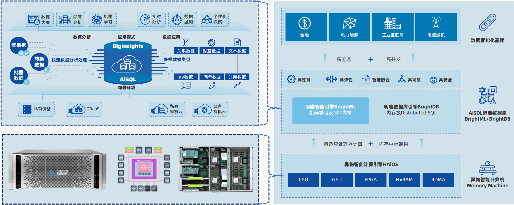

## 明睿智能数据库系统产品简介1

明睿智能数据库系统（简称 AiSQL ）是贝格迈思倾力打造的面向快数据的企业级分布式智能数据库系统。该系统利用新型硬件的革新和软件技术的飞跃，具备自适应异构智能内存计算的极致性能，融合了大模型人工智能技术，具备AI自诊断调优与高度自治的智能特性，同时达到金融级高可用，并保障了全密态计算、存储与传输的极致安全性。其核心技术涵盖异构智能计算引擎BrightOS、先进的分布式内存架构、高效的向量数据引擎、由大模型驱动的智能计算能力、数据压缩可查询和加密可检索技术等。AiSQL 满足从核心交易到复杂计算及分析的全方位企业级业务需求，尤其在处理高速、高并发的实时分析及处理场景中，展现出卓越的性能与高度的适用性。

图1 明睿智能数据库系统产品及应用架构

## 核心特性

**高性能**

软硬一体化设计内存计算框架，打造异构内存计算一体机Bright Machine，实现数据库算力革新。同时，自适应处理器的异构智能计算引擎BrightOS，充分激发Bright Machine的异构处理器协同并行计算能力；另外，采用了分布式SQL与ACID机制、异构计算、矢量加速等多种技术。保障高性能，帮助客户提高混合事务处理速度、加速业务分析。

**分布式弹性扩展**

NewSQL架构体系、完全无共享系统架构、Raft数据同步机制， 通过橫向扩展、数据分片、自动负載均衡等方式，保证了系统的灵活的扩展性。

**数据安全加密**

采用了多种安全技术来保证安全性，包括可查询加密、透明数据加密、访问控制、 安全审计、崩溃恢复和安全备份等技术， 确保数据在数据库生命周期的全密态且可共享

**多模SQL引擎**

系统对外采用统一SQL标准接口，融合NoSQL和机器学习多模引擎，实现对图、文本、时序、键值KV、JSON等多模态数据的管理和访问以及机器学习算法的调度处理，将结构化存储、非结构化存储数据打通，使企业通过简单统一的SQL标准接口，实现数据联合检索。

**智能AI融合**

无缝融合机器学习及大模型技术框架，在数据库内实现AI优化数据库配置、优化管理等数据库自治能力；通过库内机器学习、向量数据的高效存储和检索、AIGC 融合框架简化数据智能应用开发难度，降低行业智能化应用门槛。

**总成本更低**

通过数据压缩技术提高数据存储与管理的效率，减少硬件资源需求，降低运营成本。分布式弹性扩展&收缩能力， 提高数据整合与共享能力，降低系统成本。通过数据库自治提供数据安全、灵活操作和低维护成本，减少人力资源投入。

**混合事务与分析型⼯作负载**

为处理事务型/分析型混合⼯作负载提供了⼀种全新的⼀体化解决⽅案，实现了事务型负载与分析型负载的有效隔离，解决了事务型⼯作负载和分析型⼯作负载资源之间的资源竞争问题。事务数据实时同步到分析引擎，⽆需复杂且耗时的 ETL 步骤，不仅满⾜了事务的 ACID 属性，还解决了业务对数据分析实时性的需求。与传统 TP + AP 架构相⽐，AiSQL的系统架构更加简单，提⾼了数据实时性，并且保证了数据⼀致性。

## 功能概览

**云原生**

AiSQL 将企业级关系数据库功能与云原生架构的水平可扩展性和弹性相结合，可以用客户需要的任何方式和位置进行部署。

**库内机器学习**

AiSQL 扩展了标准SQL语法，支持SQL语句驱动机器学习模型在数据库内的全生命周期管理，包括模型的结构选择、调参、训练、保存、加载和应用。

**多模态数据管理和访问**

系统融合NoSQL和机器学习多模引擎，实现对图、文本、时序、键值（KV）、JSON等多模态数据的管理和访问。用户可以在同一个平台上处理多种类型的数据，无需使用多个独立的系统或工具。

**多模态数据向量化**

AiSQL 扩展了标准SQL语法，支持SQL语句驱动多模态数据（包括文本、图片和音频等）的向量化，即将多模态数据转换成向量表示的形式。

**库内大模型管理**

大模型是大语言模型（Large Language Model，LLM）的简称。AiSQL 扩展了标准SQL语法，支持SQL语句驱动商用大模型（比如ChatGPT）和私有大模型（比如ChatGLM和LLaMA）的保存、加载、精调和应用。

**库内智能搜索**

利用库内向量数据检索和大模型技术的能力，支持用户快速构建企业知识库，并通过自然语言查询快速获取知识库中的问题和答案，提升工作效率和用户体验。

**在线扩缩容**

用户根据业务需求、策略等设置伸缩规则。在业务需求增长时，系统自动增加数据库节点以保证计算存储能力；在业务需求下降时，系统自动减少数据库节点以节约成本。

**冷热分离**

存储层支持数据分层存储，实现冷热数据的分离，可以将比较昂贵的高速存储资源用于频繁的业务，低速的存储资源用于不常访问的业务数据，这样既能降低成本又能最大化提升性能。

**精细监控**

AiSQL 包含有很多指标接口用于监控整个集群（包含主机）的性能和状态。用户可以随时查看系统内部的运行情况。

**混合事务与分析处理（HTAP）**

既支持在线事务处理（OLTP），又支持在线分析处理（OLAP）。采用不同存储引擎分别支撑OLTP和OLAP应用场景，可以保证上层具有更好的业务扩展性。

**可查询加密**

AiSQL 可以选择部署可查询加密中间件，保证明文仅在数据持有者的客户端可见，而数据库服务端仅存储不可见的密文。数据持有者能像使用明文数据库一样正常查询数据库中的数据，而其他用户只能访问读取数据库中的密文数据，无法识别密文对应的明文信息。

**可查询压缩**

AiSQL 还可以选择部署可查询压缩中间件，将数据压缩迁移到另一个等价的较小容量数据库中，以节省存储空间。原始数据库可以由压缩数据库精确恢复，以支持需要原始数据的业务。用户针对原始数据库的查询可以自动转换为针对压缩数据库的查询，在不改动压缩数据的前提下，在压缩数据中精确地回答针对原始数据库的查询，保证查询回答的高效性。

**完整的SQL和ACID支持**

遵循ACID (原子性、一致性、隔离性、持久性) 标准，通过两阶段提交确保分布式事务的原子性，通过多版本并发MVCC控制和分布式事务确保一致性，通过内置的事务管理器确保隔离性，通过利用记录器将提交日志写入持久化内存和SSD来保证持久性。

**统一SQL标准接口**

系统对外提供统一的SQL标准接口，无论数据以何种模态存在，用户都可以通过标准的SQL语法进行查询和操作，大大简化了数据管理的复杂性。

**多租户**

支持多个租户数据库在单一系统中运行，并共享相同的数据库、Schema和表，内置租户ID tenent_id列进行数据分片机制，实现数据隔离。

**高可用性和灾难恢复**

通过采用先进的复制技术、故障检测和转移机制、混合逻辑时钟、分布式文件系统和分区机制等技术，以及全球分布的数据架构，实现了高可用性和灾难恢复。这些技术和策略使得 AiSQL 能够在各种场景下提供稳定、可靠的服务。

**安全管理**

我们采用全密态数据库技术、可查询加密、透明数据加密、访问控制、安全审计、崩溃恢复和安全备份等多层次安全技术，确保数据在数据库生命周期的全密态及可处理性。

**数据库系统管理平台BrightStudio**

提供全面的管理工具明睿智能数据管理平台BrightStudio，以AiSQL数据库为核心，实现一站式、可视化的管理，专用于管理和监控企业级数据库环境及数据， 提供全面的数据库安装、管理、监控、运维、安全、数据分析、自动化等功能，帮助企业提高数据库运维及数据智能效率和可靠性。

**生态工具支持**

支持的生态工具涵盖了从部署、迁移、备份、监控到开发等各个方面，为用户提供了全方位的支持和解决方案。这些工具的集成和使用可以大大简化 AiSQL 的管理和使用过程，提高数据库的可用性和可靠性。

## 应用场景

贝格迈思AiSQL智能数据库尤其适用于高速高并发的实时决策分析应用场景，如量化交易、风险监测、应急指挥以及物联网监测等实时分析应用场景，在政务、金融、医疗、智慧城市、智能制造、电子竞技等领域也有广范的应用，能支撑我国数字经济大数据采集、存储、管理和分析，是数据智能化应用平台的普适基座。

贝格迈思AiSQL智能数据库解决方案专为满足行业智能化需求而设计，在多个关键领域中展示出强大的应用能力，应用场景包括但不限于：

* 金融领域：支持量化交易、征信评估、金融欺诈检测、交易支付和验证，确保交易安全性和效率。
* 医疗健康：在ICU监测等生命关键系统中，提供实时数据分析和处理，辅助医生做出更快决策。
* 网络安全：通过网络安全识别和响应，帮助保护组织免受攻击，维护数据安全。
* 物联网：适用于时序数据处理，优化物联网设备的实时数据分析和决策。
* 智能制造：支持复杂的工业数据处理，提升制造流程的智能化和自动化。
* 政务和通信：满足政府机构和通信行业的数据处理需求，提高服务效率和透明度。
* 电子竞技：为电子竞技行业提供低延迟的数据处理，优化用户体验。
* 零售业：支持客户数据分析，提升个性化服务和营销效果。

贝格迈思AiSQL不仅在金融、医药、物联网、制造、政务、通信、网络安全和电子竞技等领域有着广泛应用，还适用于需要实时交易和分析决策的多种场景，如风险管控、应急指挥等。凭借卓越的升级扩容能力和传统数据库的国产化替代能力，AiSQL已经称为各类组织在数字化转型过程中的优选数据库产品。
