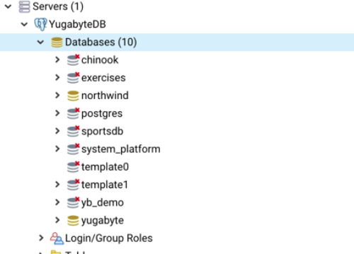

由于 AiSQL 与 PostgreSQL 和 Cassandra 兼容，因此您可以使用第三方客户端连接到 AiSQL 集群。

**工具**
* Apache Superset
* Arctype
* DBeaver
* DbSchema
* Metabase
* pgAdmin
* SQL Workbench/J
* TablePlus
**AiSQL 先决条件**
要将这些工具与 AiSQL 一起使用，您应该启动并运行一个集群，并且您需要知道客户端连接到集群所需的连接参数。

要创建本地集群，请按照快速入门中的步骤操作。

**连接参数**
要连接，请按照客户端的配置步骤操作，并使用以下值：
Hostname:localhost 或节点的 IP 地址
Port:2521 (BSQL) 9542 (BCQL)
Database:数据库名称（默认为 bigmath）
Username:bigmath 或 cassandra
Password:bigmath或cassandra；如果未启用身份验证，则留空

## **Apache Superset**
Apache Superset 是一个开源数据探索和可视化工具，可帮助您查询 AiSQL 中存储的数据，并使用基本折线图到高度详细的地理空间图表将其可视化。

您可以使用 Superset 快速探索和可视化存储在数据库和数据仓库中的数据。 您无需编写复杂的 SQL 查询即可探索数据，创建丰富的报告和自定义仪表板来可视化这些数据，并快速获得见解。


### **准备**
您的 AiSQL 集群应该已启动并正在运行。 请参阅 AiSQL 先决条件。

加载一些数据以进行探索和可视化。 对于本地安装，您可以使用 shell 中的 ./bin/bm-ctl demo connect 命令加载 Northwind 示例数据库，或者按照说明进行操作。

1.安装Superset
您可以使用 Python (pip3)（推荐）或 Docker Compose 从头开始安装 Superset。

2.安装驱动程序
安装 Superset 后，安装 AiSQL psycopg2 智能驱动程序。 如果安装了 PostgreSQL psycopg2 驱动程序，则必须先将其删除。

要检查 PostgreSQL psycopg2 驱动程序是否已安装，请输入以下命令：
pip show psycopg2

如果存在，请按如下方式卸载驱动程序：
pip uninstall psycopg2

要安装 AiSQL psycopg2 智能驱动程序，请输入以下内容：
pip install psycopg2-brightdb

### **将 Superset 连接到 AiSQL**
在浏览器中启动 Superset，网址为 http://<主机名或 IP 地址>:8088。 如果您已安装在本地计算机上，请导航到 localhost:8088 或 127.0.0.1:8088。 AiSQL v2.19 及更高版本也可以用作 Superset 元存储。

要将 Apache Superset 连接到 AiSQL：

1.导航到Data > Databases > + Databases，然后从连接数据库菜单中选择 PostgreSQL。


2.使用标准凭据输入 AiSQL Tile服务器的主机名或 IP 地址，然后单击完成。


3.验证您是否可以访问“Data”下的可用数据库和架构。 导航到Data > Datasets，然后单击“+Datasets”。

下拉列表应显示可用于探索和可视化的数据库和模式。


您已成功创建与 AiSQL 数据库的连接，现在可以开始使用 Apache Superset 探索和可视化您的数据库。

### **进一步使用**
请参阅 Apache Superset 文档，了解有关 Superset 数据探索功能的更多信息。 如果您要使用 Superset 创建第一个仪表板，请查看数据分析和探索工作流程。

## **Arctype**
Arctype 是一款免费且跨平台的协作 SQL 数据库客户端。 它为团队提供一键查询共享，您可以可视化查询输出并将多个图表和表格组合到仪表板中。

Arctype 还集成了对连接 AiSQL 集群的支持。

本文档介绍了如何使用 Arctype 连接到 AiSQL。


### **准备**
您的 AiSQL 集群应该已启动并正在运行。 请参阅 AiSQL 先决条件。

### **安装Arctype**
从 Arctype 网站下载适用于 Windows、Linux 和 Mac 的客户端。

### **创建数据库连接**
请按照以下步骤将 Arctype 桌面客户端连接到 AiSQL：
1.启动 Arctype 桌面客户端。
2.按照应用程序内的提示创建并登录您的 Arctype 帐户。
3.在“Connect a Database”步骤中，选择 AiSQL。


4.输入您的 AiSQL 连接参数。

5.单击“Test Connection”，如果连接成功，请单击“Save”。


您可以在导航面板中看到 AiSQL 中可用的架构和表。


您已成功创建与 AiSQL 数据库的连接，现在可以开始使用 Arctype 查询和可视化您的数据库。

### **进一步使用**
要了解有关 Arctype 的更多信息，请参阅 Arctype 文档。

要了解 Arctype 与 AiSQL 的集成，请参阅 AiSQL 与 Arctype SQL 客户端集成博客文章和 Arctype 文档中的 AiSQL。

AiSQL 包含示例数据库供您探索。 请参阅示例数据集。


## **DBeaver**
DBeaver 是一款免费的开源多平台、跨平台数据库工具，适用于开发人员、SQL 程序员和数据库管理员。 DBeaver支持各种数据库，包括PostgreSQL、MariaDB、MySQL、AiSQL。 此外，还有支持 JDBC 驱动程序的其他数据库的插件和扩展。 DBeaver 企业版支持非 JDBC 数据源，并允许您探索 bigmath BCQL 表。


### **先决条件**
在开始将 DBeaver 与 BSQL 结合使用之前，您需要执行以下操作：
1.启动 AiSQL。
有关更多信息，请参阅快速入门。
2.安装适用于 Java 8 或更高版本的 JRE 或 JDK。
可以从 OpenJDK、AdoptOpenJDK 或 Azul Systems 下载安装程序。 请注意，某些安装程序包含只能由 DBeaver 访问的 JRE。
3.安装DBeaver如下：
从 DBeaver Downloads 下载适合您的操作系统的分发包。
按照 DBeaver 安装中的说明开始安装。

### **创建BSQL连接**
您可以按如下方式创建连接：
1.启动 DBeaver。
2.导航到Database > New Connection 以打开Connect to database窗口，如下图所示。

3.在“Select your database”列表中，选择 AiSQL，然后单击“Next”。


4.使用连接设置指定以下内容：
* Host：localhost
* Port：2521
* Database：将默认值 postgres 替换为 bigmath 。
* User：bigmath
* Password：如果未启用 BSQL 身份验证，请留空。 如果启用，请添加 bigmath 的密码（默认为 bigmath）。
* 选择Show all databases。

5.单击“Test Connection”，验证连接是否成功，如下图所示：


DBeaver 的数据库导航器应显示 bigmath - localhost。

您可以展开列表以查看 bigmath 用户可用的所有数据库，如下图所示：


## **DbSchema**
DbSchema 是一种可视化数据库工具，通过单一界面支持 40 多个数据库，可用于对模式进行逆向工程、编辑实体关系 (ER) 图、浏览数据、可视化构建查询和同步模式。 本文档介绍如何将 DbSchema 连接到 AiSQL 数据库。


### **准备**
您的 AiSQL 集群应该已启动并正在运行。 请参阅 AiSQL 先决条件。

### **安装 DbSchema**
从下载 DbSchema 页面下载客户端计算机上操作系统的分发包。
使用安装向导安装 DbSchema。

### **创建数据库连接**
以下步骤显示如何配置在本地主机上运行的 AiSQL。
1.启动 DbSchema 应用程序。 将出现“欢迎使用 DbSchema”页面。
2.在“开始新项目”面板上，单击“开始”以连接到数据库。 数据库连接对话框打开。
3.在别名字段中，输入 AiSQL 来命名数据库连接。
4.从 DBMS 下拉列表中，选择 PostgreSQL。 方法和驱动程序字段显示可用的 PostgreSQL JDBC 驱动程序。
5.对于方法和驱动程序选项，选择标准（1 / 2）。 无需添加驱动程序，因为 DbSchema 包含 PostgreSQL JDBC 驱动程序。
6.在Compose URL 选项卡中，单击远程计算机或自定义端口。 将显示服务器主机和端口的默认 PostgreSQL 值。
7.在端口字段中，输入 2521（BSQL 的默认端口），然后单击检查 (Ping)。 将出现一条消息，表明 AiSQL 服务器可以访问。
8.在“身份验证”下，将“数据库用户”更改为 bigmath（默认 AiSQL 用户）。 如果您已启用身份验证，请输入密码。 否则，将该字段留空。
9.在“数据库”下，输入 bigmath（默认 AiSQL 数据库）或要连接的数据库的名称。
10.单击“连接”。 将出现“选择模式/目录”对话框。
11.单击“确定”接受默认选项。 否则，您可以自定义此连接所需的架构信息。

您已使用默认用户 (bigmath) 成功创建了到默认数据库 (bigmath) 的数据库连接。

### **进一步使用**
有关使用 DbSchema 的帮助，请参阅 DbSchema 文档。

AiSQL 包含示例数据库供您使用 DbSchema 进行探索。 请参阅示例数据集。


## **Metabase**
Metabase 是一种商业智能 (BI) 工具。

本文档展示了如何设置 Metabase 以与 AiSQL 的 PostgreSQL 兼容 API 集成。

1.启动本地集群
按照快速入门说明运行本地 AiSQL 集群。

2. 加载数据
    （1）下载示例架构

  ```
  $ wget https://raw.githubusercontent.com/bigmath/bm-sql-workshop/mserver/query-using-bi-tools/schema.sql
  ```

​        （2）下载样本数据

```
$ wget https://github.com/bigmath/bm-sql-workshop/raw/mserver/query-using-bi-tools/sample-data.tgz
$ tar zxvf sample-data.tgz
$ ls data/
orders.sql  products.sql  reviews.sql  users.sql
```

（3）使用 sqlsh 连接到 AiSQL
运行以下命令使用 BSQL shell 连接到 AiSQL：

```
$ ./bin/sqlsh

sqlsh (11.2)
Type "help" for help.

bigmath=#
```

（4）创建数据库

```
bigmath=# CREATE DATABASE bm-demo;
bigmath=# GRANT ALL ON DATABASE bm-demo to bigmath;
bigmath=# \c bm-demo;
```

（5）创建架构并加载数据
首先创建存储数据所需的 4 个表：

```
bigmath=# \i 'schema.sql';
```

现在将数据加载到表中：

```
bigmath=# \i 'data/products.sql'
bigmath=# \i 'data/users.sql'
bigmath=# \i 'data/orders.sql'
bigmath=# \i 'data/reviews.sql'
```

3.下载并配置Metabase
设置Metabase的详细步骤可在Metabase文档中找到。 以下是入门的最少步骤：

```
$ wget http://downloads.metabase.com/v0.30.4/metabase.jar

$ java -jar metabase.jar
```

转至 http://localhost:3000 配置您的 Metabase 服务器并将其指向 localhost:2521 处的 BSQL API 端点。

4. 使用Metabase运行复杂查询
有关如何使用 Metabase 的详细步骤，请参阅 Metabase 文档。 对于本文档，您将特别关注提出需要 RDBMS 功能的问题。
* 使用 WHERE 子句过滤数据
* 表之间连接数据
* 使用 GROUP BY 执行数据聚合
* 使用内置函数，例如 SUM、MIN、MAX 等

单击提出问题 > 自定义查询。 选择您刚刚设置的数据库，然后输入“零售分析”部分中记录的 SQL 查询。

## **pgAdmin**
pgAdmin 是一个流行的开源 PostgreSQL 数据库管理工具。 它简化了数据库对象的创建、维护和使用。 PgAdmin 包括一个连接向导、用于导入 SQL 脚本的内置 SQL 编辑器以及自动生成 SQL 脚本的机制（如果您需要在数据库命令行 shell 上运行它们）。 您可以通过 Web 界面运行 PgAdmin，也可以作为本地安装的可下载应用程序运行。 由于 AiSQL 与 PostgreSQL 兼容，因此您还可以使用 pgAdmin 来使用 AiSQL。

### **准备**
要将 pgAdmin 与 AiSQL 结合使用，您需要启动并运行 AiSQL、所需的 Java 运行时环境以及所需的 PostgreSQL JDBC 驱动程序。

1.AiSQL 
您的 AiSQL 集群应该已启动并正在运行。 请参阅 AiSQL 先决条件。

2.PostgreSQL JDBC 驱动程序
要将 pgAdmin 连接到 AiSQL 集群，您需要安装 PostgreSQL JDBC 驱动程序。 要下载支持 Java 8 或更高版本的当前版本，请转至 PostgreSQL JDBC 驱动程序下载页面。

### **安装pgAdmin**
要安装 pgAdmin，请转至下载页面并选择适合您操作系统的 pgAdmin 4 版本。

### **配置pgAdmin**
添加 pgAdmin 服务器以连接到集群，如下所示：

1.启动 pgAdmin 4 应用程序。 系统会提示您保存应用程序的主密码。
2.在“快速链接”下，单击“添加新服务器”以显示“注册 - 服务器”窗口。
3.在“常规”选项卡上，输入服务器的名称，例如 BMManaged。
4.在“连接”选项卡上，填写连接参数。
5.对于 AiSQL 托管集群，在 SSL 选项卡上，将根证书设置为您下载的集群根证书。
6.单击“保存”。 新连接出现在应用程序中。

展开数据库以查看所有可用数据库的列表。



您可以开始探索 AiSQL 数据库。

### **进一步使用**
有关使用 pgAdmin 的详细信息，请单击 pgAdmin 菜单中的帮助。

如果您正在寻找示例数据库来使用 pgAdmin 探索 AiSQL，请参阅示例数据集。

## **SQL Workbench/J**
SQL Workbench/J 是一款免费、独立于 DBMS 的跨平台 SQL 查询工具，也可与 AiSQL 配合使用。 SQL Workbench/J 是用 Java 编写的，应该在提供 Java 运行时环境 (JRE) 的任何操作系统上运行。

SQL Workbench/J 主要关注以下几个方面：
* 以交互方式或批量方式运行 SQL 脚本
* 丰富的数据集导入导出支持
* 直接在查询结果视图中编辑、插入和删除数据
* 在控制台模式下运行查询

在本节中，您将了解如何将 SQL Workbench/J 与本地集群上的所有 AiSQL API 连接。 SQL Workbench/J 与 AiSQL 配合使用不会出现任何问题，因为 AiSQL API 在有线协议级别与 SQL Workbench/J 已支持的数据库兼容。

### **准备**
要将 SQL Workbench/J 与 AiSQL 结合使用，您需要启动并运行 AiSQL、所需的 Java 运行时环境 (JRE) 以及所需的 PostgreSQL JDBC 驱动程序。

1.AiSQL
您的 AiSQL 集群应该已启动并正在运行。 请参阅 AiSQL 先决条件。

2.Java 运行时环境 (JRE)
SQL Workbench/J 需要 Java 8 或更高版本的 Java 运行时（或 JDK）。 适用于 Linux、macOS 和 Windows 的 JRE 和 JDK 安装程序可以从 OpenJDK、AdoptOpenJDK 或 Azul Systems 下载。

有关 JRE 要求的详细信息，请参阅 SQL Workbench/J 入门页面中的先决条件部分。

3.PostgreSQL JDBC 驱动程序
要将 SQL Workbench/J 连接到 AiSQL 集群，您需要安装 PostgreSQL JDBC 驱动程序。 要下载支持 Java 8 或更高版本的当前版本，请转至 PostgreSQL JDBC 驱动程序下载页面。

### **安装 SQL Workbench/J**
1.转至 SQL Workbench/J 网站并下载适用于您的客户端计算机上的操作系统的分发包。
2.将存档解压到您选择的目录中。

该应用程序现在已准备好运行 - 无需执行进一步的步骤。 有关详细信息，请参阅 SQL Workbench/J 用户手册中的安装和启动 SQL Workbench/J。

### **配置 SQL Workbench/J**
1.配置 PostgreSQL 驱动程序
AiSQL 与 PostgreSQL 兼容，因此在使用 SQL Workbench/J 时，请使用 PostgreSQL JDBC 驱动程序。

（1）启动 SQL Workbench/J 应用程序。 将出现“选择连接配置文件”弹出窗口。


（2）单击“管理驱动程序”（位于窗口左下角）以打开“管理驱动程序”窗口。


（3）在驱动程序列表中，选择 PostgreSQL，然后编辑驱动程序的字段：
* Name：PostgreSQL（用于 AiSQL）
* Library：显示 PostgreSQL JDBC 驱动程序 JAR 文件的位置。 [对于新配置，请浏览到文件位置并单击“选择”。] 安装后，JRE 或 JDK 的默认位置为：
\Library\Java\Extensions\<jdbc-driver>.jar`

* Classname：org.postgresql.Driver
* Sample URL：jdbc:postgresql:127.0.0.1:2521/name_of_database（基于 AiSQL 默认值）。 初次打开驱动程序配置时，该字段显示
jdbc:postgresql://host:port/name_of_database

（4）单击“确定”。 “管理驱动程序”窗口将关闭并返回到“选择连接配置文件”窗口。

您现在已经配置了 PostgreSQL JDBC 驱动程序以与 AiSQL 一起使用，现在可以创建连接配置文件。

有关更多信息，请参阅：

SQL Workbench/J 用户手册中的 JDBC 驱动程序。
PostgreSQL JDBC 驱动程序文档。

2.创建 AiSQL 连接配置文件
您需要为您使用的每个数据库创建一个连接配置文件，并且您始终可以通过选择“文件”>“连接”窗口从菜单进入“选择连接配置文件”窗口。
（1）在“选择连接配置文件”窗口中，单击“创建新的连接配置文件”。 创建一个新的配置文件。
（2）将 New profile 替换为连接配置文件的有意义的名称。 由于每个数据库连接都需要一个单独的配置文件，因此请在配置文件名称中包含数据库名称。
（3）对于驱动程序，选择 PostgreSQL（对于 AiSQL）(org.postgresql.Driver)。
（4）对于 URL，将 name_of_database 替换为要连接的数据库的名称。
（5）对于用户名，输入 bigmath 或您将使用的用户名。
（6）对于密码，请将字段留空，除非启用了 BSQL 身份验证。
（7）选择自动提交。 在 PostgreSQL 和 AiSQL 中，AUTOCOMMIT 默认处于打开状态。
（8）单击“测试”以验证连接是否成功。
（9）单击“确定”。 将出现 SQL Workbench/J 默认窗口。 您的连接现在可以使用了。

这就是开始使用连接所需的所有设置。 有关配置文件的详细信息，请参阅 SQL Workbench/J 用户手册中的连接到数据库。

### **进一步使用**
现在您已经了解了如何配置 SQL Workbench/J 以与 AiSQL 数据库配合使用，您可以开始探索 SQL Workbench/J 的功能。 有关使用 SQL Workbench/J 的详细信息，请参阅 SQL Workbench/J 用户手册。

如果您正在寻找示例数据库以使用 SQL Workbench/J 探索 AiSQL，请参阅示例数据。

## **TablePlus**
TablePlus 是一款流行的数据库开发人员控制台，具有与 PostgreSQL、Cassandra 和 Redis 等主要数据库的内置集成。 可以免费开始使用升级到永久付费许可证的选项。 TablePlus 与 AiSQL 配合使用不会出现任何问题，因为 AiSQL API 在有线协议级别与 TablePlus 已支持的数据库兼容。

本教程展示如何将 TablePlus 连接到 AiSQL 集群。

### **准备**
您的 AiSQL 集群应该已启动并正在运行。 请参阅 AiSQL 先决条件。

### **安装TablePlus**
要安装 TablePlus，请转至下载页面并选择适合您的操作系统的版本。

### **创建连接**
您可以使用 TablePlus 通过 BSQL 和 BCQL API 连接到 AiSQL。

要创建连接，请执行以下操作：
1.在 TablePlus 中，从“连接”菜单中选择“新建”。
2.对于 BSQL 选择 PostgreSQL，对于 BCQL 选择 Cassandra，然后单击“创建”。


3.输入连接的名称并填写连接参数。
4.单击“测试”以验证 TablePlus 是否可以与 AiSQL 连接。 如果测试成功，字段的颜色将变为绿色。


5.单击“连接”以创建连接。

连接保存在应用程序中，并在每次启动 TablePlus 时显示。

