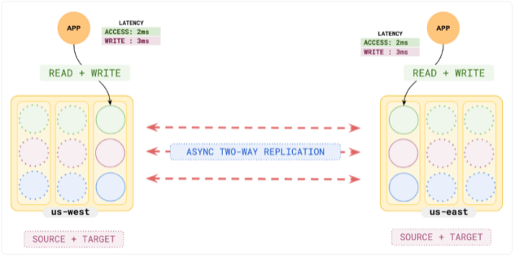

独立 AiSQL Universe 之间的异步复制.

## **同步复制与异步复制**

AiSQL的同步复制可用于容忍丢失整个数据中心或区域。 它在分布于多个（三个或更多）数据中心的单一universe中复制数据，因此一个数据中心的丢失不会影响 Raft 共识算法的可用性、持久性或强一致性。

然而，以这种方式使用同步复制有两个重要的缺点：

* 高写入延迟：每次写入必须在至少两个数据中心之间达成共识，这意味着数据中心之间至少有一次往返。 这可能会在多区域部署中增加数十甚至数百毫秒的额外延迟。

* 需要至少三个数据中心：由于共识需要奇数个故障域，因此必须使用至少三个数据中心，这会增加运营成本。

作为替代方案，AiSQL 提供异步复制，可在两个或多个单独的 Universe 之间复制数据。 它没有同步复制的缺点：因为它是在后台完成的，所以不会影响写入延迟，并且因为它不使用共识，所以不需要第三个数据中心。

然而，异步复制也有其自身的缺点，包括：

* 故障时数据丢失：当Universe发生故障时，其中尚未复制的数据将丢失。 丢失的数据量取决于复制延迟，通常为亚秒级。
* 事务性的限制：由于universe中的事务无法相互协调，因此要么必须限制事务的类型，要么必须失去某些一致性和隔离性。

## **AiSQL 的 xDCR 复制**

xDCR复制是AiSQL为灾难恢复而实现的异步复制。 它允许您在 Universe 之间设置一个或多个单向复制流。 请注意，xDCR 只能用于在两个不同 Universe 中的主集群之间进行复制； 它不能用于在同一universe中的集群之间进行复制。 （有关universe和cluster之间区别的更多信息，请参阅universe与cluster）

对于每个流，数据从源（也称为生产者）Universe 复制到目标（也称为消费者）Universe。 复制是在 CoreDB 级别完成的，源 Universe 中新提交的写入会异步复制到目标 Universe。 BSQL 和 BCQL 均受支持。

可以使用多个流； 例如，两个Universe之间的两个单向流（每个方向一个）会产生双向复制，其中在一个Universe中写入的任何内容都将复制到另一个Universe - 数据仅异步复制一次以避免无限循环。 

尽管为了简单起见，我们将描述整个 Universe 之间的流，但流实际上由一对表之间的流组成，每个 Universe 中有一个，仅允许复制某些命名空间或表。

xDCR 比假设的方案更灵活，当主副本丢失时，只读副本将提升为完整副本，因为它不需要两个 Universe 紧密耦合。 例如，使用xDCR，同一个表可以在两个universe中以不同的方式拆分为Tile。 xDCR 还允许双向复制，这是使用只读副本无法实现的，因为只读副本无法进行写入。

## **异步复制模式**

因为在丢失多少一致性和允许哪些事务之间存在有用的权衡，所以 AiSQL 提供了两种不同的异步复制模式：

* 非事务复制：允许所有事务，但会丢失一些一致性
* 事务复制：保留一致性，但目标universe事务必须是只读的

**1.非事务性复制**
在这里，每个事务在源 Universe 中提交后，其写入都会独立复制到目标 Universe，并在目标 Universe 中应用与源 Universe 上相同的时间戳。 目标端不会采取或兑现任何锁定。

请注意，就目标universe而言，写入通常是在过去写入的。 这违反了 AiSQL 提供一致读取的先决条件（请参阅有关安全时间戳的讨论）。 因此，对目标universe的读取不再是强一致的，而是最终一致的。

如果目标 Universe 和源 Universe 都写入相同的键，则最后一个写入者获胜。 决定因素是每个universe更新的底层混合时间。

由于复制滞后，在源 Universe 上完成写入后立即在目标 Universe 中完成的读取可能看不到该写入。 另一种说法是，目标 Universe 中的读取不会等待源 Universe 中的最新数据变得可见

**影响事务的不一致**
由于写入是独立复制的，因此随着时间的推移，来自源 Universe 的事务变得可见。 这意味着目标 Universe 中的事务可以看到非重复读取和幻像读取，无论其声明的隔离级别是什么。 实际上，目标 Universe 上的所有事务都处于 SQL-92 隔离级别 READ COMMITTED，这仅保证事务永远不会读取未提交的数据。 与正常的 AiSQL READ COMMITTED 级别不同，这并不能保证语句将看到一致的快照或在该语句发出之前已提交的所有数据。

如果源 Universe 死亡，则目标 Universe 可能会处于不一致状态，其中某些源 Universe 事务仅将部分写入应用于目标 Universe（这些称为撕裂事务）。 这种不一致不会随着时间的推移自动修复，可能需要手动解决。

请注意，这些不一致仅限于从源 Universe 写入和复制的表/行：任何不与此类行交互的目标事务都不会受到影响。

**2.事务复制**
这种模式是前一种模式的延伸。 为了恢复一致性，我们还禁止对目标 Universe 进行写入，并导致读取时间距过去足够远的时间（通常为 250 毫秒），使得来自源 Universe 的所有相关数据都已被复制。

特别是，我们选择从 T 开始读取的时间，以便来自将在时间 T 或之前提交的所有源事务的所有写入都已复制到目标 Universe。 换句话说，我们在过去足够远的时间读到，在该时间或之前不可能有新的传入源提交。 这将恢复一致的读取并确保源 Universe 事务结果以原子方式可见。 请注意，我们不会等待任何当前正在进行的源universe事务。

为了知道何时读取，我们维护了一个名为 xDCR 安全时间的安全时间模拟，它是 xDCR 事务复制当前安全读取的最新时间，以保证一致性和原子性。 xDCR 安全时间随着复制的进行而提前，但由于当前的复制滞后而落后于实时时间。 这意味着，例如，如果我们在源 Universe 中于下午 2 点写入并在目标 Universe 中于下午 2:01 读取，并且复制延迟为 5 分钟，则读取将在下午 1:56 读取，并且不会看到写。 假设复制延迟保持在五分钟，我们直到下午 2:06 才能在目标 Universe 中看到写入。

如果源 Universe 死亡，那么我们可以使用 AiSQL 的时间点恢复 (PITR) 功能将其回退到最新的 xDCR 安全时间（示例中为下午 1:56），从而丢弃目标 Universe 中的所有不完整信息。 结果将是通过应用源 Universe 事务的前缀而产生的完全一致的数据库，即那些在 xDCR 安全时间或之前提交的事务。 与非事务复制不同，因此不需要处理撕裂的事务。

目前还不清楚如何使用这种通过仅在过去的安全时间读取来保持一致性的策略来最好地支持目标universe中的写入：目标更新事务似乎需要从过去读取但在现在写入； 因此，它必须至少等待复制延迟，以确保在该时间间隔内不会发生来自源 Universe 的干扰写入。 因此，此类交易会很慢并且容易中止。

因此，使用 xDCR 事务复制时当前不允许目标写入。 这意味着事务复制模式无法支持双向复制。

目标universe只读事务仍然被允许； 它们在过去拍摄的单个一致快照上以可串行化的隔离级别运行。

## **高层实施细节**

在较高级别上，xDCR 复制是通过在目标 Universe 中设置轮询器来实现的，这些轮询器轮询源 Universe Tablet 服务器以了解最近的更改。 每个轮询器独立工作并轮询一个源Tile，将收到的更改分发到一组目标Tile中。

轮询的Tile仅检查其 Raft 日志以确定最近发生了哪些更改，而不是查看其 RocksDB 实例。 传入的轮询请求指定要开始收集更改的 Raft 日志条目 ID，响应包括一批更改和下次继续的 Raft 日志条目 ID。

轮询器偶尔会检查他们处理的最后一批更改的继续 Raft ID； 这确保每个更改至少被处理一次。

**1.源Tile和目标Tile之间的映射**
在简单的情况下，我们可以将轮询器与轮询相应源Tile的每个目标Tile相关联。

但是，在一般情况下，源 Universe 和目标 Universe 中表的 Tablet 数量可能不同。 即使Tablet的数量相同，由于过去发生在不同地方的Tablet分裂，它们也可能具有不同的分片边界。

这意味着每个目标Tile可能需要来自多个源Tile的更改，并且多个目标Tile可能需要来自同一源Tile的更改。 为了避免对同一个源tablet进行多次冗余的跨universe读取，每个源tablet只有一个轮询器读取； 如果多个目标Tile需要源Tile的更改，则分配给该源Tile的轮询器会将更改分发到相关的目标Tile。

下图显示了一张表的情况：

此处，源 Universe 位于左侧，具有三个 dbserver（白色框），每个 dbserver 包含一个表（内部框)以及显示的表范围。 目标universe位于右侧，少了一台 dbserver 和Tile。 如您所见，顶级源 Tablet 的数据由顶级目标 dbserver 中运行的轮询器在两个目标 Tablet 之间分割，其余源 Tablet 的数据由另一个目标 dbserver 中运行的轮询器复制到第二个目标 Tablet。 为简单起见，此处仅显示Tile领导者 - 轮询器仅在领导者处运行并进行轮询。

Tablet 分裂会生成一个 Raft 日志条目，该日志条目会被复制到目标端，以便在源 Tablet 分裂时可以根据需要更新轮询器到源 Tablet 的映射。

**2.单分片事务**
这些都很简单：当其中一个事务提交时，会生成一个 Raft 日志条目，其中包含该事务的所有写入及其提交时间。 当轮询器请求更改时，该条目又用于生成一批更改的一部分。

收到更改后，轮询器会检查每个写入以查看写入的键，以确定哪个目标Tile覆盖了表的该部分。 然后轮询器将写入转发到适当的Tile。 写入的提交时间将被保留，并且写入将被标记为外部，这可以防止它们被 xDCR 进一步复制，无论是向前复制到其他集群还是在双向情况下返回到它们来自的集群。

**3.分布式事务**
这些比较复杂，因为它们涉及多个 Raft 记录和事务状态表。 稍微简化一下，每次这些事务之一进行临时写入时，都会在相应的Tile上创建一个 Raft 条目，并且在事务提交后，在所有涉及的Tile上都会创建一个 Raft 条目以应用该事务。 这里应用事务意味着将其写入从临时写入转换为常规写入。

临时写入的处理方式与单分片事务情况下的正常写入类似，但被写入临时记录而不是正常写入。 使用与通常的临时记录格式不同的特殊惰性格式。 这既节省了空间，因为目标端不需要的原始锁定信息被省略，并且防止临时记录与目标读取或锁定路径交互。 这确保了事务不会影响目标端的事务。

应用 Raft 条目还会生成轮询器收到的更改。 当轮询器收到应用条目时，它会向它处理的所有目标Tile发送指令以应用给定的事务。 目标Tile上的事务应用程序与源 Universe 上的事务应用程序类似，但由于临时记录格式不同而存在其他差异。 它将临时写入转换为常规写入，再次在与源 Universe 相同的提交时间并将它们标记为外部。 此时，事务对此Tile的写入对读取可见。

由于轮询器独立运行，并且对多个Tile的写入/应用不是作为一组原子完成的，因此从单个事务（甚至是单分片事务）到多个Tile的写入可能在不同时间变得可见。

当源事务提交时，它会被延迟地应用于相关的tablet。 这意味着，即使事务 X 在事务 Y 之前提交，但在某些Tile上，X 的应用程序 Raft 条目可能会发生在 Y 的应用程序 Raft 条目之后。 如果发生这种情况，来自 X 的写入可能会在 Y 之后在目标 Universe 中变得可见。 这就是为什么非事务模式读取仅最终一致而不是时间线一致的原因。

**4.事务模式**
xDCR 安全时间是由目标universe主领导者为每个数据库计算的，作为该数据库中任何 Tablet 已达到的最小 xDCR 应用程序时间。 轮询器使用来自源tablet 服务器的信息来确定该时间，其形式为“一旦您完全应用了此之前的所有更改，则此tablet 的xDCR 应用程序时间将为T”。

当源tablet服务器确定没有涉及该tablet的活动事务可以在T之前提交并且涉及在T之前提交的该tablet的所有事务具有先前已作为更改发送的应用程序Raft条目时，源tablet服务器发送此类信息。 它还定期（当前为 250 毫秒）检查缺少应用 Raft 条目的已提交事务，并为它们生成此类条目； 这有助于 xDCR 安全时间提前得更快。

## **架构差异**

xDCR 复制不支持在具有不同架构的表的两个副本之间进行复制。 例如，您无法将表复制到缺少列或列具有不同类型的表的版本。

更巧妙的是，此限制扩展到隐藏模式元数据，例如将列 ID 分配给列。 仅仅因为两个表在 BSQL 中显示相同的模式并不意味着它们的模式实际上是相同的。 因此，在实践中，目标表模式需要从源表的模式复制； 有关如何完成此操作的信息，请参阅复制引导。

由于此限制，当在 Universe 之间复制行时，xDCR 不需要对行内容进行深度转换（例如，删除列或转换键和值内的列 ID）。 避免深度翻译可以简化代码并降低复制成本。

**支持架构更改**
如今，这是一个手动过程，必须在一侧手动进行完全相同的架构更改，然后在另一侧进行。 当检测到架构差异时，给定表的复制会自动暂停，并在架构再次相同时恢复。

正在进行的工作 #11537 将实现这一自动化：对源 Universe 进行的架构更改将自动复制到目标 Universe 并进行，从而允许复制继续运行而无需操作员干预。

## **复制引导Replication bootstrapping**

xDCR 复制会将源 Universe 上所做的更改复制到目标 Universe。 如果源 Universe 开始为空，这很好，但如果我们想要开始复制已包含数据的 Universe 该怎么办？

在这种情况下，我们需要通过首先将源 Universe 复制到目标 Universe 来引导复制过程。

如今，这是通过备份源 Universe 并将其恢复到目标 Universe 来完成的。 除了复制所有数据之外，这还会复制表架构，以便它们在两侧相同。 在备份完成之前，当前的 Raft 日志 ID 会被保存，以便在从备份完成之前的时间恢复后可以开始复制。 这可确保复制备份期间写入源 Universe 的任何数据。

正在进行的工作#17862 将使用在源 Universe 和目标 Universe 之间直接复制 RocksDB 文件来取代此处的备份和恢复。 这将提高性能和灵活性，并且无需使用 S3 等外部存储来设置复制。

## **支持的部署场景**

xDCR目前支持主动-被动和主动-主动部署。

**1.主动-被动**
此处，从源 Universe 到目标 Universe 的复制是单向的。 目标 Universe 通常位于与源 Universe 不同的数据中心或区域中。 目标 Universe 是被动的，因为它不接受来自更高层服务的写入。

通常，此类部署用于提供来自目标 Universe 的低延迟读取以及灾难恢复目的。 当主要用于灾难恢复目的时，这些部署也称为主动-备用，因为如果源 Universe 丢失，目标 Universe 会随时接管。

此处可以使用事务模式或非事务模式，但通常首选事务模式，因为如果源 Universe 丢失，它可以提供一致性。

下图显示了主动-被动部署示例：

**2.主动-主动**
数据复制可以在两个 Universe 之间双向进行，在这种情况下，两个 Universe 都可以执行读取和写入操作。 对任何 Universe 的写入都会异步复制到另一个 Universe，并带有更新时间戳。 如果相同的键在相似的时间在两个 Universe 中更新，则会导致具有较大时间戳的写入成为最新写入。 在这种情况下，Universe 都是活动的，这种部署模式称为多主部署或双活部署。

多主部署是使用非事务模式的两个源-目标单向复制流在内部构建的。 特别注意确保分配时间戳以保证最后写入者获胜语义，并且从复制流到达的数据不会被重新复制。

下图显示了主动-主动部署示例：

## **不支持的部署场景**

AiSQL 尚不支持许多部署方案。

**1.广播**
此拓扑涉及一个源 Universe 向多个目标 Universe 发送数据。 有关详细信息，请参阅#11535。

**2.合并**
此拓扑涉及多个源 Universe 将数据发送到一个中央目标 Universe。 有关详细信息，请参阅#11535。

**3.更复杂的拓扑**
除了传统的 1:1 拓扑以及之前描述的 1:N 和 N:1 拓扑之外，还有许多其他当前不支持的所需配置，例如：

* Daisy chaining，涉及连接一系列作为源和目标的 Universe，例如：A <-> B <-> C
* 环，涉及将一系列universe连接成一个环，例如：A <-> B <-> C <-> A
  一旦广播和整合用例得到解决，其中一些拓扑可能会自然变得可用，从而允许一个 Universe 同时成为多个其他 Universe 的源和目标。 有关详细信息，请参阅#11535

## **局限性**

除了可能的部署之外，当前的 xDCR 实现还存在许多限制。

**1.数据库触发器不会针对复制数据触发**
由于 xDCR 复制绕过查询层，因此不会在复制记录的目标端触发任何数据库触发器，这可能会导致意外行为。

**2.无法在主动-主动中强制执行约束**
同样，无法检查主动-主动设置中是否违反唯一约束。 例如，在不同的 Universe 中可能存在两个冲突的写入，这两个写入一起将违反唯一约束并导致主表包含两行，但索引仅包含一行，从而导致不一致的状态。

因此，使用主动-主动的应用程序应避免使用 UNIQUE 索引和约束以及主键中的串行列：因为两个 Universe 生成相同的序列号，这可能会导致行冲突。 建议使用 UUID 代替。

将来，可能会默认检测到此类不安全约束并发出警告。 这在 #11539 中进行了跟踪。

请注意，如果您尝试同时将两个 Universe 上的同一行插入到没有主键的表中，那么最终会得到具有相同数据的两行。 这是预期的 PostgresSQL 行为——没有主键的表可以有多行包含相同的数据。

**3.非事务模式一致性问题**
使用非事务模式与从另一个 Universe 复制的数据进行交互时：

* 读取只有最终一致
* 最后一位写入者赢得写入
* 事务仅限于隔离级别 SQL-92 READ COMMITTED
* 失去一个universe后，另一个universe可能会留下交易被撕裂的情况。

**4.事务模式的限制**
通过事务模式，

* 目标 Universe 中不允许写入
* 不支持主动-主动
* 尚不支持 BCQL
  当源Universe丢失时，必须做出明确的决定以切换到备用Universe，并且必须运行时间点恢复； 预计这会将恢复时间增加一分钟左右。

**5.引导复制**
目前，您有责任确保目标 Universe 具有足够新的更新，以便可以安全地恢复复制（有关说明，请参阅引导目标 Universe）。 将来，引导目标universe将是自动化的，这在#11538中进行了跟踪。
Bootstrap 目前依赖于 AiSQL 的底层备份和恢复（BAR）机制。 这意味着它也继承了 BAR 的所有限制。 对于BSQL来说，目前BAR的范围是数据库级别的，而复制的范围是表级别的。 这意味着，当您引导目标 Universe 时，您会自动将源数据库中的任何表带到目标数据库，甚至是您可能不打算实际配置复制的表。 这在 #11536 中进行了跟踪。

**6.DDL 更改**
目前，DDL 更改不会自动复制。 您有责任将 CREATE TABLE、ALTER TABLE 和 CREATE INDEX 等命令应用到目标 Universe。
不支持删除表。 您必须首先禁用该表的复制。
不支持截断表。 由于这两个功能的运行级别，这是一个潜在的限制。 也就是说，复制是在 Raft WAL 文件之上实现的，而截断是在 RocksDB SST 文件之上实现的。
将来，将有可能将 DDL 更改安全地传播到其他universe。 这在 #11537 中进行了跟踪。

**7.Kubernetes** 
从技术上讲，可以使用 Kubernetes 部署的 Universe 来设置 xDCR 复制。 但是，源和目标必须能够通过直接引用另一个universe中的 Pod 进行通信。 实际上，这要么意味着两个 Universe 必须属于同一个 Kubernetes 集群，要么两个 Kubernetes 集群必须在它们之间正确设置 DNS 和路由。
根据 #2422，目前不支持拥有两个 AiSQL Universe，每个都在自己的独立 Kubernetes 集群中，通过负载均衡器相互通信。

## **跨功能交互**

支持多种跨功能的交互。

**支持的:**

* 客户端和内部 RPC 流量均支持 TLS。 Universe 还可以配置不同的证书。
* 支持 RPC 压缩。 请注意，在启用压缩算法之前，两个 Universe 的版本都必须支持压缩。
* 支持静态加密。 请注意，从技术上讲，Universe 可以使用不同的密钥管理服务 (KMS) 配置。 但是，为了引导目标 Universe，依赖于备份和恢复流程。 因此，继承了这一限制，这要求正在恢复的 Universe 至少可以访问与进行备份的 KMS 相同的 KMS。 这意味着源和目标都必须有权访问相同的 KMS 配置。
* 支持 BSQL 共址。
* 支持 BSQL 地理分区。 请注意，您必须在所有新分区上手动配置复制，因为 DDL 更改不会自动复制。
* 源 Universe 和目标 Universe 可以具有不同数量的Tile。
* 源 Universe 和目标 Universe 均支持 Tablet 拆分。
