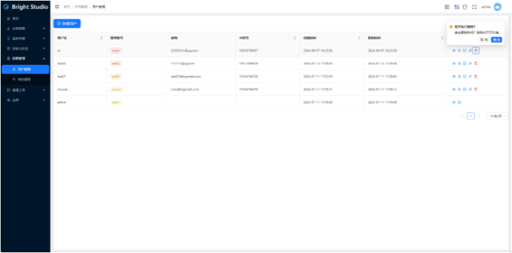

BrightStudio明睿智能数据管理平台，以AiSQL数据库为核心，实现一站式、可视化的管理，专用于管理和监控企业级数据库环境及数据， 提供全面的数据库安装、管理、监控、运维、安全、数据分析、自动化等功能，帮助企业提高数据库运维及数据智能效率和可靠性，具体如下：
**安装部署**：支持数据库的安装、配置、备份、恢复、升级、迁移、监控、优化等功能。
**监控告警**：实时监控数据库的性能、资源使用情况、故障等，并提供报警和通知功能。
**系统与安全**：提供数据库的数据加密、审计等功能，保障数据安全。
**权限管理**：提供项目的访问控制、权限管理。
**管理工具**：支持数据库的自动化运维，如自动化备份、自动化恢复、自动化升级等，提高运维效率。
**应用**：支持数据库的数据查询、报表生成、数据挖掘等功能，帮助企业进行数据分析和决策。


## **安装部署**
用于完成集群的资源管理，安装部署和参数控制。
### **资源管理**
对主机资源进行创建、扩容、缩容、重启、停止、删除管理。

1.添加主机
根据提供的IP和账户密码，添加对应的主机，用于后续创建集群，扩容集群等需要主机资源的时候进行分配。

2.删除主机
对未分配的主机，可以进行删除。

### **添加主机**
根据提供的IP和账户密码，添加对应的主机，用于后续创建集群，扩容集群等需要主机资源的时候进行分配。


### **集群管理**
对集群资源进行创建、扩容、缩容、重启、停止、删除管理。
1.集群创建：创建集群，可手动选择需要部署的机器，也可以自动分配部署的机器，且节点数量必须大于等于复制因子。若出现创建失败，可能是网络出现问题或者是端口已被占用等情况，若出现失败的情况，可删除重新创建。
2.集群扩容：集群扩容需要选择要扩容多少节点，以及节点需要加载的服务。如扩容失败，可能是资源不足或网络错误导致。 若是资源不足，可以选择继续导入主机；若是网络问题，可检查网络状态后重试。具体错误信息请查看工作流信息。
3.集群缩容：集群缩容需要选择要卸载多少节点，以及节点需要卸载的服务。如缩容失败，可能是网络错误导致，可检查网络状态后重试。具体错误信息请查看工作流信息。
4.集群重启：集群重启会先将集群停止，然后再进行启动。如果出现重启后失败的情况，可能存在网络错误，可检查网络状态后重试。
5.集群停止：集群停止会直接停止进程，若出现停止后失败的情况，可能存在网络错误，可检查网络状态后重试。
6.集群删除：集群删除会将集群信息全部删除，包括但不限于集群的进程，回收集群所拥有的机器，删除集群机器中的资源。若出现停止后失败的情况，可能存在网络错误，可检查网络状态后重试。


### **参数配置**
参数配置用于复制和管理参数组。参数组用于定义集群的参数值，在创建集群时需要选择参数组。
1.参数组的编辑: 编辑参数组中的某些参数值。
2.参数组的复制: 基于该参数组创建一个新的参数组。
3.参数组的删除: 删除某个参数组。


### **任务状态**
用于查看每个任务的状态（例如新增主机，创建集群等），关联资源类型表示这是一个针对主机的操作，还是一个针对集群的操作，关联资源ID表示操作资源的ID值，如果是主机类型，则为主机的ID，如果是集群类型，则为集群的ID。
1任务列表：用于查看每个任务的状态（例如新增主机，创建集群等），关联资源类型表示这是一个针对主机的操作，还是一个针对集群的操作，关联资源ID表示操作资源的ID值，如果是主机类型，则为主机的ID，如果是集群类型，则为集群的ID。
2.点击任务记录前的加号，查看任务每个步骤的执行情况。
3.点击具体步骤的名称，查看步骤执行的返回信息。


## **监控告警**
### **集群总览**
集群信息页面包括实例和主机信息。


### **集群监控**
#### **集群信息**
该页面是对整个系统的一个概览，显示集群状况和集群总数。对每个集群，显示监控状态、状态、集群ID、创建时间、存储容量、更新时间、数据库版本、复制因子、节点数量及节点IP。
实例列表


下面介绍右侧两个按钮的作用
1.图表按钮
点进对应实例的图表，将详细展示记录实例各项数据的时间图表，该部分内容由grafana嵌入而来。可以通过用上面的时间范围来选择展示的对应时间范围数据。 


2.参数按钮
参数按钮，将指向老版的BrightDB监控。


主机列表
记录主机的详细信息，点击右侧图表按钮可以看见主机的资源历史使用记录。


#### **慢查询分析**
该页面会筛选出时间超过指定耗时(默认1s)的SQL语句,。来源于日志抓取程序，用户可自行选择是否开启日志抓取程序来获取相关页面数据。需要注意的是，开启日志抓取程序有可能会影响到BrightDB数据库的性能，而且会导致日志增长速度加快，请用户自行选择！


#### **SQL分析**
该页面记录了所有非事务的语句，默认显示30分钟内数据。来源于日志抓取程序，用户可自行选择是否开启日志抓取程序来获取相关页面数据。需要注意的是，开启日志抓取程序有可能会影响到BrightDB数据库的性能，而且会导致日志增长速度加快，请用户自行选择！


#### **日志分析**
该页面记录DBserver和MServer的日志，程序出现意外可以尝试从这里进行分析。来源于日志抓取程序，用户可自行选择是否开启日志抓取程序来获取相关页面数据。需要注意的是，开启日志抓取程序有可能会影响到BrightDB数据库的性能，而且会导致日志增长速度加快，请用户自行选择！


1.分析页面
慢查询分析页面、SQL分析页面、日志分析页面的数据都来源于日志抓取程序，用户可自行选择是否开启日志抓取程序来获取相关页面数据。需要注意的是，开启日志抓取程序有可能会影响到BrightDB数据库的性能，而且会导致日志增长速度加快，请用户自行选择！

2.SQL分析、慢查询分析，对应fluentbit的配置文件fluent-bit.conf的以下内容。

```
 [INPUT]  
      name                tail  
      path                /root/biginsights-data/node-1/disk-1/bi-data/tserver/logs/postgresql*.log  
      Buffer_Max_Size     5M  
      Buffer_Chunk_Size   1M  
      tag                 pglog  
      multiline.parser    multiline-pglog  
      Rotate_Wait         30  
      db                  /var/lib/fluentbit/pg.db  
  
[OUTPUT]  
      name  http  
      match pglog  
      host  127.0.0.1  
      port  9050  
      uri   /sql/write  
      format json  
      Workers 0  
      net.keepalive on
```

3.日志分析页面对应fluent-bit.conf的以下内容 

```
 [INPUT]  
        name                tail  
        path                /root/biginsights-data/node-1/disk-1/bi-data/tserver/logs/bi-tserve.*ERROR.*,/root/biginsights-data/node-1/disk-1/bi-data/tserver/logs/bi-tserver.*WARNING.*  
        tag                 glog  
        Rotate_Wait         30  
        db                  /var/lib/fluentbit/logs.db  
        Path_Key            logName  
  
[OUTPUT]  
    name  http  
    match glog  
    host  127.0.0.1  
    port  9050  
    uri   /log/write  
    format json
```
用户可自行选择抓取哪部分内容，不需要的部分注释掉即可
### **集群告警**
支持通过邮件、钉钉等方式发送报警通知。
#### **告警列表**
告警列表记录了prometheus的组件alertmanager发送的警报，用户可以翻找该列表查看告警信息，默认显示30分钟内的告警信息。


#### **接收人设置**
该页面可以选择将告警信息发送给对应的接收人，目前支持邮件和钉钉告警两种方式。


#### **规则设置**
该页面预置了数个模板，大部分是针对主机资源的告警。 


添加钉钉机器人的流程：

1.创建钉钉群组，打开群设置


2.添加自定义机器人


3.设置安全参数 目前支持两种方式，一是ip字段，一是自定义关键字的方式 

4.自定义关键字
添加关键字"告警"，使得消息能通过钉钉验证


5.IP地址
用户需要将prometheus服务所在机器的ip填入。


6.获取token地址
设置成功后就可以获得web机器人的地址


7.将该webhook复制到接收人页面即可


8.测试 可以试着将CPU的上限调高，如果钉钉能收到如下消息，则代表测试成功


## **系统与安全**
### **操作审计**
显示Bright Studio系统自身的操作日志，支持灵活的过滤和查找功能。 


### **通知服务器设置**
通过配置邮件服务器和邮箱，在对集群进行监控并产生告警时，可以将告警通过邮件发送给接收人。


## **权限管理**
负责Bright Studio系统本身权限的管理，包括用户管理和角色管理。
### **用户管理**
支持项目的用户。如新增、编辑、删除、查看用户列表、查看用户权限、给用户分配角色、重置用户密码等。
1.新增用户：增加一个用户账户。


2.编辑用户：编辑已有用户的账户信息。 


3.删除用户：删除已有用户的账户信息。



4.查看用户列表：显示所有用户的列表。


5.查看用户权限：查看用户的所有权限。 


6.给用户分配角色：用户可绑定多个角色，每个角色所拥有的权限用户都拥有，且对于同一权限，取所有角色中的最高权限。


7.重置用户密码：将用户密码重置成与登录账号的值相同。 


### **角色管理**
支持项目的角色控制。如创建角色、给角色分配权限、删除角色等。
1.创建角色：创建一个新角色，新创建的角色默认无任何权限。


2.给角色分配权限：显示所有角色的列表。


3.角色列表：为角色分配权限，所有绑定了该角色的用户都会拥有该角色所拥有的权限。


4.删除角色：将角色进行删除，若有用户绑定了此角色，也会将此进行解绑，删除角色时请确认绑定了该角色的用户在删除后的权限是否符合自己的需求。


## **管理工具**
### **SQL客户端**
集成的第三方postgres sql客户端pgweb。


### **JupyterLab**
是一个基于浏览器的交互式开发环境，支持运行 Jupyter 笔记本、编辑代码和文本文件，以及进行数据分析和可视化，适用于 Python 等多种编程语言。


## **应用**
### **BrightGPT**
通过数据库关键字提取来达到自动对话。


### **图文检索**
支持数据库关键向量信息，返回相应的结果。


### **BrightBI**
能够连接多种数据源、提供丰富的可视化图表，支持自定义仪表盘，帮助用户轻松探索和呈现数据。

