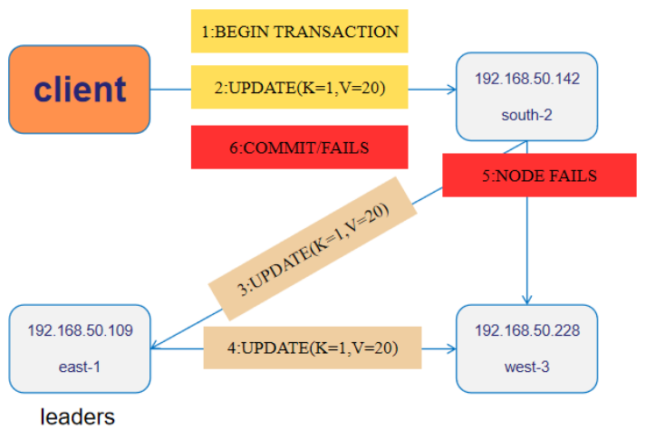

BMDB 可以在发生计划内或计划外停机时持续处理请求，例如系统升级以及与节点、可用区或区域相关的停机。

BMDB 通过跨故障域复制数据来提供高可用性 (HA)。 如果故障域发生故障，则在当前领导者发生故障后几秒钟内，活动副本就准备好接管作为新的领导者并服务请求。

这反映在 BMDB Universe 的恢复点目标 (RPO) 和恢复时间目标 (RTO) 中：

BMDB 全域中Tile的 RPO 为 0，这意味着在故障转移到另一个故障域时不会丢失任何数据。
区域中断的 RTO 大约为 3 秒，这是完成故障转移并在剩余故障域中恢复运行的时间窗口。

BMDB 还通过跨故障域复制未提交的值（也称为临时记录）来提供事务 HA。

持续可用性的好处扩展到执行维护和数据库升级。 您可以通过执行滚动升级来维护和升级您的 Universe 到较新版本的 BMDB； 也就是说，停止每个节点，升级软件，然后重新启动节点，整个Universe 的停机时间为零。

## **节点、可用区和区域级故障容灾**

在节点、专区和区域故障期间保持请求服务。

## **事务高可用**

高可用性和容错事务。
事务和弹性都是 BMDB 的关键功能，并且它们旨在协同工作。 这意味着即使在某些失败情况下事务也可以取得进展。

以下示例演示了 BMDB 事务如何应对处理事务时可能发生的常见故障场景。 在示例中，您执行更新单行的客户端驱动事务，故障场景如下表所示。

| 场景                             | 描述                                                         |
| -------------------------------- | ------------------------------------------------------------ |
| 事务执行语句之前的leader节点故障 | 语句即将被发送到的leader节点在执行语句之前发生故障。 BMDB 会自动处理这个问题。 |
| 事务执行语句后leader节点故障     | 已向其发送语句的leader节点在事务提交之前发生故障。 BMDB 会自动处理这个问题 |
| 客户端连接的节点发生故障         | 客户端连接的节点在语句之后但事务提交之前发生故障。 数据库返回一个标准错误，该错误在客户端中使用重试逻辑进行处理 |

### **前置条件**

1.按照设置说明启动三节点 Universe。 这将创建一个包含 3 个不同区域中的节点的集群，如下图所示：

3. 使用 sqlsh 连接到您的 Universe
4. 创建一个表空间以确保示例事务中键的leader位于节点192.168.50.109中，如下所示：

```
create tablespace txndemo_tablespace
with (replica_placement='{"num_replicas":3,"placement_blocks":[
{"cloud":"qq","region":"east","zone":"east-1","min_num_replicas":1,"leader_preference":1},
{"cloud":"qq","region":"south","zone":"south-2","min_num_replicas":1,"leader_preference":2},
{"cloud":"qq","region":"west","zone":"west-3","min_num_replicas":1,"leader_preference":3}
 ]}');
```

5. 使用以下命令在表空间中创建表：

```
CREATE TABLE txndemo (
    k int,
    v int,
    PRIMARY KEY(k)
) TABLESPACE txndemo_tablespace;
```

由于leader首选项已设置为 192.168.50.109，因此 txndemo 表的所有leader现在都位于 192.168.50.109。

5.使用以下命令插入示例数据：

```
INSERT INTO txndemo SELECT id,10 FROM generate_series(1,5) AS id;
```

导航到 http://192.168.50.109:10000/tile-servers 以列出服务器并查看数据所在位置。

所有leader (3/3) 都在节点192.168.50.109中，这是您在以下故障场景中停止的节点。
使用以下命令检查 k=1 处的行的值：

```
SELECT * from txndemo where k=1;
 
  k | v
----+----
  1 | 10
(1 row)
```

k=1 的行的值为v=10。

### **场景1：事务执行语句之前节点发生故障**

在事务期间，当修改或获取行时，BMDB 会将相应的请求发送到包含正在修改或获取的行的节点。

在此示例中，您可以通过关闭节点 192.168.50.109 来了解当即将接收临时写入的节点失败时事务如何完成，因为该节点具有事务将要修改的行。

下图说明了当节点在接收写入之前发生故障时确保事务成功的高级步骤。

1.按如下方式连接到节点192.168.50.142：

```
./bin/sqlsh -h 127.0.0.1
```

2.开始事务如下：

```
BEGIN;
 
BEGIN
Time: 2.047 ms
```

事务已启动，但尚未修改任何行。 此时，还没有临时记录发送到节点192.168.50.109。

3.停止节点192.168.50.109，如下所示：

```
./bin/bm-ctl stop --base_dir=/tmp/bmd2
```

4.导航到 http://192.168.50.109:10000/tile-servers 以验证节点 2 是否已从Tile列表中消失。
192.168.50.109已dead，并且已为192.168.50.109中的所有Tile选举了新的leader 192.168.50.142。

5.将第 k=1 行的值更新为 20 并提交事务，如下所示：

```
UPDATE txndemo set v=20 where k=1;
COMMIT;
 
UPDATE 1
Time: 1728.246 ms (00:01.728)
COMMIT
Time: 2.964 ms
```

即使节点192.168.50.109在接收临时写入之前发生故障，事务也会成功，并且值更新为 20。事务会成功，因为节点 192.168.50.109 故障后很快会选举出新的leader（192.168.50.142）。

6.使用以下命令检查 k=1 处的行的值：

```
SELECT * from txndemo where k=1;
 
  k | v
----+----
  1 | 20
(1 row)
```

k=1 的行的新值 v=20，确认事务完成。

7.使用以下命令重新启动节点 192.168.50.109：

```
./bin/bm-ctl start --base_dir=/tmp/bmd2
```

### **场景2：事务执行语句后节点发生故障**

正如前面的示例中提到的，当在事务期间修改或获取行时，BMDB 会将适当的语句发送到包含正在修改或获取的行的节点。 在此示例中，您可以看到当刚刚收到临时写入的节点失败时事务如何完成。

下图说明了当节点在收到语句后发生故障时确保事务成功的高级步骤。


1.如果尚未连接，请使用以下 sqlsh 命令连接到 192.168.50.142：

```
./bin/sqlsh -h 127.0.0.1
```

2.使用以下命令启动事务以将行 k=1 的值更新为 30：

```
BEGIN;
 
BEGIN
Time: 2.047 ms
UPDATE txndemo set v=30 where k=1;
 
UPDATE 1
Time: 51.513 ms
```

更新成功。 这意味着值 v=30 的更新行已发送到节点 192.168.50.109，但尚未提交。

3.停止节点 192.168.50.109，因为这是已接收修改行的节点。

```
./bin/bm-ctl stop --base_dir=/tmp/bmd2
```

4.导航到 http://192.168.50.109:10000/tile-servers 以验证节点 192.168.50.109 是否已从服务器列表中消失，并且已为 k=1 的行选举了新的leader。
192.168.50.109已dead，并且已为192.168.50.109中的所有Tile选举了新的leader 192.168.50.142。

5.提交事务如下：

```
COMMIT;
 
COMMIT
Time: 6.243 ms
```

即使192.168.50.109在收到临时写入后失败，并且行值更新为30，事务也会成功。这是因为临时写入已复制到跟随者Tile，并且当leader失败时，新当选的leader已经有了临时写入 ，这使得交易能够不间断地继续进行。

6.使用以下命令检查 k=1 处的行的值：

```
SELECT * from txndemo where k=1;
 
  k | v
----+----
  1 | 30
(1 row)
```

k=1 的行的新值 v=30，确认事务完成。

7.使用以下命令重新启动节点 192.168.50.109：

```
./bin/bm-ctl start --base_dir=/tmp/bmd2
```

### **场景3：客户端连接的节点故障**

客户端连接的节点充当事务的管理器。 事务管理器协调事务流并维护客户端和事务id（每个事务的唯一标识符）之间的相关性。 BMDB 本质上对节点故障具有弹性，如前面两个场景所示。

在此示例中，您可以看到当事务管理器失败时事务如何中止。 有关事务管理器角色的更多详细信息，请参阅事务 I/O。

下图说明了当客户端连接到的节点发生故障时导致事务中止的高级步骤。


对于这种情况，您可以连接到集群中的任何节点； 本例中选择了192.168.50.142。
1.连接到节点192.168.50.142

```
./bin/sqlsh -h 127.0.0.1
```

2.启动一个事务将第k=1行的值更新为40，如下：

```
BEGIN;
 
BEGIN
Time: 2.047 ms
UPDATE txndemo set v=40 where k=1;
 
UPDATE 1
Time: 50.624 ms
```

3.停止节点 192.168.50.142（您已连接到的节点），如下所示：

```
./bin/bm-ctl stop --base_dir=/tmp/bmd1
```

4.提交事务如下：

```
COMMIT;
```

请注意，客户端会从服务器收到类似于以下内容的错误响应：

```
FATAL:  57P01: terminating connection due to unexpected postmaster exit
server closed the connection unexpectedly
  This probably means the server terminated abnormally
  before or while processing the request.
The connection to the server was lost. Attempting reset: Failed.
Time: 2.499 ms
```

5.从 BMDB 主目录的另一个终端连接到不同的节点并检查值，如下所示：

```
./bin/sqlsh -h 127.0.0.2
SELECT * from txndemo where k=1;
 
  k | v
----+----
  1 | 30
(1 row)
```

交易失败； 该行没有获得预期的值 40，并且仍然保留旧值 30。当事务管理器在提交发生之前失败时，事务就会丢失。 此时，应用程序有责任重新启动事务。
