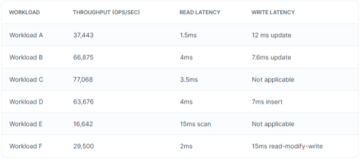
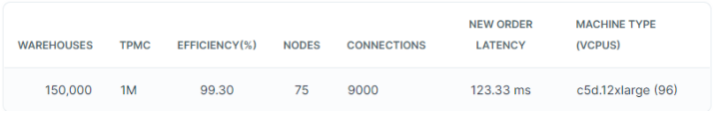

 AiSQL 旨在提供高可用性、可扩展性和容错能力，同时通过 BSQL 和 BCQL API 提供简单的接口。 然而，为了评估其真实能力并展示其处理实际工作负载的潜力，严格的基准测试至关重要。

基准测试是评估系统在特定工作负载下的性能和功能的过程，以深入了解其可扩展性、弹性和整体效率。 此过程涉及使用标准化工作负载模拟现实世界的使用场景，以了解系统的执行、扩展和从故障中恢复的情况。 了解 AiSQL 处理各种工作负载的能力至关重要，例如 TPC-C、YCSB 和 sysbench 基准测试，它们代表了分布式数据库性能的不同方面。

TPC-C（Transaction Processing Performance Council - Benchmark C）
TPC-C 是广泛认可的测试事务数据库系统性能的基准。 它模拟复杂的 OLTP（在线事务处理）工作负载，其中涉及不同事务的组合，例如订单创建、付款处理和库存水平检查。 使用 TPC-C 对 AiSQL 进行基准测试有助于评估其处理大量并发事务以及保持一致性和完整性的能力。

YCSB（Yahoo Cloud Serving Benchmark）
YCSB 旨在评估数据库在各种读写工作负载下的性能，范围从大部分高负荷读到高负荷写。 使用 YCSB，您可以评估 AiSQL 处理不同数据访问模式和查询负载的能力，这对于具有不同使用需求的应用程序至关重要。

Sysbench
sysbench 是一款多功能基准测试工具，涵盖广泛的数据库工作负载，包括 CPU、内存、磁盘 I/O 和数据库操作。 它有助于衡量系统在不同压力条件下的性能、稳定性和可扩展性，使您能够识别潜在的瓶颈和弱点。


## **TPC-C**
使用 TPC-C 对 BSQL 性能进行基准测试

TPC-C 是一种流行的在线事务处理基准测试，它提供了可用于评估 AiSQL 对于不同类型和复杂性的并发事务的性能的指标，这些事务要么在线执行，要么排队等待延迟执行。

### **结果概览**
集群中的所有节点均位于同一区域的 AWS-west 中。 基准虚拟机与集群节点类型相同，部署在同一可用区。 每个测试在加载数据后运行 30 分钟。

所有基准测试均使用 AiSQL v2.18.1 运行，但 150K 仓库除外，该仓库在 v2.11 上运行。

1.水平缩放
下表显示了 AiSQL 如何水平扩展，当集群中的节点数量增加时，以相同的效率提供更高的吞吐量。



2.垂直缩放
下表显示了 AiSQL 如何垂直扩展，在机器功率增加时提供更高的吞吐量，同时保持集群中的节点数量不变。


3.100K warehouses


4.150K warehouses 


### **Benchmark安装**
使用以下步骤针对 AiSQL BSQL 运行 TPC-C 工作负载。

1.获取 TPC-C 二进制文件
要下载 TPC-C 二进制文件，请运行以下命令。
```
$ wget https://github.com/bigmath/tpcc/releases/download/2.0/tpcc.tar.gz
$ tar -zxvf tpcc.tar.gz
$ cd tpcc
```

2.启动 AiSQL
按照手动部署步骤启动 AiSQL 集群。

提示：下一步您将需要集群中节点的 IP 地址。


3.配置数据库连接参数（可选）
您可以使用命令行参数配置工作负载，包括节点的 IP 地址、仓库数量和加载器线程数量。

如果需要，可以使用 config/workload_all.xml 中的配置文件更改其他选项，例如用户名、密码、端口等。
```
<port>2521</port>
<username>bigmath</username>
<password></password>
```

4.其他考虑因素
运行测试时，请务必执行以下操作：
1.运行最新的 TPCC 代码。 通过下载最新发布的版本来使用 bigmath TPCC 应用程序的最新增强功能，或者克隆存储库并从源代码构建以获得最新的更改。
2.使用 bm-admin 实用程序的compact_table 命令预压缩表。
3.当您调用 TPCC 基准测试的执行阶段时，使用 --warmup-time-secs 标志预热数据库。

### **运行 TPC-C**
#### **10 warehouses**
1.加载数据
在开始工作负载之前，您需要加载数据。 确保将 IP 地址替换为集群中节点的 IP 地址。
```
$ ./tpccbenchmark --create=true --nodes=127.0.0.1,127.0.0.2,127.0.0.3
$ ./tpccbenchmark --load=true --nodes=127.0.0.1,127.0.0.2,127.0.0.3
```



3 个 c5d.4xlarge 类型节点的集群上 10 个仓库的加载时间约为 3 分钟

2.TPC-C执行阶段
您可以按如下方式针对数据库运行工作负载：
```
$ ./tpccbenchmark --execute=true \
  --nodes=127.0.0.1,127.0.0.2,127.0.0.3
```

3.TPC-C 基准测试结果

```
Cluster: 3 nodes of type c5d.large
 
TPMC: 127
 
Efficiency: 98.75%
 
Latencies:
 
New Order Avg: 66.286 msecs, p99: 212.47 msecs
Payment Avg: 17.406 msecs, p99: 186.884 msecs
OrderStatus Avg: 7.308 msecs, p99: 86.974 msecs
Delivery Avg: 66.986 msecs, p99: 185.919 msecs
StockLevel Avg: 98.32 msecs, p99: 192.054 msecs
Once the execution is completed, the TPM-C number along with the efficiency is printed, as follows:
 
21:09:23,588 (DBWorkload.java:955) INFO  - Throughput: Results(nanoSeconds=1800000263504, measuredRequests=8554) = 4.752221526539232 requests/sec reqs/sec
21:09:23,588 (DBWorkload.java:956) INFO  - Num New Order transactions : 3822, time seconds: 1800
21:09:23,588 (DBWorkload.java:957) INFO  - TPM-C: 127
21:09:23,588 (DBWorkload.java:958) INFO  - Efficiency : 98.75%
21:09:23,593 (DBWorkload.java:983) INFO  - NewOrder, Avg Latency: 66.286 msecs, p99 Latency: 212.47 msecs
21:09:23,596 (DBWorkload.java:983) INFO  - Payment, Avg Latency: 17.406 msecs, p99 Latency: 186.884 msecs
21:09:23,596 (DBWorkload.java:983) INFO  - OrderStatus, Avg Latency: 7.308 msecs, p99 Latency: 86.974 msecs
21:09:23,596 (DBWorkload.java:983) INFO  - Delivery, Avg Latency: 66.986 msecs, p99 Latency: 185.919 msecs
21:09:23,596 (DBWorkload.java:983) INFO  - StockLevel, Avg Latency: 98.32 msecs, p99 Latency: 192.054 msecs
21:09:23,597 (DBWorkload.java:792) INFO  - Output Raw data into file: results/oltpbench.csv
```

 

#### **100 warehouses**
1.加载数据
在开始工作负载之前，您需要加载数据。 确保将 IP 地址替换为集群中节点的 IP 地址。 加载器线程允许您配置用于加载数据的线程数。 对于 3 节点 c5d.4xlarge 集群，加载程序线程值 48 是最佳值。
```
$ ./tpccbenchmark --create=true --nodes=127.0.0.1,127.0.0.2,127.0.0.3
$ ./tpccbenchmark --load=true \
  --nodes=127.0.0.1,127.0.0.2,127.0.0.3 \
  --warehouses=100 \
  --loaderthreads 48
```


根据集群中节点的数量和类型，调整 --loaderthreads 参数以在加载期间获得更高的并行性。 指定的 48 个线程值对于 c5d.4xlarge 类型的 3 节点集群（16 个 vCPU）来说是最佳的。 对于较大的集群或具有更多 vCPU 的计算机，请相应地增加此值。 对于复制因子为 3 的集群，一个好的近似方法是使用集群中所有节点拥有的核心数。

2.TPC-C执行阶段
您可以按如下方式针对数据库运行工作负载：
```
$ ./tpccbenchmark --execute=true \
  --nodes=127.0.0.1,127.0.0.2,127.0.0.3 \
  --warehouses=100
```

3.TPC-C 基准测试结果
```
Cluster: 3 nodes of type c5d.4xlarge
 
TPMC: 1271.77
 
Efficiency: 98.89%
 
Latencies:
 
New Order Avg: 68.265 msecs, p99: 574.339 msecs
Payment Avg: 19.969 msecs, p99: 475.311 msecs
OrderStatus Avg: 13.821 msecs, p99: 571.414 msecs
Delivery Avg: 67.384 msecs, p99: 724.67 msecs
StockLevel Avg: 114.032 msecs, p99: 263.849 msecs
Once the execution is completed, the TPM-C number along with the efficiency is printed, as follows:
 
04:54:54,560 (DBWorkload.java:955) INFO  - Throughput: Results(nanoSeconds=1800000866600, measuredRequests=85196) = 47.33108832382159 requests/sec reqs/sec
04:54:54,560 (DBWorkload.java:956) INFO  - Num New Order transactions : 38153, time seconds: 1800
04:54:54,560 (DBWorkload.java:957) INFO  - TPM-C: 1,271.77
04:54:54,560 (DBWorkload.java:958) INFO  - Efficiency : 98.89%
04:54:54,596 (DBWorkload.java:983) INFO  - NewOrder, Avg Latency: 68.265 msecs, p99 Latency: 574.339 msecs
04:54:54,615 (DBWorkload.java:983) INFO  - Payment, Avg Latency: 19.969 msecs, p99 Latency: 475.311 msecs
04:54:54,616 (DBWorkload.java:983) INFO  - OrderStatus, Avg Latency: 13.821 msecs, p99 Latency: 571.414 msecs
04:54:54,617 (DBWorkload.java:983) INFO  - Delivery, Avg Latency: 67.384 msecs, p99 Latency: 724.67 msecs
04:54:54,618 (DBWorkload.java:983) INFO  - StockLevel, Avg Latency: 114.032 msecs, p99 Latency: 263.849 msecs
04:54:54,619 (DBWorkload.java:792) INFO  - Output Raw data into file: results/oltpbench.csv
```

#### **1000 warehouses**
1.加载数据
在启动工作负载之前，您需要先加载数据。 确保将 IP 地址替换为集群中节点的 IP 地址。 加载器线程允许您配置用于加载数据的线程数。 对于 3 节点 c5d.4xlarge 集群，加载程序线程值 48 是最佳值。
```
$ ./tpccbenchmark --create=true --nodes=127.0.0.1,127.0.0.2,127.0.0.3
$ ./tpccbenchmark --load=true \
  --nodes=127.0.0.1,127.0.0.2,127.0.0.3 \
  --warehouses=1000 \
  --loaderthreads 48
```

2.TPC-C执行阶段
您可以按如下方式针对数据库运行工作负载：
```
$ ./tpccbenchmark --execute=true \
  --nodes=127.0.0.1,127.0.0.2,127.0.0.3 \
  --warehouses=1000
```

3.TPC-C 基准测试结果
```
Cluster: 3 nodes of type c5d.4xlarge
 
TPMC: 12,563.07
 
Efficiency: 97.69%
 
Latencies:
 
New Order Avg: 325.378 msecs, p99: 3758.859 msecs
Payment Avg: 277.539 msecs, p99: 12667.048 msecs
OrderStatus Avg: 174.173 msecs, p99: 4968.783 msecs
Delivery Avg: 310.19 msecs, p99: 5259.951 msecs
StockLevel Avg: 652.827 msecs, p99: 8455.325 msecs
Once the execution is completed, the TPM-C number along with the efficiency is printed, as follows:
 
17:18:58,728 (DBWorkload.java:955) INFO  - Throughput: Results(nanoSeconds=1800000716759, measuredRequests=842216) = 467.8975914612168 requests/sec reqs/sec
17:18:58,728 (DBWorkload.java:956) INFO  - Num New Order transactions : 376892, time seconds: 1800
17:18:58,728 (DBWorkload.java:957) INFO  - TPM-C: 12,563.07
17:18:58,728 (DBWorkload.java:958) INFO  - Efficiency : 97.69%
17:18:59,006 (DBWorkload.java:983) INFO  - NewOrder, Avg Latency: 325.378 msecs, p99 Latency: 3758.859 msecs
17:18:59,138 (DBWorkload.java:983) INFO  - Payment, Avg Latency: 277.539 msecs, p99 Latency: 12667.048 msecs
17:18:59,147 (DBWorkload.java:983) INFO  - OrderStatus, Avg Latency: 174.173 msecs, p99 Latency: 4968.783 msecs
17:18:59,166 (DBWorkload.java:983) INFO  - Delivery, Avg Latency: 310.19 msecs, p99 Latency: 5259.951 msecs
17:18:59,182 (DBWorkload.java:983) INFO  - StockLevel, Avg Latency: 652.827 msecs, p99 Latency: 8455.325 msecs
17:18:59,183 (DBWorkload.java:792) INFO  - Output Raw data into file: results/oltpbench.csv
```

#### **10000 warehouses**
1.加载数据
在开始工作负载之前，您需要加载数据。 此外，您需要确保导出了所有涉及节点的所有 IP 地址的列表。

对于 10k 仓库，您需要 10 个 c5.4xlarge 类型的客户端来驱动基准测试。 对于多个客户端，您需要执行三个步骤。

首先，创建数据库和相应的表。 从客户端之一执行以下命令：
```
./tpccbenchmark  --nodes=$IPS  --create=true
```

| 客户端 | 命令 |
| --- | --- |
| 1 | ./tpccbenchmark --load=true --nodes=$IPS --warehouses=1000 --start-warehouse-id=1 --total-warehouses=10000 --loaderthreads 48 |
| 2 | ./tpccbenchmark --load=true --nodes=$IPS --warehouses=1000 --start-warehouse-id=1001 --total-warehouses=10000 --loaderthreads 48 |
| 3 | ./tpccbenchmark --load=true --nodes=$IPS --warehouses=1000 --start-warehouse-id=2001 --total-warehouses=10000 --loaderthreads 48 |
| 4 | ./tpccbenchmark --load=true --nodes=$IPS --warehouses=1000 --start-warehouse-id=3001 --total-warehouses=10000 --loaderthreads 48 |
| 5 | ./tpccbenchmark --load=true --nodes=$IPS --warehouses=1000 --start-warehouse-id=4001 --total-warehouses=10000 --loaderthreads 48 |
| 6 | ./tpccbenchmark --load=true --nodes=$IPS --warehouses=1000 --start-warehouse-id=5001 --total-warehouses=10000 --loaderthreads 48 |
| 7 | ./tpccbenchmark --load=true --nodes=$IPS --warehouses=1000 --start-warehouse-id=6001 --total-warehouses=10000 --loaderthreads 48 |
| 8 | ./tpccbenchmark --load=true --nodes=$IPS --warehouses=1000 --start-warehouse-id=7001 --total-warehouses=10000 --loaderthreads 48 |
| 9 | ./tpccbenchmark --load=true --nodes=$IPS --warehouses=1000 --start-warehouse-id=8001 --total-warehouses=10000 --loaderthreads 48 |
| 10 | ./tpccbenchmark --load=true --nodes=$IPS --warehouses=1000 --start-warehouse-id=9001 --total-warehouses=10000 --loaderthreads 48 |

创建数据库和表后，您可以从所有十个客户端加载数据：

根据集群中节点的数量和类型，调整 --loaderthreads 参数以在加载期间获得更高的并行性。 此处指定的值 48 个线程对于 c5d.4xlarge 类型的 3 节点集群（16 个 vCPU）来说是最佳的。 对于较大的集群或具有更多 vCPU 的计算机，请相应地增加此值。 对于复制因子为 3 的集群，一个好的近似方法是使用集群中所有节点拥有的核心数。

加载完成后，执行以下命令以启用已禁用的外键以帮助缩短加载时间：
./tpccbenchmark  --nodes=$IPS  --enable-foreign-keys=true


2.TPC-C执行阶段
在开始执行之前，您必须通过运行以下命令将所有tablet领导者移出包含mserver领导者的节点：
```
./bm-admin --mserver_addresses <mserver-ip1>:11000,<mserver-ip2>:11000,<mserver-ip3>:11000 change_leader_blacklist ADD <mserver-leader-ip>
```

确保执行阶段使用的IP地址不包含mserver-leader-ip。 然后，您可以从每个客户端针对数据库运行工作负载：
| 客户端 | 命令 |
| --- | --- |
| 1 | ./tpccbenchmark --nodes=$IPS --execute=true --warehouses=1000 --num-connections=300 --start-warehouse-id=1 --total-warehouses=10000 --warmup-time-secs=900 |
| 2 | ./tpccbenchmark --nodes=$IPS --execute=true --warehouses=1000 --num-connections=300 --start-warehouse-id=1001 --total-warehouses=10000 --warmup-time-secs=900 |
| 3 | ./tpccbenchmark --nodes=$IPS --execute=true --warehouses=1000 --num-connections=300 --start-warehouse-id=2001 --total-warehouses=10000 --warmup-time-secs=900 |
| 4 | ./tpccbenchmark --nodes=$IPS --execute=true --warehouses=1000 --num-connections=300 --start-warehouse-id=3001 --total-warehouses=10000 --warmup-time-secs=900 |
| 5 | ./tpccbenchmark --nodes=$IPS --execute=true --warehouses=1000 --num-connections=300 --start-warehouse-id=4001 --total-warehouses=10000 --warmup-time-secs=900 |
| 6 | ./tpccbenchmark --nodes=$IPS --execute=true --warehouses=1000 --num-connections=300 --start-warehouse-id=5001 --total-warehouses=10000 --warmup-time-secs=720 --initial-delay-secs=180 |
| 7 | ./tpccbenchmark --nodes=$IPS --execute=true --warehouses=1000 --num-connections=300 --start-warehouse-id=6001 --total-warehouses=10000 --warmup-time-secs=540 --initial-delay-secs=360 |
| 8 | ./tpccbenchmark --nodes=$IPS --execute=true --warehouses=1000 --num-connections=300 --start-warehouse-id=7001 --total-warehouses=10000 --warmup-time-secs=360 --initial-delay-secs=540 |
| 9 | ./tpccbenchmark --nodes=$IPS --execute=true --warehouses=1000 --num-connections=300 --start-warehouse-id=8001 --total-warehouses=10000 --warmup-time-secs=180 --initial-delay-secs=720 |
| 10 | ./tpccbenchmark --nodes=$IPS --execute=true --warehouses=1000 --num-connections=300 --start-warehouse-id=9001 --total-warehouses=10000 --warmup-time-secs=0 --initial-delay-secs=900TPC-C Benchmark R |


3.TPC-C 基准测试结果
执行完成后，需要将每个节点的csv文件复制到其中一个节点，并运行merge-results来显示合并结果。

将 csv 文件复制到诸如 results-dir 之类的目录后，您可以按如下方式合并结果：
```
./tpccbenchmark --merge-results=true --dir=results-dir --warehouses=10000
Cluster: 30 nodes of type c5d.4xlarge
 
TPMC: 125193.2
 
Efficiency: 97.35%
 
Latencies:
 
New Order Avg: 114.639 msecs, p99: 852.183 msecs
Payment Avg: 114.639 msecs, p99 : 852.183 msecs
OrderStatus Avg: 20.86 msecs, p99: 49.31 msecs
Delivery Avg: 117.473 msecs, p99: 403.404 msecs
StockLevel Avg: 340.232 msecs, p99: 1022.881 msecs
The output after merging should look similar to the following:
 
15:16:07,397 (DBWorkload.java:715) INFO - Skipping benchmark workload execution
15:16:11,400 (DBWorkload.java:1080) INFO - Num New Order transactions : 3779016, time seconds: 1800
15:16:11,400 (DBWorkload.java:1081) INFO - TPM-C: 125193.2
15:16:11,401 (DBWorkload.java:1082) INFO - Efficiency : 97.35%
15:16:12,861 (DBWorkload.java:1010) INFO - NewOrder, Avg Latency: 114.639 msecs, p99 Latency: 852.183 msecs
15:16:13,998 (DBWorkload.java:1010) INFO - Payment, Avg Latency: 29.351 msecs, p99 Latency: 50.8 msecs
15:16:14,095 (DBWorkload.java:1010) INFO - OrderStatus, Avg Latency: 20.86 msecs, p99 Latency: 49.31 msecs
15:16:14,208 (DBWorkload.java:1010) INFO - Delivery, Avg Latency: 117.473 msecs, p99 Latency: 403.404 msecs
15:16:14,310 (DBWorkload.java:1010) INFO - StockLevel, Avg Latency: 340.232 msecs, p99 Latency: 1022.8
```

## **sysbench**
使用 sysbench 对 BSQL 性能进行基准测试
sysbench 是一种流行的工具，用于对 PostgreSQL 和 MySQL 等数据库以及 CPU、内存和 I/O 等系统功能进行基准测试。 AiSQL 版本的 sysbench 是从官方版本派生出来的，并进行了一些修改，以更好地反映 AiSQL 的分布式特性。

### **运行sysbench**
1.先决条件
为了确保在基准测试之前满足建议的硬件要求并正确配置数据库，请查看部署清单。

使用以下步骤安装 sysbench：
```
$ cd $HOME
$ git clone https://github.com/bigmath/sysbench.git
$ cd sysbench
$ ./autogen.sh && ./configure --with-pgsql && make -j && sudo make install
```

这会将 sysbench 实用程序安装在 /usr/local/bin 中。

确保您已将 BSQL shell sqlsh 导出到 PATH 变量。

```
$ export PATH=$PATH:/path/to/sqlsh
```

2.启动 AiSQL
按照手动部署中的步骤启动 AiSQL 集群。

提示：下一步您将需要集群中节点的 IP 地址。

运行sysbench
运行 run_sysbench.sh shell 脚本来加载数据并运行各种工作负载：
```
./run_sysbench.sh --ip <ip>
```

该脚本使用 64 个线程运行所有 8 个工作负载，表数量为 10，表大小为 100k。

如果您想使用不同的表数量和表大小运行基准测试，请执行以下操作：
```
./run_sysbench.sh --ip <ip> --numtables <number of tables> --tablesize <number of rows in each table>
```

3.运行单独的工作负载（可选）
您可以选择单独运行以下工作负载：
* oltp_insert
* oltp_point_select
* oltp_write_only
* oltp_read_only
* oltp_read_write
* oltp_update_index
* oltp_update_non_index
* oltp_delete

在启动工作负载之前，请按如下方式加载数据：
```
$ sysbench <workload>               \
      --tables=10                   \
      --table-size=100000           \
      --range_key_partitioning=true \
      --db-driver=pgsql             \
      --pgsql-host=127.0.0.1        \
      --pgsql-port=2521             \
      --pgsql-user=bigmath         \
      --pgsql-db=bigmath           \
      Prepare
```

按如下方式运行工作负载：
```
$ sysbench <workload>               \
      --tables=10                   \
      --table-size=100000           \
      --range_key_partitioning=true \
      --db-driver=pgsql             \
      --pgsql-host=127.0.0.1        \
      --pgsql-port=2521             \
      --pgsql-user=bigmath         \
      --pgsql-db=bigmath           \
      --threads=64                  \
      --time=120                    \
      --warmup-time=120             \
      run
```

### **预期成绩**
以下结果适用于 3 节点集群，其中每个节点都位于 c5.4xlarge AWS 实例（16 个核心、32 GB RAM 和 2 个 EBS 卷）上，所有节点均位于同一可用区，并且客户端虚拟机在同一可用区中运行。

10 个表，每个表有 100k 行
| WORKLOAD | THROUGHPUT (TXNS/SEC) | LATENCY (MS) |
| --- | --- | --- |
| OLTP_READ_ONLY | 3276 | 39 |
| OLTP_READ_WRITE | 487 | 265 |
| OLTP_WRITE_ONLY | 1818 | 70 |
| OLTP_POINT_SELECT | 95695 | 1.3 |
| OLTP_INSERT | 6348 | 20.1 |
| OLTP_UPDATE_INDEX | 4052 | 31 |
| OLTP_UPDATE_NON_INDEX | 11496 | 11 |
| OLTP_DELETE | 67499 | 1.9 |

 


## **YCSB**
使用 YCSB 和标准 JDBC 绑定对 BSQL 性能进行基准测试

### **JDBC Binding**
 本文档描述如何使用标准 JDBC 绑定来运行 YCSB 基准测试。

#### **运行基准测试**
要运行基准测试，请确保满足先决条件并完成启动 AiSQL 和配置其属性等步骤。

1.先决条件
这些二进制文件是使用 Java 13 编译的，建议使用该版本运行这些二进制文件。

运行以下命令下载 YCSB 二进制文件：
```
$ cd $HOME
$ wget https://github.com/bigmath/YCSB/releases/download/1.0/ycsb.tar.gz
$ tar -xzf ycsb.tar.gz
$ cd YCSB
```
确保您拥有 BCQL shell cqlsh 并且其位置包含在 PATH 变量中，如下所示：
```
$ export PATH=$PATH:/path/to/cqlsh
```

您可以在 AiSQL 安装的 bin 目录中找到 sqlsh。 例如：
```
$ export PATH=$PATH:/Users/bigmath/code/bin
```

2.启动 AiSQL
按照手动部署中描述的过程启动 AiSQL 集群。 记下集群中节点的 IP 地址，因为配置属性文件时需要这些地址。

3.配置属性文件
使用以下内容更新 YCSB 目录中的 db.properties 文件，将 db.url 字段中的 IP 地址值替换为集群中所有节点的正确值：
```
db.driver=org.postgresql.Driver
db.url=jdbc:postgresql://<ip1>:2521/ycsb;jdbc:postgresql://<ip2>:2521/ycsb;jdbc:postgresql://<ip3>:2521/ycsb;
db.user=bigmath
db.passwd=
```

其他配置参数在核心属性中进行了描述。

4.运行基准测试
使用以下脚本 run_jdbc.sh 加载并运行所有工作负载：
```
$ ./run_jdbc.sh --ip <ip>
```

前面的命令在包含一百万行的表上运行工作负载。 要在具有不同行数的表上运行基准测试，请使用以下命令：
```
$ ./run_jdbc.sh --ip <ip> --recordcount <number of rows>
```

为了获得系统的最大性能，您可以调整脚本中的 threadcount 参数。 作为参考，对于具有 16 个核心和 32GB RAM 的 c5.4xlarge 实例，您在加载阶段使用 32 个线程数，在执行阶段使用 256 个线程数。

5.验证结果
run_jdbc.sh 脚本为每个工作负载创建两个结果文件：一个用于加载，另一个用于执行阶段，其中包含吞吐量和延迟的详细信息。

例如，对于它创建的工作负载，检查workloada-bsql-load.dat 和workloada-bsql-transaction.dat 文件。

6.运行单独的工作负载（可选）
或者，您可以使用以下步骤单独运行工作负载：
（1）使用以下命令启动 BSQL shell：
```
$ ./bin/sqlsh -h <ip>
```

（2）创建ycsb数据库如下：
```
bigmath=# CREATE DATABASE ycsb;
```

（3）连接数据库如下：
```
bigmath=# \c ycsb
```

（4）创建表如下：
```
ycsb=# CREATE TABLE usertable (
            YCSB_KEY TEXT,
            FIELD0 TEXT, FIELD1 TEXT, FIELD2 TEXT, FIELD3 TEXT,
            FIELD4 TEXT, FIELD5 TEXT, FIELD6 TEXT, FIELD7 TEXT,
            FIELD8 TEXT, FIELD9 TEXT,
            PRIMARY KEY (YCSB_KEY ASC))
            SPLIT AT VALUES (('user10'),('user14'),('user18'),
            ('user22'),('user26'),('user30'),('user34'),('user38'),
            ('user42'),('user46'),('user50'),('user54'),('user58'),
            ('user62'),('user66'),('user70'),('user74'),('user78'),
            ('user82'),('user86'),('user90'),('user94'),('user98'));
```

（5）在启动 jdbc 工作负载之前加载数据：
```
$ ./bin/ycsb load jdbc -s        \
      -P db.properties           \
      -P workloads/workloada     \
      -p recordcount=1000000     \
      -p operationcount=10000000 \
      -p threadcount=32
```

（6）按如下方式运行工作负载：

注：以下 ycsb 命令中的 recordcount 参数应与表中的行数匹配。

```
$ ./bin/ycsb run jdbc -s         \
      -P db.properties           \
      -P workloads/workloada     \
      -p recordcount=1000000     \
      -p operationcount=10000000 \
      -p threadcount=256
```

（7）通过更改上述命令中的相应参数来运行其他工作负载（例如workloadb），如下所示：
```
$ ./bin/ycsb run jdbc -s         \
      -P db.properties           \
      -P workloads/workloadb     \
      -p recordcount=1000000     \
      -p operationcount=10000000 \
      -p threadcount=256
```


#### **预期成绩**
当在 c5.4xlarge AWS 实例（16 个核心、32GB RAM 和 2 个 EBS 卷）的 3 节点集群上运行时，所有实例都属于同一可用区，并且客户端 VM 在同一可用区中运行，预计会出现以下结果 100 万行：


### **BSQL Binding**
使用 YCSB 对 BSQL 性能进行基准测试
本文档介绍了如何使用 BSQL 特定的绑定来使用 YCSB 基准测试 BSQL API。


#### **运行基准测试**
要运行基准测试，请确保满足先决条件并完成启动 AiSQL 和配置其属性等步骤。

1.先决条件
这些二进制文件是使用 Java 13 编译的，建议使用该版本运行这些二进制文件。

运行以下命令下载 YCSB 二进制文件：

```
$ cd $HOME
$ wget https://github.com/bigmath/YCSB/releases/download/1.0/ycsb.tar.gz
$ tar -zxvf ycsb.tar.gz
$ cd YCSB
```

确保您拥有 BSQL shell sqlsh 并且其位置包含在 PATH 变量中，如下所示：

```
$ export PATH=$PATH:/path/to/sqlsh
```